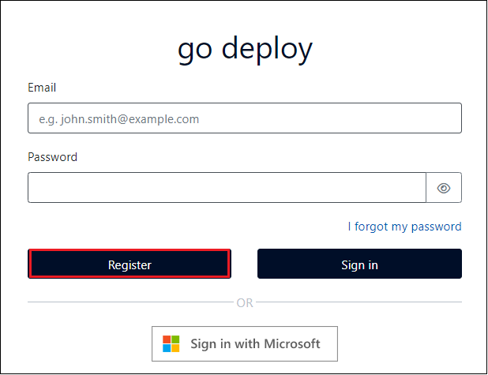

# Lab0: ラボのセットアップ

## ラボのセットアップ

### タスク 1: ラボキーの引き換え

1. go deploy (https://lms.godeploy.it/) にアクセスして、  **[Register]** をクリックします。

   **※注意※**
   **職場で、office  365 または Dynamics 365 を既に使用している場合は、InPrivate ウィンドウ(Microsoft Edge) もしくは、シークレットウィンドウ (Google Chrome) からアクセスしてください。**

   

2. 以下の項目を入力し、アカウント作成をします。項目を入力したら、 **[I agree to the go deploy terms of use and privacy policy.]  (利用規約に同意する)** にチェックを入れ、  **[Register]** をクリックします。

   | 項目                 | 値                                                           |
   | -------------------- | ------------------------------------------------------------ |
   | **Forename**         | 名前を入力します。(ローマ字)                                 |
   | **Surname**          | 苗字を入力します。(ローマ字)                                 |
   | **Email**            | メールアドレスを入力します。 ※ログイン時のアカウントとして使用します。 ※パスワードリセットが必要な時に登録したメールアドレスにメールが届きます。 確実に受信できるアドレスを入力してください。 |
   | **Confirm Email**    | 確認用に再度メールアドレスを入力します。                     |
   | **Password**         | パスワードを設定します。                                     |
   | **Confirm Password** | 確認用に再度パスワードを入力します。                         |

3.  **[Welcome]** と表示されたら、 **[Register for a Lab]** をクリックし、コードを引き換えます。

   **※引き換えコードは講師より配布します。引き換え回数は1回しか行えません。誤ったアカウントで引き換えしないようにしてください。**

4. Labが登録されたことを確認し、 **[Open Lab]** をクリックします。

5.  **[Launch Lab]** をクリックして、Lab を起動させます。

   **※注意※**
   **Lab内で提供されるMicrosoft 365 試用版アカウントの有効期限は 30 日間です。**

### タスク 2: Microsoft 365 試用版アカウントの取得

1. Lab の画面左側にある **[Home]** タブ内の情報を確認します。

   

   

2. 演習で使用するアカウント情報 (Office 365 Tenant Credencials (メールアドレスとパスワード)) をコピーし、メモ帳などでローカルに保存してください。

　　

　　以上でLabの事前準備は終了です。

