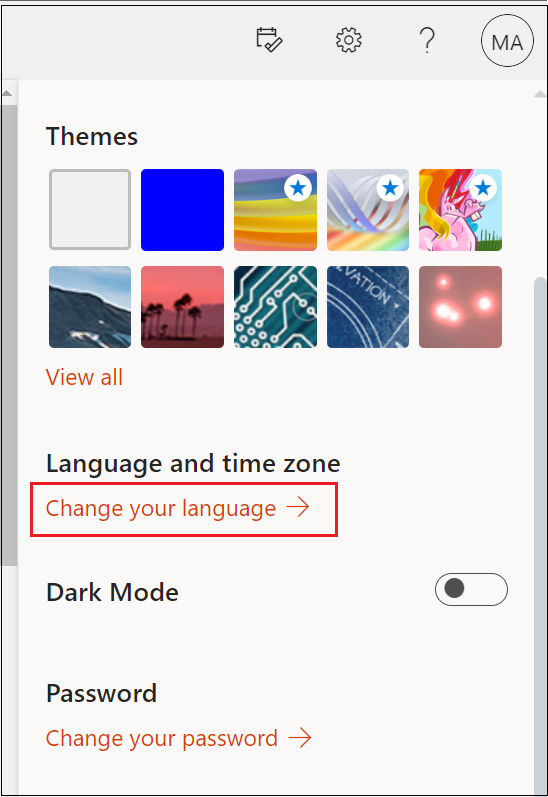
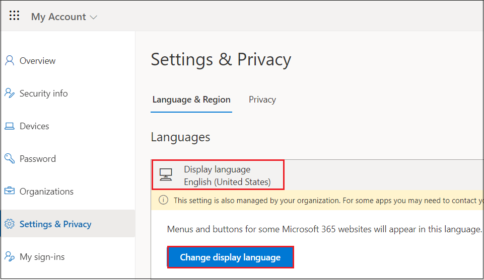
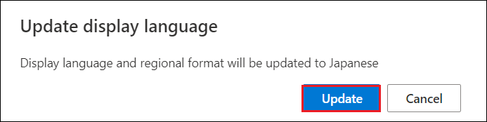
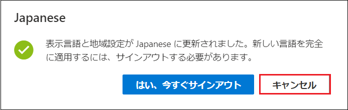
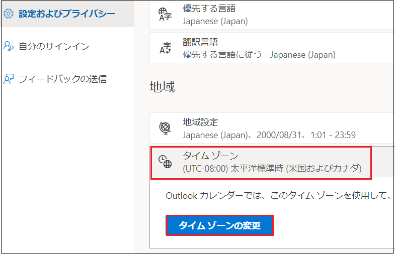
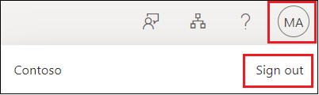

# Lab01: Microsoft 365 の組織設定

## シナリオ

あなたは、Microsoft 365 テナントを契約した直後に行う組織の設定を確認することにしました。

## 目標とタスク

このラボを完了すると、次のことができるようになります。

- Microsoft 365 テナントの設定を確認する。

- Microsoft 365 管理センターの組織プロファイルの設定を変更する。

  

この演習の主なタスクは次のとおりです。

1. Microsoft 365 ポータルの日本語化
2. Microsoft 365 管理センターで組織プロファイルを設定する

## 予想所要時間: 20 分

### タスク 1: Microsoft 365 ポータルの日本語化

1. InPrivate ウィンドウ(Microsoft Edge) もしくは、シークレットウィンドウ (Google Chrome) で、Microsoft 365 管理センター (https://admin.microsoft.com/) にアクセスし、事前に取得した資格情報でサインインします。

   | 項目           | 値                                                           |
   | -------------- | ------------------------------------------------------------ |
   | **ユーザーID** | `admin@XXXXXXXXXXX.onmicrosoft.com` @マーク以降のXXXXXXXXXは各自異なります。 |
   | **パスワード** | 事前に取得したパスワード                                     |

1.  **[サインインの状態を保持しますか]** ページでは、 **[いいえ]** をクリックします 。

1. ポータル画面が表示されたら、画面右上の歯車マーク **[Settings]** をクリックします。

1. **[Setting]** の一覧から、 **[Language and time zone]** の **[Change your language]** をクリックします。

   

6. **[My Account]** の **[Settings ＆ Privacy]** ページが表示されます。

7. **[Language]** セクションの **[Display Language]** をクリックして、 **[Change display language]** をクリックします。

8. **[Language]** ページで **[Japanese]** を選択し、 **[Select]** をクリックします。

9. **[Display language and regional format will be updated to Japanese]** とメッセージが表示されたら、 **[Update]** をクリックします。

10. **[表示言語と地域設定が Japanese に更新されました。新しい言語を完全に適用するには、サインアウトする必要があります。]** とメッセージが表示されたら、 **[キャンセル]** をクリックします。

11. **[設定およびプライバシー]** ページで、 **[地域]** の **[タイムゾーン] - [タイムゾーンの変更]** をクリックします。

12. **[ (UTC ＋ 09:00)大阪、札幌、東京]** を選択して、 **[選択]** をクリックします。

13. Microsoft 365 ポータル の右上にあるイニシャルのアイコンをクリックしてから、 **[sign out]** をクリックします。

14. **[どのアカウントをサインアウトしますか?]** というメッセージが表示されたら、サインインしていたアカウントを選択します。

15. サインアウトが完了したら、一度ブラウザーを×で閉じます。

16. 再度、InPrivate ウィンドウ(Microsoft Edge) もしくは、シークレットウィンドウ (Google Chrome) で、Microsoft 365 管理センター (https://admin.microsoft.com) にアクセスし、Lab0 で取得した資格情報でサインインします。

17. **[サインインの状態を維持しますか]** ページが表示された場合は、 **[いいえ]** をクリックします 。

18. **[Microsoft 365 管理センター]** のメニュー表記が日本語となっていることが確認できます。

19. **[Microsoft 365 管理センター]** が日本語に変更されていない場合は、一度サインアウトし、16の手順を繰り返します。

　　**※日本語化されたことが確認出来たら、タスク2に進んでください。**

### タスク 2: Microsoft 365 管理センターで組織プロファイルを設定する

1. Microsoft 365 管理センターの左ペインから、 **[・・・すべて表示]** をクリックします。

   

1. **[設定] - [組織設定]** をクリックしてから、 **[組織のプロファイル(Organization profile)]** タブを選択します。

3. **[組織のプロファイル(Organization profile)]** タブが表示されていることを確認し、 **[カスタムテーマ(Custom themes)]** をクリックします。

   

4. **[組織のMicrosoft 365のカスタマイズ(Customize ‎Microsoft 365‎ for your organization)]** ページで、 **[ ＋ テーマを追加する(Add theme)]** をクリックします。 

5. **[既定のテーマ(Default theme)]** ページで、 **[色(Colors)]** タブをクリックし、 **[ナビゲーションバーの色(Navigation bar color)]** の黒いボタンをクリックします。

6. カラーパレットから任意の色を選択します。 

   **※注意※以下のようにパレット内に警告マークが表示された場合、その色は推奨されないため、使用可能な色 (濃色)を選択してください。**

   

   色を選択したら、 **[保存(Save)]** ボタンをクリックします。

7. **「変更内容が保存されました。」** というメッセージが表示されたことを確認して、 **[既定のテーマ(Default theme)]** ページを画面右上の **[x]** をクリックして閉じます。 

8. **[F5] キー** を押して、ページを更新します。 

9. 画面上部のナビゲーションバーの色が変更されたことを確認します。

   

### **結果 : この演習を完了すると、Microsoft 365 管理ポータルの言語設定の変更や、組織プロファイルの設定変更ができるようになります。**
