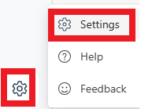
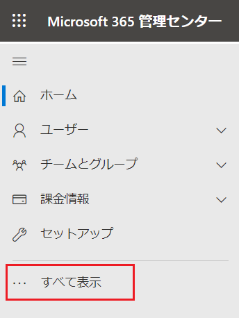

# <a name="lab-answer-key-Microsoft 365-organization-settings"></a>Lab01: Microsoft 365 の組織設定

## <a name="scenario"></a>シナリオ

あなたは、Microsoft 365 テナントを契約した直後に行う組織の設定を確認することにしました。

## <a name="objectives"></a>目標とタスク

このラボを完了すると、次のことができるようになります。

- Microsoft 365 テナントの設定を確認する。

  

この演習の主なタスクは次のとおりです。

1. Microsoft 365 ポータルの日本語化
2. Microsoft 365 管理センターで組織プロファイルを設定する
3. AD DS でオブジェクトを管理する

## <a name="estimated-time-45-minutes"></a>予想所要時間: 20 分


### <a name="task-1-Japanese-localization-of-Microsoft 365-portal"></a>タスク 1: Microsoft 365 ポータルの日本語化

1. InPrivate ウィンドウ(Microsoft Edge) もしくは、シークレットウィンドウ (Google Chrome) で、Microsoft 365 管理センター (https://portal.office.com/) にアクセスし、Lab0 で取得した資格情報でサインインします。

   | 項目           | 値                                                           |
   | -------------- | ------------------------------------------------------------ |
   | **ユーザーID** | `admin@XXXXXXXXXXX.onmicrosoft.com`<br />@マーク以降のXXXXXXXXXは各自異なります。 |
   | **パスワード** | Lab 0でコピーしたパスワード                                  |

1.  **[サインインの状態を保持しますか]** ページでは、 **[いいえ]** をクリックします 。

1.  **[Welcome to your new Office,Mod]** ページが表示された場合は、右側に表示される **[>]** ボタンを3回クリックします。(表示されない場合は、そのままMicrosoft 365 ポータルが表示されます)

1. ポータル画面が表示されたら、右上の歯車マーク **[Settings]** をクリックします。

   

1.  **[Setting]** の一覧から、 **[Language and time zone]** の **[Change your language]** をクリックします。

   

1.  **[My Account]** の **[Settings ＆ Privacy]** ページが表示されます。

1.  **[Language]** セクションの **[Display Language]** をクリックして、 **[Change display language]** をクリックします。

   

1.  **[Language]** ページで **[Japanese]** を選択し、 **[Select]** をクリックします。

1.  **[Display language and regional format will be updated to Japanese]** とメッセージが表示されたら、 **[Update]** をクリックします。

   

1.  **[表示言語と地域設定が Japanese に更新されました。新しい言語を完全に適用するには、サインアウトする必要があります。]** とメッセージが表示されたら、 **[キャンセル]** をクリックします。

   

1.  **[設定およびプライバシー]** ページで、 **[地域]** の **[タイムゾーン] - [タイムゾーンの変更]** をクリックします。

   

1.  **[ (UTC ＋ 09:00)大阪、札幌、東京]** を選択して、 **[選択]** をクリックします。

1. Microsoft 365 ポータル の右上にあるイニシャルのアイコンをクリックしてから、 **[sign out]** をクリックします。

   

1.  **[どのアカウントをサインアウトしますか?]** というメッセージが表示されたら、サインインしていたアカウントを選択します。

1. サインアウトが完了したら、一度ブラウザーを×で閉じます。

1. 再度、InPrivate ウィンドウ(Microsoft Edge) もしくは、シークレットウィンドウ (Google Chrome) で、Microsoft 365 管理センター (https://admin.microsoft.com) にアクセスし、Lab0 で取得した資格情報でサインインします。

1.  **[サインインの状態を保持しますか]** ページが表示された場合は、 **[いいえ]** をクリックします 。

1.  **[Microsoft 365 管理センター]** のメニュー表記が日本語となっていることが確認できます。

1.  **[Microsoft 365 管理センター]** が日本語に変更されていない場合は、一度サインアウトし、16の手順を繰り返します。

   ※日本語化されたことが確認出来たら、タスク2に進んでください。


### <a name="task-1-Japanese-localization-of-Microsoft 365-portal"></a>タスク 2: Microsoft 365 管理センターで組織プロファイルを設定する

1. Microsoft 365 管理センターの左ペインから、 **[・・・すべて表示]** をクリックします。

   

2.  **[設定] - [組織設定]** をクリックしてから、 **[組織のプロファイル]** タブを選択します。

   

3.   **[組織のプロファイル]** タブ を下にスクロールし、 **[組織の情報]** をクリックします。

4.  **[組織の情報]** ページで組織名が **[Contoso]** と表示されていることを確認したら、以下の項目を設定します。**※特に指示がないものは規定値のままで構いません。**
   入力したら、 **[保存]** をクリックします。

   | 項目     | 値                                                           |
   | -------- | ------------------------------------------------------------ |
   | **名前** | Adatum Corporation<br />※Adatum と Corporation の間に半角スペースを入れてください。 |

   


1. 以下のWindows PowerShellコマンドレットを実行し、**SEA-SVR1**にAD DS (Active Directory ドメインサービス)の役割をインストールします。

   ```powershell
   Install-WindowsFeature –Name AD-Domain-Services –ComputerName SEA-SVR1
   ```

   **※インストールが完了するまでに数分時間を要します。**

   **※実行結果の[Success]が[True]とかえってくれば、インストール完了です。**

   

1. **SEA-SVR1** に AD DS 役割がインストールされていることを確認するには、**SEA-ADM1**で以下のWindows PowerShell コマンドレットを実行します。

   ```powershell
   Get-WindowsFeature –ComputerName SEA-SVR1
   ```

1. 4のコマンドレット実行結果で、**Active Directory Domain Services** を探し、**[X]** が表示されていれば、**SEA-SVR1**にインストール済みです。

   

   > **注: インストール プロセスが完了してから、AD DS の役割がインストールされていることが確認できるようになるまで、時間を要する場合があります。 Get-WindowsFeature コマンドレットから結果が得られない場合は、時間をおいて再度実行してみてください。**

### <a name="task-2-prepare-the-ad-ds-installation-and-promote-a-remote-server"></a>タスク 2: AD DS インストールの準備をして、リモート サーバーを昇格させる

1.  **SEA-ADM1** の **[スタート]** メニューから **[Server Manager]** を選択して起動させます。起動後、左ペインから **[All Servers(すべてのサーバー)]** を選択します。

   

2. **[Manage(管理)]** メニューで、**[Add Servers(サーバーの追加)]** を選択します。

   
   
3. **[Add Servers(サーバーの追加)]** ダイアログ ボックスで、 **[Find Now(今すぐ検索)]** をクリックします。


   4.サーバーの **[Active Directory]** リストで **[SEA-SVR1]** を選び、矢印を選択して **[選択済み]** リストに追加してから、**[OK]** を選択します。


   5.**SEA-ADM1** の **[Server Manager]** の左ペインから **[AD DS]** を選択し、**SEA-SRV1** への AD DS 役割のインストールが完了していることを確認します。


   6.**[Server Manager]**の右上にある**[通知]** フラグ をクリックします。**SEA-SVR1** の展開後の構成に注目します。**[ Promote this server to a domain controller (このサーバーをドメイン コントローラーに昇格する)]** のリンクをクリックします。


> **注: SEA-SVR1にAD DSの役割をインストールしただけではドメインコントローラーにならないため、昇格させる必要があります。**

**※通知フラグに[Refresh failed]エラーが表示される場合がありますが、ラボと直接関係のないエラーのため無視して構いません。**

7. **[Active Directory Domain Services Configuration ウィザード]** の **[Deployment Configuration(展開構成)]** ページの **[Select the deployment operation (展開操作の選択)]**  の下で、**[Add a domain controller to an existing domain(既存のドメインにドメイン コントローラーを追加する)]** が選択されていることを確認します。


   8.`Contoso.com` ドメインが指定されていることを確かめてから、**[Supply the credentials to perform this operation (この操作を実行する資格情報を指定する)]** セクションで **[Change (変更)]** を選択します。

 


   9.**[資格情報]** ダイアログ ボックスに以下の資格情報を入力し、**[OK]** をクリックします。

| 資格情報       |                            |
| -------------- | -------------------------- |
| **ユーザー名** | **Contoso\\Administrator** |
| **パスワード** | **Pa55w.rd**               |

10. 資格情報が変更されたことを確認し、**[Next (次へ)]** をクリックします。

11.  **[Domain Controller Options]** ページで、**[Domain Name System (DNS) server]** と **[Global Catalog (GC)]** チェックボックスがオンになっていることを確認します。 **[読み取り専用ドメイン コントローラー (RODC)]** チェック ボックスはオフで構いません。

12. **[Type the Directory Services Restore Mode (DSRM) password (ディレクトリ サービス復元モード (DSRM) パスワードの入力)]** セクションで、以下のパスワードを入力し、**[次へ]** をクリックします。

| パスワード   |
| ------------ |
| **Pa55w.rd** |


13. **[DNS Options]** ページでは規定値のまま、**[Next (次へ)]** をクリックします。

**※ページ内に、DNSゾーンの委任に関する警告メッセージが表示されますが、このラボではDNSゾーンの委任は行わないため無視して構いません。**

14.  **[Additional Options (追加オプション)]**  ページで、規定値のまま **[Next (次へ)]**  をクリックします。

**※IFMオプションはチェックを外したままで構いません。**

15.  **[Paths (パス)]** ページでは、既定のパスのまま、**[Next (次へ)]** をクリックします。

16.  **[Review Options (オプションの確認)]**ページでは、**[Next (次へ)]** をクリックします。

17.   **[Prerequisites Check (前提条件のチェック)]** ページで、緑のチェックが表示されたことを確認したら **[Install (インストール)]** をクリックします。

 **[This server was successfully configured as a domain contoroller]** のメッセージが表示されたら、 **[Close (閉じる)]** をクリックします。

18.  **SEA-ADM1** で **[Server Manager]** に切り替え、右上の更新ボタンをクリックします。その後、通知メッセージを確認し **[ Promote this server to a domain controller (このサーバーをドメイン コントローラーに昇格する)]**  が表示されなくなっていることを確認します。

> **注:SEA-SVR1の再起動が完了するまでに何度か [更新] を繰り返す必要がある場合があります。**


### <a name="task-3-manage-objects-in-ad-ds"></a>タスク 3: AD DS でオブジェクトを管理する

1. **SEA-ADM1** で **Windows PowerShell (管理者)** に切り替えます。

1. 以下のWindows PowerShellコマンドレットを実行し、**SEA-DC1** のドメインコントローラーに **Seattle** という組織単位 (OU) を作成します。

   ```powershell
   New-ADOrganizationalUnit -Name "Seattle" -Path "DC=contoso,DC=com" -ProtectedFromAccidentalDeletion $true -Server SEA-DC1.contoso.com
   ```

1. 以下のWindows PowerShellコマンドレットを実行し、**Seattle** OU 配下に、 **Ty Carlson** というユーザーを作成します。

   ```powershell
   New-ADUser -Name Ty -DisplayName 'Ty Carlson' -GivenName Ty -Surname Carlson -Path 'OU=Seattle,DC=contoso,DC=com'
   ```

1. Ty のユーザー アカウントのパスワードを設定するには、次のコマンドレットを実行します。

   ```powershell
   Set-ADAccountPassword Ty
   ```

1. 現在のパスワードの入力を求めるメッセージが表示されたら、何も入力せずにEnter キーを押します。

   > **注 : ユーザーTyの作成時にパスワード設定をせずに作成したため、現在のパスワードは設定されていません。**

1. 新たに設定するパスワードを求めるメッセージが表示されたら、「**Pa55w.rd**」と入力し、Enter キーを押します。

1. パスワードをもう一度入力するよう求められたら、「**Pa55w.rd**」と入力し、Enter キーを押します。

1. アカウントを有効にするには、次のコマンドを入力し、Enter キーを押します。

   ```powershell
   Enable-ADAccount Ty
   ```

1.  **SeattleBranchUsers** という名前のドメイン グローバル グループを作成します。**SEA-ADM1** の **Windows PowerShell (管理者)** で以下のコマンドレットを実行します。

   ```powershell
   New-ADGroup SeattleBranchUsers -Path 'OU=Seattle,DC=contoso,DC=com' -GroupScope Global -GroupCategory Security
   ```
   
1. 以下のWindows PowerShell コマンドレットを実行し、 **SeattleBranchUsers** に ユーザー **Ty**  を追加します。

   ```powershell
   Add-ADGroupMember -Identity SeattleBranchUsers -Members Ty
   ```

1. 以下のWindows PowerShell コマンドレットを実行し、 **SeattleBranchUsers** に ユーザー **Ty** が追加されたことを確認します。

     ```powershell
     Get-ADGroupMember -Identity SeattleBranchUsers
     ```

     

1. 以下のWindows PowerShell コマンドレットを実行し、ローカルの管理者グループ(Administrators グループ)にユーザー Ty を追加します。

     ```powershell
     Add-LocalGroupMember -Group 'Administrators' -Member 'CONTOSO\Ty'
     ```

     > **注:  この次の演習で検証のためにサインインする必要があるため、管理者グループにユーザーを追加しました。**

#### **結果**: この演習が完了すると、AD DS に新しいドメイン コントローラーとマネージド オブジェクトが作成できています。

## **オプション : オブジェクト作成結果の確認** 

1.   **SEA-ADM1** の **[スタート]** メニューから **[Server Manager]** を起動させます。
2.  **[Tools]** を展開し、**[Active Directory Users and Computers (Active Directory ユーザーとコンピューター)]** を選択します。


3.   **Seattle OU**  配下に、 **SeattleBrunchUsers** グループとユーザー **Ty** が作成されていることが確認できます。

   

4.   **SeattleBrunchUsers**  グループのプロパティを確認すると、ユーザー **Ty** がメンバーとして追加されていることが確認できます。


**注 : OUとグループは、Windows PowerShell のコマンドレットでリモートサーバーの SEA-DC1 に作成しましたが、GUIでも確認ができます。** 

#### **結果 : この演習を完了すると、リモートサーバーにAD DS の役割をインストールと、ドメインコントローラーに昇格できました。また、OU、ユーザー、グループオブジェクトを作成、管理できるようになっています。**
