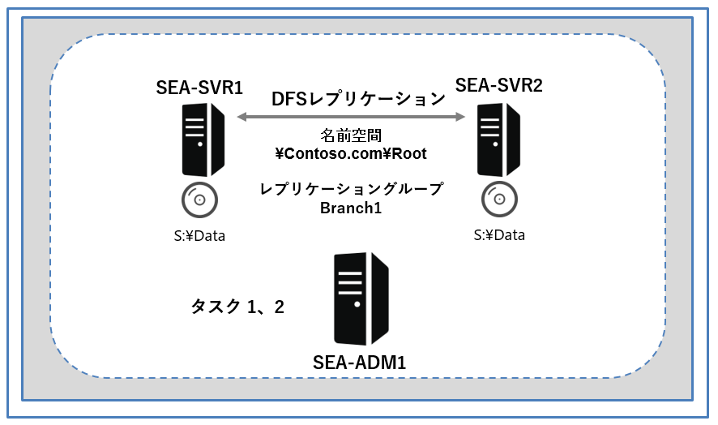
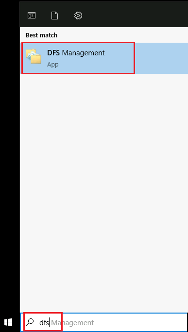
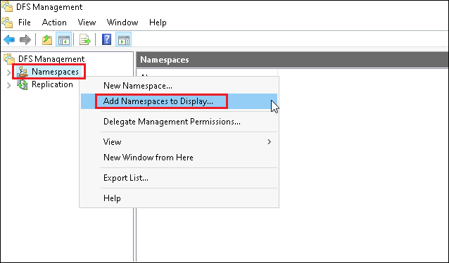
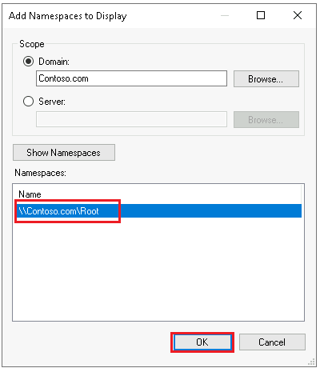
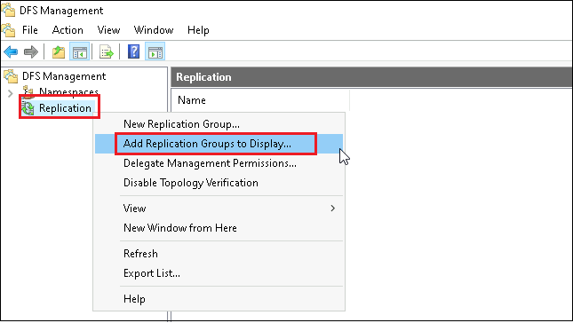
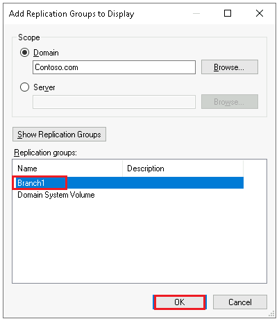
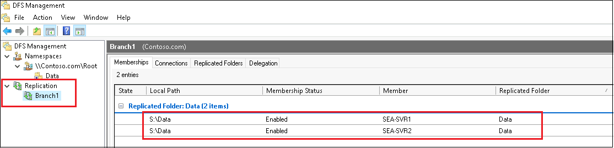

---
lab:
  title: 'ラボ : Azure File Sync の実装'
  module: 'Module 10: Implementing a hybrid file server infrastructure'
---

# <a name="lab-implementing-azure-file-sync"></a>Lab10a: オンプレミス環境での DFS レプリケーションの実装

## <a name="scenario"></a>シナリオ

Contoso のロンドン本社とシアトルを拠点とするブランチ オフィスとの間の分散ファイル システム (DFS) レプリケーションに関する懸念に対処するために、2 つのオンプレミス ファイル共有間で行うレプリケーションの代替機能として Azure File Sync を検証することにしました。あなたは、オンプレミスの DFS レプリケーション移行を検証する前に、 **SEA-SVR1** および **SEA-SVR2** に DFS レプリケーションを実装します。


## <a name="objectives"></a>目標とタスク

このラボを完了すると、次のことができるようになります。

- オンプレミス環境で DFS レプリケーションを実装する。

この演習の主なタスクは次のとおりです。

1. DFS をデプロイする。
1. DFS のデプロイをテストする。

## <a name="estimated-time-60-minutes"></a>予想所要時間: 15 分

## <a name="architecture"></a>アーキテクチャの図



## <a name="lab-setup"></a>ラボのセットアップ

仮想マシン: **SEA-DC1**、**SEA-SVR1**、**SEA-SVR2**、**SEA-ADM1** を使用します。 

1. **SEA-ADM1** を選択します。
1. 次の資格情報を使用してサインインします。

   - ユーザー名: **Administrator**
   - パスワード: **Pa55w.rd**
   - ドメイン: **CONTOSO**

このラボでは、仮想マシンと Azure サブスクリプションを使用します。 


### <a name="task-1-deploy-dfs"></a>タスク 0: ラボのセットアップ

1. **SEA-ADM1** に以下の資格情報でサインインします。

   | 資格情報       | 値                        |
   | -------------- | ------------------------- |
   | **ユーザー名** | **Contoso\Administrator** |
   | **パスワード** | **Pa55w.rd**              |

1.  **[スタート]** メニューをの一覧から **Windows PowerShell** を起動します。

1. 次の Windows PowerShell コマンドレットを実行して、ラボ ファイルの最新バージョンを仮想マシンにダウンロードします。

   ```powershell
   ([System.Net.WebClient]::new()).DownloadFile('https://github.com/MicrosoftLearning/AZ-800-Administering-Windows-Server-Hybrid-Core-Infrastructure/archive/refs/heads/master.zip', 'C:\Labfiles\master.zip')
   ```

   ```powershell
   Expand-Archive -Path 'C:\Labfiles\master.zip' -DestinationPath 'C:\Labfiles'
   ```

   ```powershell
   Move-item -Path "C:\Labfiles\AZ-800-Administering-Windows-Server-Hybrid-Core-Infrastructure-master\Allfiles\Labfiles\Lab10*" -Destination "C:\Labfiles" -confirm:$false
   ```


### <a name="task-1-deploy-dfs"></a>タスク 1: DFS をデプロイする

1. Windows PowerShell コンソールで次のコマンドレットを実行して、分散ファイル システム (DFS) 管理ツールをインストールします。

   > **注 : インストールが完了するまでに、1～2分程度かかります。**

   ```powershell
   Install-WindowsFeature -Name RSAT-DFS-Mgmt-Con -IncludeManagementTools
   ```

2. タスクバーから、 **[エクスプローラー]** を選択します。

3. ファイル エクスプローラーが起動したら、`C:\Labfiles\Lab10`を参照します。

4. `C:\Labfiles\Lab10` 配下にあるスクリプトファイル、 **L10_DeployDFS.ps1** を選択してから右クリックし、メニューから **[Edit (編集)]** を選択します。

5. **Windows PowerShell ISE** が起動したら、コードを確認し、**F5** キーを押してスクリプトを実行し、 **SEA-SVR1** と **SEA-SVR2** に、サンプル DFS 名前空間と DFS レプリケーション グループを作成します。

   > **注 : スクリプトの実行が完了するまでに、3～4分程度かかります。**

6. スクリプトの実行が完了したら、タスク2に進んでください。


### <a name="task-2-test-dfs-deployment"></a>タスク 2: DFS のデプロイをテストする

1.   **SEA-ADM1** で、 **[検索ボックス]** に **[DFS]** と入力し、 **[DFS Management (管理)]** を起動します。

   


2.  **[DFS Management (管理)]** のナビゲーション ウィンドウで、 **[Namespaces (名前空間)]** を右クリックし、 **[Add Namespaces to Display (表示する名前空間を追加)]** をクリックします。

   


3.  **[Add Namespaces to Display (表示する名前空間の追加)]** ダイアログ ボックスの名前空間の一覧で、**\\Contoso.com\Root** を選択し、 **[OK]** をクリックします。

   


4.  **[DFS Management (管理)]** のナビゲーション ウィンドウで、 **[Replication (レプリケーション)]** を右クリックし、 **[Add Replication Groups to Display (レプリケーション グループを表示に追加)]** をクリックします。

   


5.  **[Add Replication Groups to Display (表示するレプリケーション グループの追加)]** ダイアログ ボックスの  **[Replication groups (レプリケーショングループ)]** セクションで、 **[Branch1]** を選択し、 **[OK]** をクリックします。

   


6.  **[DFS Management (管理)]** のナビゲーション ウィンドウで、 **[Namespaces (名前空間)]  - [\\contoso.com\Root]** の順に展開し、 **[Data]** フォルダーを表示します。

7.  詳細ペインで、Dataフォルダーに SEA-SVR1 および SEA-SVR2 のDataフォルダーへの 2 つのリンクが表示されていることを確認します。

   


8. **[DFS Management (管理)]** のナビゲーション ウィンドウで、 **[Replication (レプリケーション)]  - [Branch 1]** の順に展開します。

9. 詳細ウィンドウで、 **SEA-SVR1** と **SEA -SVR2** の `S:\Data ` フォルダー が Branch1レプリケーション グループのメンバーであることを確認します。

   > **注: DFS レプリケーションは、SEA-SVR1とSEA-SVR2の**S:\Data**フォルダーの間でコンテンツをレプリケートします。**

   

   

10. **SEA-ADM1** で2つのファイルエクスプローラーを起動させます。1つ目のファイル エクスプローラー で、 `\\SEA-SVR1\Data` 、2つめのファイル エクスプローラーで `\\SEA-SVR2\Data` に接続します。

11. `\\SEA-SVR1\Data` に新しいファイルを作成します。(ファイル名は任意で構いません。)

12. 新規作成したファイルが、数秒後に `\\SEA-SVR2\Data` に複製されることを確認します。

    > **注 : SEA-SVR2に複製されるまでに、数十秒～数分かかる場合があります。**
    >
    > **注 : この結果から、DFS レプリケーションが機能していることを確認できます。**

    

### <a name="results"></a>結果

この演習を完了すると、機能する DFS インフラストラクチャが作成されます。 これには、**SEA-SVR1** と **SEA-SVR2** の間で内容をレプリケートする DFS レプリケーションが含まれます。

