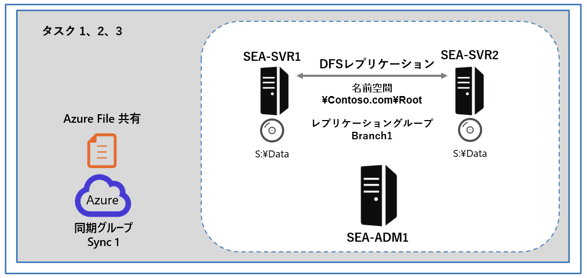
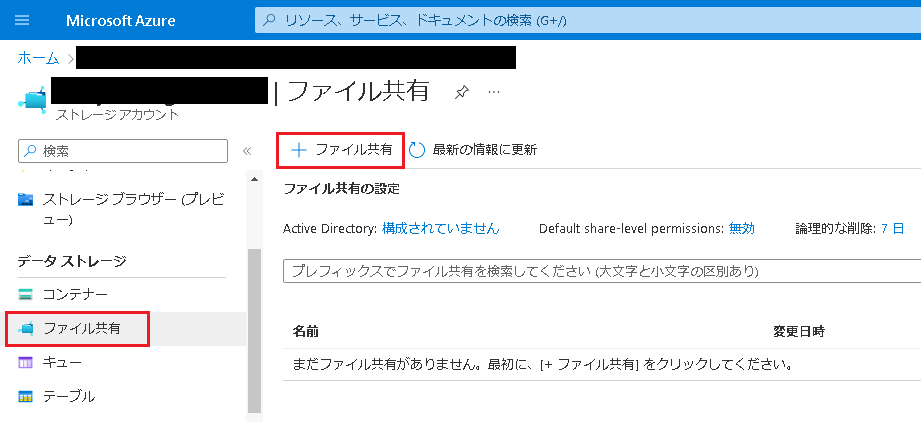
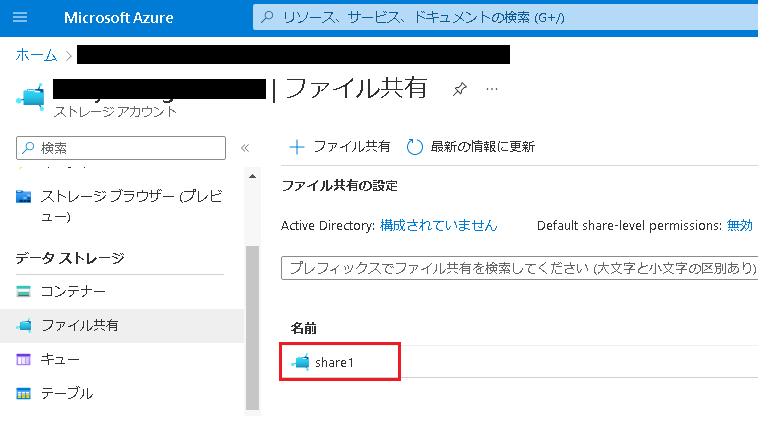
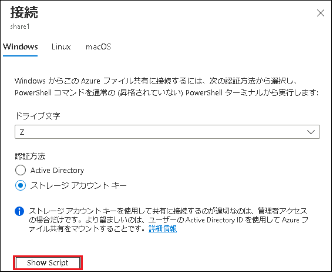
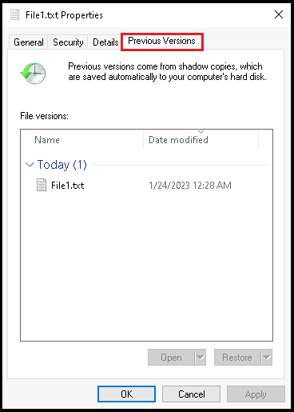
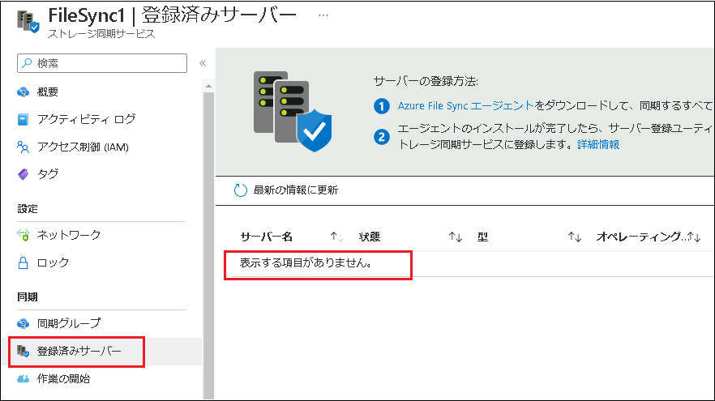

---
lab:
  title: 'ラボ : Azure File Sync の実装'
  module: 'Module 10: Implementing a hybrid file server infrastructure'
---

# Lab10b: 同期グループの作成と構成

## シナリオ

DFS レプリケーション環境を File Sync に移行するための準備として、最初に File Sync グループを作成して構成する必要があります。

## 目標とタスク

このラボを完了すると、次のことができるようになります。

- 同期グループを作成して構成する。

この演習の主なタスクは次のとおりです。

1. Azure ファイル共有を作成する。
1. Azure ファイル共有を使用する。
1. ストレージ同期サービスと File Sync グループをデプロイする。

## 予想所要時間: 10 分

## アーキテクチャの図

## ラボのセットアップ

仮想マシン: **SEA-SVR1**、**SEA-SVR2**、**SEA-ADM1** を使用します。 

1. **SEA-ADM1** を選択します。
1. 次の資格情報を使用してサインインします。

   - ユーザー名: **Administrator**
   - パスワード: **Pa55w.rd**
   - ドメイン: **CONTOSO**

このラボでは、仮想マシンと Azure サブスクリプションを使用します。 

### タスク 1: Azure ファイル共有を作成する

1. **SEA-ADM1** で Microsoft Edge を起動し、Azure portal `https://portal.azure.com`にアクセスして、このラボで使用するサブスクリプションの所有者ロールを持つユーザー アカウントの資格情報を使用してサインインします。(資格情報は、ラボの **[Home]** タブ内で提供されているものを使用してください。)

   ※Azure Portal にサインイン後は、必要に応じ、右上の歯車マーク(設定)画面から、言語設定を日本語に変更できます。

1.  Azure portal で、ツール バーの **[リソース、サービス、およびドキュメントの検索]** テキスト ボックスで、 **[ストレージ アカウント]** を検索して選択します。

1.  **[ストレージ アカウント]** ページで、 **[ + 作成]** をクリックします。

1. **[ストレージ アカウントの作成]** ページの **[基本]** タブで、次の設定を指定します。指示がないものは規定値のままで構いません。設定をしたら **[確認]** をクリックし、 **[作成]** を選択します。

   | 設定                   | 値                                                           |
   | ---------------------- | ------------------------------------------------------------ |
   | リソースグループ       | **予め指定されたものを使用してください**                     |
   | ストレージアカウント名 | **グローバルに一意の名前を入力してください (先頭は小文字で、 3 ～ 24 文字の名前にしてください。)** |
   | 地域 (リージョン)      | **East US (米国東部)**                                       |
   | 冗長性                 | **ローカル冗長ストレージ (LRS)**                             |

5. ストレージ アカウントが作成されたら、 **[デプロイ]** ページで **[リソースに移動]** をクリックします。

6. ストレージ アカウントページで、左のナビゲーションペインを下にスクロールし、 **[ファイル共有]** を選択し、更に **[ + ファイル共有]** をクリックします。

7. [**新しいファイル共有**] タブで、 **[名前]** テキスト ボックスに  **「share1」** と入力し、 **[作成]** をクリックします。

8. ストレージ アカウントで、**share1** という名前のファイル共有が作成できたことを確認したら、タスク2に進んでください。

### タスク 2: Azure ファイル共有を使用する

1.  **SEA-ADM1** の **Azure portal** の詳細ペインで、前のタスクで作成した **share1** を選択します。

   

2.  詳細ペインで、 **[アップロード]** をクリックします。

3.  **[ファイルのアップロード]** タブで、`C:\Labfiles\Lab10\File1.txt` を参照し、 **[アップロード]** をクリックします。アップロードが完了したら、 **[ファイルのアップロード]** タブを閉じます。

4.  **share1** ページで、 **[スナップショット] 、 [スナップショットの追加] 、 [ OK ]** の順にクリックします。 **※コメントは省略して構いません。**

5.  **share1** ページで、 **[概要] 、 [接続]** の順に選択します。 **[スクリプトを表示 (Show Script)]** を選択し、スクリプトが表示されているボックスの右下にあるドキュメントマーク、 **[クリップボードにコピー]** ボタンをクリックしてスクリプトをコピーし、 **[接続]** タブを閉じます。

   

6. **SEA-ADM1** で、 **Windows PowerShell ISE** ウィンドウに切り替え、スクリプト ペインで新しいタブを開きます。新規に開いたタブ内で、前の手順でコピーしたスクリプトを貼り付けます。

7. スクリプトの内容を確認したら、 **F5 キー**  を押してスクリプトを実行します。

   > **注:スクリプトを実行すると、Azure ファイル共有を Z ドライブにマウントします。**

8. **SEA-ADM1** で新しくファイル エクスプローラーを起動し、 **Z ドライブ** にアクセスします。

9. **File1.txt** が詳細ペインに表示されることを確認します。

   > **注 : File1.txt は、Azure ファイル共有にアップロードしたファイルであることに注目してください。**

10. **File1.txt** をメモ帳で開きます。

11. 最後の行に自分の名前を追加して変更を保存し、メモ帳を閉じます。

12. File1.txt を右クリックして から **[Properties (プロパティ)]** をクリックし、 **[ File1.txt  Properties]** ウィンドウで **[Previous Versions (以前のバージョン)]** タブに切り替えます。

    

    

13. 以前のファイル バージョンが 1 つ利用可能であることを確認します。利用可能なバージョン **( File1.txt )** を選択し、 **[Restore (復元)]** を 2 回クリックしてから、 **[OK]** を選択します。

14. File1.txt を開き、自分の名前が含まれていないことを確認します。

    > **注 : これは、ファイルを変更する前に作成されたスナップショットを復元したためです。**

15. メモ帳を閉じ、タスク3に進んでください。

### タスク 3: ストレージ同期サービスと File Sync グループをデプロイする

1.  **SEA-ADM1** のAzure portal で、ツールバーの **[リソース、サービス、およびドキュメントを検索]** テキスト ボックスで、 **[ストレージ同期サービス]** を検索します。サービス一覧から、 **[ストレージ同期サービス]** を選択します。

1.  **[ストレージ同期サービス]** ページで、 **[ + 作成]** をクリックします。

1. **[基本]** タブで以下の値を設定し、 **[確認と作成]** **- [作成]** の順にクリックしてください。

   | 設定                     | 値                                               |
   | ------------------------ | ------------------------------------------------ |
   | リソースグループ         | **プルダウンの一覧にあるものを選択してください** |
   | ストレージ同期サービス名 | **FileSync1**                                    |
   | リージョン               | **East US (米国東部)**                           |

4. File Sync がプロビジョニングされたら、 **[リソースに移動]** をクリックします。

5. **[FileSync1 ストレージ同期サービス]** ページで、 **[ + 同期グループ]** を選択して、新しいファイル同期グループを作成します。

6. **[同期グループ]** ページで、以下の値を設定し、 **[作成]** をクリックします。

| 設定                       | 値                                                           |
| -------------------------- | ------------------------------------------------------------ |
| 同期グループ名             | **Sync1**                                                    |
| サブスクリプション         | **予め指定されたものを使用してください**                     |
| ストレージアカウントの選択 | **プルダウンから自分で作成したストレージアカウントを選択してください** |
| Azure ファイル共有         | **Share 1**                                                  |

>**注: File Sync をデプロイすると、ストレージ同期サービス リソースが作成されます。**

7. **[ストレージ同期サービス]** ページで **[登録済みサーバー]** を選択し、現在登録済みのサーバーがないことを確認します。

登録済みサーバーがないことを確認したら、演習3に進んでください。

### 結果

この演習を完了すると、File Sync グループが作成されます。 また、**SEA-ADM1** にマップされたクラウド エンドポイントも作成され、Azure ファイル共有の内容を調べることができます。

