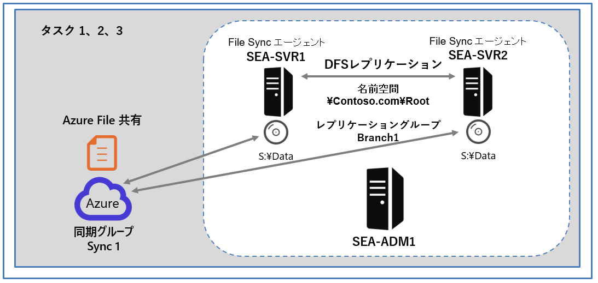
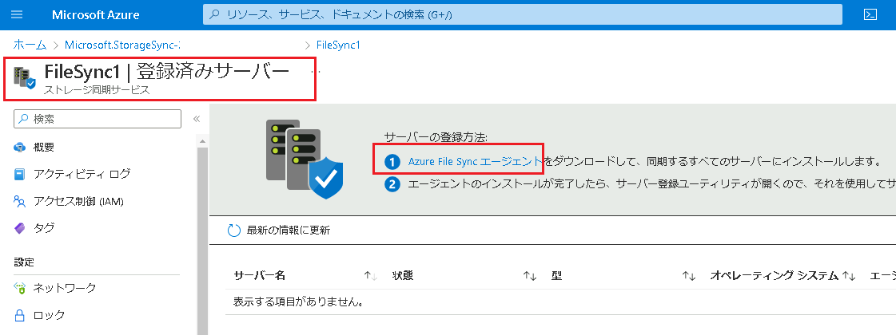
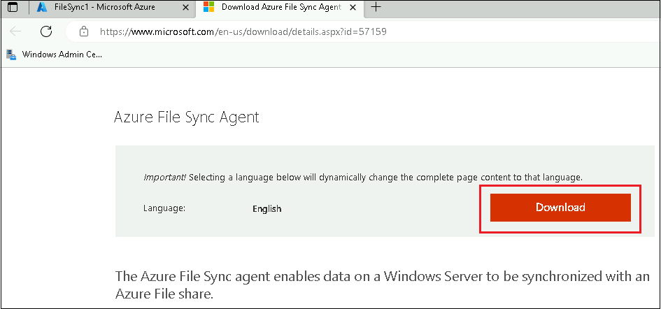
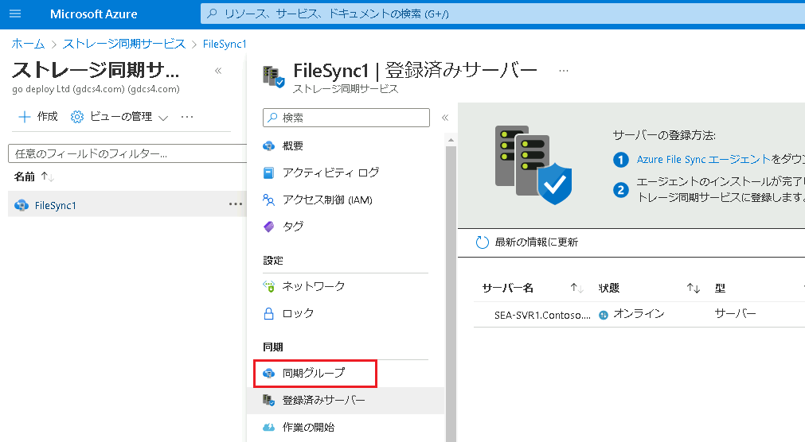
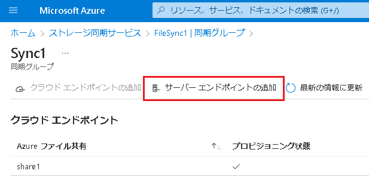

---
lab:
  title: 'ラボ : Azure File Sync の実装'
  module: 'Module 10: Implementing a hybrid file server infrastructure'
---

# Lab10c: DFS レプリケーションを File Sync ベースのレプリケーションに置き換える

## シナリオ

必要なコンポーネントがすべて準備できたので、DFS レプリケーションを File Sync ベースのレプリケーションに置き換えます。

## 目標とタスク

このラボを完了すると、次のことができるようになります。

- DFS レプリケーションを Azure File Sync ベースのレプリケーションに置き換える。

この演習の主なタスクは次のとおりです。

1. **SEA-SVR1** をサーバー エンドポイントとして追加する。
1. **SEA-SVR2** を File Sync に登録する。
1. DFS レプリケーションを削除し、**SEA-SVR2** をサーバー エンドポイントとして追加する。

## 予想所要時間: 20 分

## アーキテクチャの図

## ラボのセットアップ

仮想マシン: **SEA-SVR1**、**SEA-SVR2**、**SEA-ADM1** を使用します。 

1. **SEA-ADM1** を選択します。
1. 次の資格情報を使用してサインインします。

   - ユーザー名: **Administrator**
   - パスワード: **Pa55w.rd**
   - ドメイン: **CONTOSO**

このラボでは、仮想マシンと Azure サブスクリプションを使用します。 

### タスク 1: SEA-SVR1 をサーバー エンドポイントとして追加する

1. **SEA-ADM1** の Azure portal に表示されている、**「FileSync1  | [登録済みサーバー]」** ページで、 **Azure File Sync エージェントのリンク** を選択して、Azure File Sync エージェントのMicrosoft ダウンロード ページに移動します。

   

   

2. Microsoft ダウンロード ページに移動したら、 **[Download]** をクリックします。

3. Windows Server 2022 用の File Sync エージェント  **(StorageSyncAgent_WS2022.msi )** のエントリの横にあるチェックボックスを選択し、 **[Next (次へ)]** をクリックしてダウンロードを開始します。ダウンロードが完了したら、ダウンロード用に開いた Microsoft Edge タブを閉じます。

4. 3 の手順でダウンロードしたファイルを `C:\Labfiles\Lab10` フォルダーにコピーします。

5. `C:\Labfiles\Lab10` に格納されている、 **Install-FileSyncServerCore.ps1** を右クリックし、 **[Edit (編集)]** を選択します。

6. スクリプトの 2行目 の変数 $rgName の値をAzureportalで既に使用しているリソースグループ名に変更してから、スクリプトを F5 キーで実行します。

   > **注 : リソースグループ名は、Azure Poral のリソースグループで確認します。** 
   >
   > **注 : スクリプトの実行が終了してから次の作業に進んでください。実行が完了するまでに3分程度かかります。**
   >
   > **注 : スクリプトを実行することにより、SEA-SVR1に File Sync エージェントをインストールします。**

7. PowerShell コンソールにサインインを求める警告メッセージが表示されたら、警告メッセージ内の 9 文字のコードをコピーします。

8. Microsoft Edge ウィンドウに切り替え、新しいタブを開き、 `https://microsoft.com/devicelogin` にアクセスします。

9. **[コードの入力]** ダイアログ ボックスで、コピーしたコードを貼り付けます。Azure の 資格情報を使用してサインインします。認証に成功したことを確認してから、次の作業に進んでください。

10. **Windows PowerShell ISE**  に切り替えて、スクリプトが正常に完了したことを確認します。

    > **注 : 「Script finished」 と表示されていれば、正常に完了しています。**

11. Azure portal に戻り、 **「FileSync1 | [登録済みサーバー]」** ページで、 **[最新の情報に更新]** をクリックして、登録済みサーバーの現在のリストを表示します。

12. 登録済みサーバーのリストに **SEA-SVR1.Contoso.com** サーバーが表示されていることを確認します。

13. ファイル エクスプローラー に切り替え、`\\SEA-SVR1\Data` を参照して、フォルダーに現在 **File1.txt** が含まれていないことを確認します。

14. Azure portal に切り替え、 **[FileSync1 | 登録済みサーバー]** ページで、 [同期グループ] を選択し、 **[ Sync1]** をクリックします。

15. **[Sync1]** ページで **[サーバー エンドポイントの追加]** をクリックします。

16. **[サーバー エンドポイントの追加**] タブで、 **[登録済みサーバー]**  リストから **SEA-SVR1.Contoso.com** を選択します。

17. **[パス]** テキスト ボックスに **「S:\Data 」** と入力し、 **[作成]** をクリックします。

18. サーバーエンドポイントが作成されたことを確認したら、ファイル エクスプローラーに切り替えて、 `\\SEA-SVR1\Data` に  **File1.txt**  が含まれていることを確認します。

    > **注 :  Azure ファイル共有にアップロードしているため、File Sync によってSEA-SVR1に同期されたことが確認できます。**

### タスク 2: SEA-SVR2 を File Sync に登録する

1.  **SEA-ADM1** の  **Windows PowerShell ISE** に切り替え、更に、 **Install-FileSyncServerCore.ps1** の内容を表示するスクリプト ペインのタブに切り替えます。

1. スクリプト 1行目の `SEA-SVR1` を `SEA-SVR2` に置き換え、スクリプトを F5 キーで実行します。

1. PowerShell コンソールにサインインを求める警告メッセージが表示されたら、警告メッセージ内の 9 文字のコードをコピーします。

1. Microsoft Edge ウィンドウに切り替え、新しいタブを開き、 `https://microsoft.com/devicelogin` にアクセスします。

1.  **[コードの入力]** ダイアログ ボックスで、コピーしたコードを貼り付けます。Azure の 資格情報を使用してサインインします。認証に成功したことを確認してから、次の作業に進んでください。

1. **Windows PowerShell ISE**  に切り替えて、スクリプトが正常に完了したことを確認します。

   > **注 : 「Script finished」 と表示されていれば、正常に完了しています。**

7. Azure Portal に切り替え、 **「FileSync1 | 同期グループ」** ページに戻ります。

8. **[登録済みサーバー]** を選択すると、一覧に **SEA-SVR2.Contoso.com** が登録されたことが確認できます。

   

### タスク 3: DFS レプリケーションを削除し、SEA-SVR2 をサーバー エンドポイントとして追加する

1.  **SEA-ADM1 で、 [DFS Management (管理)]** に切り替えます。

1.  左ナビゲーションペインから、 **Branch1** を右クリックし、 **[Delete (削除)]** をクリックします。

1. 警告メッセージが表示されたら、 **[Yes]**  オプションを選択して、 **[OK]** をクリックします。

1.  Azure portal に切り替え、 **「FileSync1 | 同期グループ」** ページに戻ります。同期グループの一覧から  **[Sync1]** を選択し、 **[サーバー エンドポイントの追加]** をクリックします。

1.  **[サーバー エンドポイントの追加**] タブで、 **[登録済みサーバー]**  リストから **SEA-SVR2.Contoso.com** を選択します。

1.  **[パス]** テキスト ボックスに **「S:\Data 」** と入力し、 **[作成]** をクリックします。

   > **注 : このタスクを完了すると、SEA-SVR2をFile Sync1 同期グループに追加できます。**

### 結果

この演習を完了すると、DFS レプリケーションが File Sync に置き換えられます。

