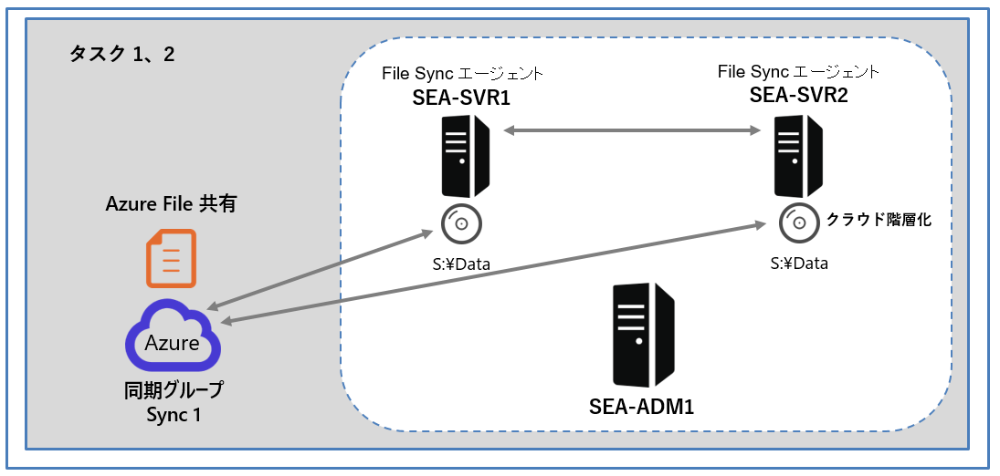
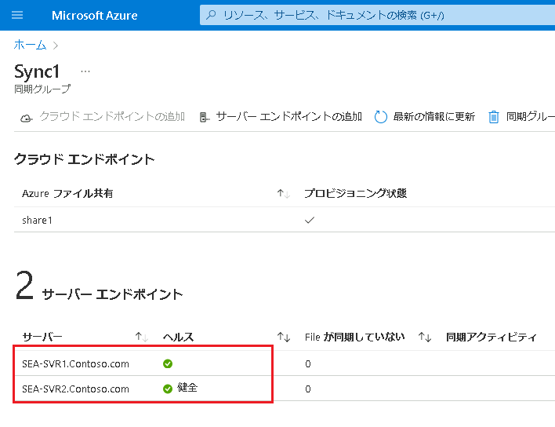

---
lab:
  title: 'ラボ : Azure File Sync の実装'
  module: 'Module 10: Implementing a hybrid file server infrastructure'
---

# Lab10e: レプリケーションのトラブルシューティング

## シナリオ

Contoso では、レプリケーションの競合など、レプリケーションの問題を迅速に特定して解決する必要があります。 そのため、発生する可能性があるレプリケーションの問題をシミュレートし、検証することにになりました。

## 目標とタスク

このラボを完了すると、次のことができるようになります。

- レプリケーションの競合のトラブルシューティングを行う。

この演習の主なタスクは次のとおりです。

1. File Sync レプリケーションを監視する。
1. レプリケーションの競合の解決をテストする。

## 予想所要時間: 10 分

## アーキテクチャの図

## ラボのセットアップ

仮想マシン: **SEA-SVR1**、**SEA-SVR2**、**SEA-ADM1** を使用します。 

1. **SEA-ADM1** を選択します。
1. 次の資格情報を使用してサインインします。

   - ユーザー名: **Administrator**
   - パスワード: **Pa55w.rd**
   - ドメイン: **CONTOSO**

このラボでは、仮想マシンと Azure サブスクリプションを使用します。 

### タスク 1: File Sync レプリケーションを監視する

1. **SEA-ADM1** で、ファイルエクスプローラーを使用し、 `C:\Windows\INF` フォルダーを `\\SEA-SVR2\Data\` にコピーします。

   > **注 : この結果、フォルダーはクラウド エンドポイントに同期され、同期トラフィックが発生します。**

2. Azure Portal に切り替え、 **FileSync1** ストレージ同期サービスの **Sync1 同期グループ** ページを確認します。

3. **[サーバー エンドポイント]** セクションで、両方のエンドポイントの正常性に緑色のチェック マークが付いていることを確認します。

4. SEA-ADM1 のファイルエクスプローラーで、Azure File 共有がマップされたZドライブを表示し、 `\\SEA-SVR2\Data` から同期された INF フォルダーが含まれていることを確認します。

5. **INF** フォルダーがドライブ **Z**に同期中であることを確認します。

6. Azure portal で、同期トラフィックが、 **[同期されたファイル数]** および **[同期されたバイト数]** のグラフに反映されていることを確認します。 **INF** フォルダーには 800 個以上のファイルが含まれており、そのサイズは 40 MB を超えていることが確認できます。

   > **注: 同期トラフィックがAzure portal に反映されるまでに、5分以上かかる場合があります。ブラウザ更新をして確認してください。**

### タスク 2: レプリケーションの競合の解決をテストする

1. **SEA-ADM1** で、`\\SEA-SVR1\Data\`と `\\SEA-SVR2\Data\` のファイルエクスプローラー を表示します。

1. `\\SEA-SVR1\Data\`の内容が表示されているファイルエクスプローラーで、**Demo.txt** という名前のファイルを作成します。 

1.  `\\SEA-SVR2\Data\` の内容が表示されているエクスプローラー ウィンドウで、**Demo.txt** という名前のファイルを作成します。 

1. 最初に作成した **Demo.txt** ファイルに任意のテキストを追加し、変更を保存します。

1. その後すぐに、2 番目に作成した **Demo.txt** ファイルに任意のテキスト (前の手順で使用したものとは異なるテキスト) を追加し、変更を保存します。

   >**注: 2 番目のファイルに対する変更をできる限り早く保存してください。 同期の競合を意図的にトリガーするために、名前は同一で、内容が異なるファイルを作成しています。**

1. 各エクスプローラー ウィンドウで、内容を確認し、**Demo.txt** ファイルだけでなく、**Demo-SEA-SVR2.txt** ファイル (および場合によっては **Demo-SEA-SVR1.txt**) が含まれていることを確認します。 

   >**注: File Sync によって同期の競合が検出されたため、エンドポイント名を表すサフィックス (SEA-SVR2など) が、競合が発生したファイルに追加されます。**

### 結果

この演習を完了すると、File Sync レプリケーションを監視し、レプリケーションの問題が解決されます。

以上で演習は終了です。お疲れさまでした。
