# Lab01b: グループポリシーの実装

## シナリオ

Contoso Ltd. のITチームでは、組織のコンプライアンスに準拠したグループ ポリシー オブジェクト (GPO) を構成したいと考えています。そこで、グループポリシーオブジェクトを構成し、どのように適用されるか検証することにしました。

## 目標とタスク

このラボを完了すると、次のことができるようになります。

- グループ ポリシーを構成する。
- グループポリシーを検証する。

この演習の主なタスクは次のとおりです。

1. GPO を作成および編集する

2. GPO をリンクする

3. GPO の結果を検証する

## 予想所要時間: 25 分

## アーキテクチャの図

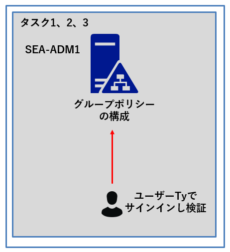

## ラボのセットアップ

使用する仮想マシン: **SEA-DC1**、**SEA-SVR1**、**SEA-ADM1**  

1.  **SEA-ADM1** を選択します。
2. 次の資格情報を使用してサインインします。
   - ユーザー名: **Administrator**
   - パスワード: **Pa55w.rd**
   - ドメイン: **CONTOSO**

### タスク 1: GPO を作成および編集する

1. **SEA-ADM1** で、サーバー マネージャーから **[Tools(ツール)]** を選択し、**[Group Policy Management (グループ ポリシーの管理)]** を選びます。

   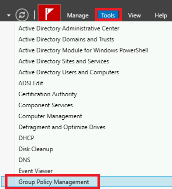

   

1.  **[Group Policy Management (グループ ポリシーの管理)]** コンソールのナビゲーション ペインで、 **[Forest:Contoso.com] - [Domains] - [Contoso.com]** の順に展開してから、 **[Group Policy Objects (グループ ポリシー オブジェクト)]** コンテナーを選択します。

   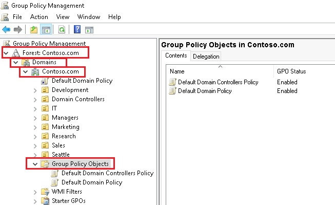

   ※Group Policy Objects コンテナーには、既定でリンク済みのDefault Domain Controllers Policyと Default Domain Policyが格納されています。

1. ナビゲーション ペインで、**[Group Policy Objects (グループ ポリシー オブジェクト)]** コンテナーのコンテキスト メニューを右クリックして、 **[New (新規)]** を選択します。

   

   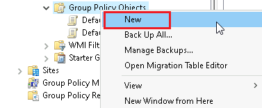

   

1.  **[Name]** テキスト ボックスに「**CONTOSO Standards**」と入力し、**[OK]** をクリックします。

   

   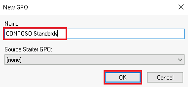

   

1. **4** の手順で作成した **[CONTOSO Standards]** GPOを右クリックし、 **[Edit (編集)]** をクリックします。

   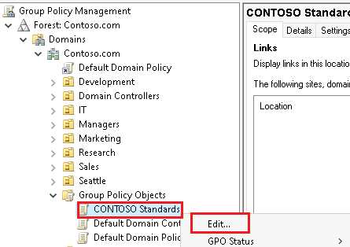

   

1.  **[Group Policy Management Editor (グループ ポリシー管理エディター)]** ウィンドウのナビゲーション ペインで、**[User Configuration (ユーザーの構成)] - [Policies (ポリシー)] - [Administrative Templates (管理用テンプレート)]** の順に展開してから **[System (システム)]** をクリックします。

   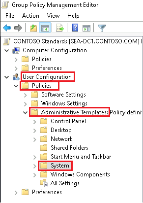

1. System のポリシー一覧から、 **[Prevent access to registry editing tools (レジストリ編集ツールへアクセスできないようにする)]** ポリシーをダブルクリックします。

   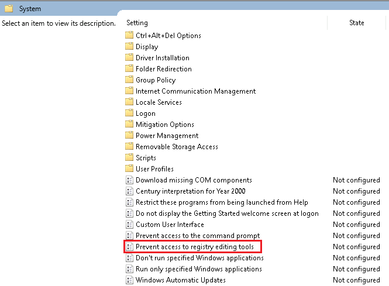

1. **[Prevent access to registry editing tools (レジストリ編集ツールへアクセスできないようにする)]** ダイアログ ボックスで、**[Enabled (有効)]**、のラジオボタンをチェックし、 **[OK]** をクリックします。

   

   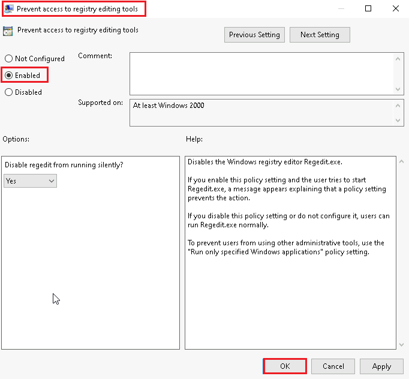

   > **※Prevent access to registry editing tools (レジストリ編集ツールへアクセスできないようにする)ポリシーを有効化すると、Windows のレジストリ エディター (Regedit.exe) を無効にします。ユーザーがRegedit.exeを実行しようとすると、「この操作はポリシー設定によって禁止されています」というメッセージが表示されるようになります。**

1. ナビゲーション ペインに戻り、 **[User Configuration (ユーザーの構成)] - [Policies (ポリシー)] - [Administrative Templates (管理用テンプレート)]** の順に展開し、**[Control Panel (コントロール パネル)]** を展開してから **[Personalization (個人用設定)]** をクリックします。

   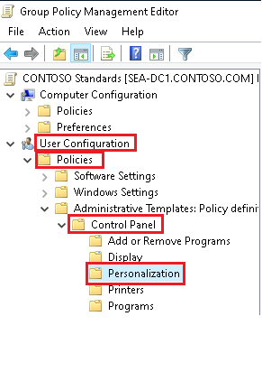

1. 詳細ペインで、**[Screen saver timeout (スクリーン セーバーのタイムアウト)]** ポリシー設定をダブルクリックします。

   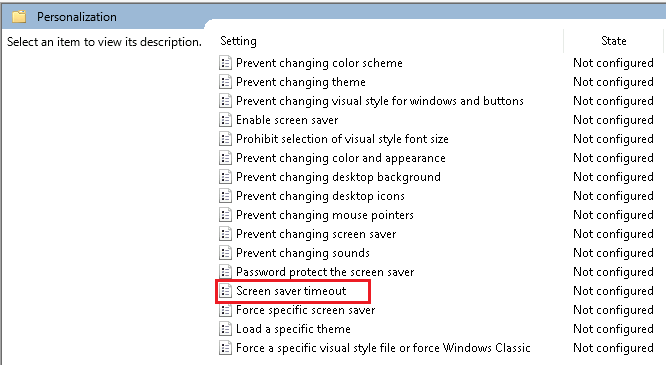

1. **[Screen saver timeout (スクリーン セーバーのタイムアウト)]** ダイアログ ボックスで、**[Enabled (有効)]** を選択します。 **[Seconds (秒)]** テキスト ボックスに「**600**」と入力してから、**[OK]** をクリックします。 

   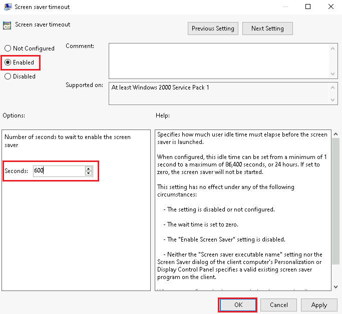

   > **※Screen saver timeout (スクリーン セーバーのタイムアウト)ポリシーを有効化すると、スクリーンセーバーの起動する時間(秒単位)を指定できます。ラボでは600秒で設定したため、600秒コンピューターでの作業が行われない場合はスクリーンセーバーが起動するようになります。**

   

1. ポリシー一覧に戻り、 **[Password protect the screen saver (パスワードでスクリーン セーバーを保護する)]** ポリシー設定をダブルクリックします。

   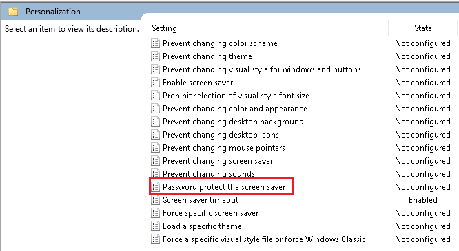

1. **[Password protect the screen saver (スクリーン セーバーをパスワードで保護する)]** ダイアログ ボックスで、**[Enabled (有効)]** を選んでから、**[OK]** をクリックします。

   

   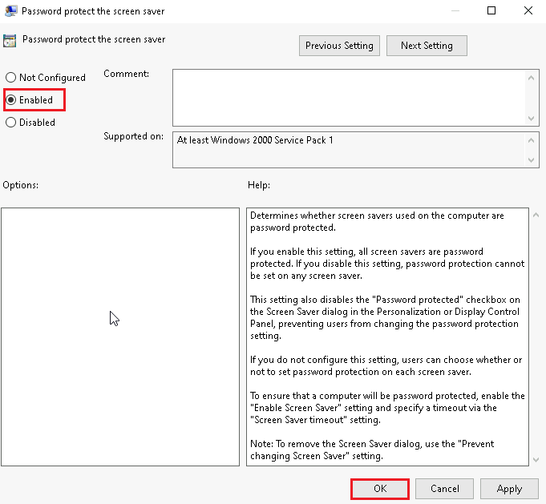

   > **※[Password protect the screen saver (スクリーン セーバーをパスワードで保護する)] ポリシーを有効にすると、すべてのスクリーン セーバーはパスワードで保護されます。また、有効化することで、コントロール パネルの [個人用設定] の [スクリーン セーバー] ダイアログにある [パスワード保護] チェック ボックスが無効になります。ユーザーはパスワード保護設定を変更できなくなります。**

   

1. 設定したポリシーが **[Enabled]** になっていることを確認し、 **[Group Policy Management Editor (グループ ポリシー管理エディター)]** ウィンドウを × で閉じます。

   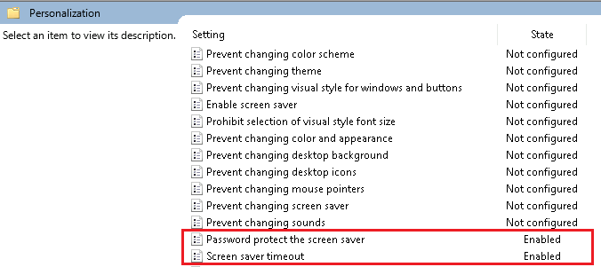

### タスク 2: GPO をリンクする

1. **[Group Policy Management (グループ ポリシーの管理)]** ウィンドウのナビゲーション ペインで、`Contoso.com` ドメインのコンテキスト メニューを右クリックし、**[Link an Existing GPO (既存の GPO のリンク)]** を選択します。

   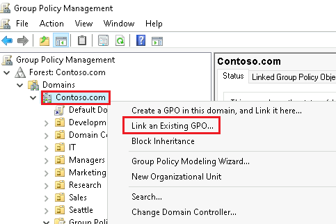

1. **[Select GPO (GPO の選択)]** ダイアログ ボックスで、**[CONTOSO Standards]** を選択してから、**[OK]** をクリックします。

   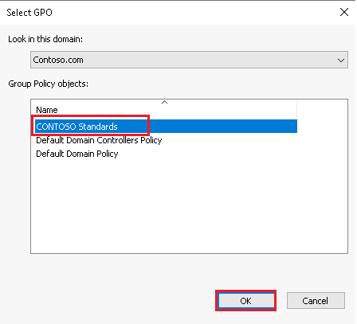

   3. Contoso.com ドメインに、 **CONTOSO Standards** と **Default Domain Policy** の2つのGPOがリンクされたことが確認できます。

      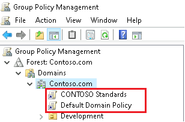

      

### タスク 3: GPO の結果を検証する

1. **SEA-ADM1** で、タスク バーの検索ボックスに「**Control Panel**」と入力します。 

1. **[Best match (最も一致する検索結果)]** リストで、**[Control Panel]** を選択します。

1. **[System and Security]** を選択してから、**[Allow an app through Windows Firewall (Windows ファイアウォールによるアプリケーションの許可)]** を選びます。

   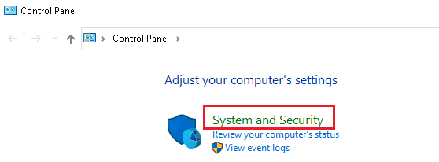

   

   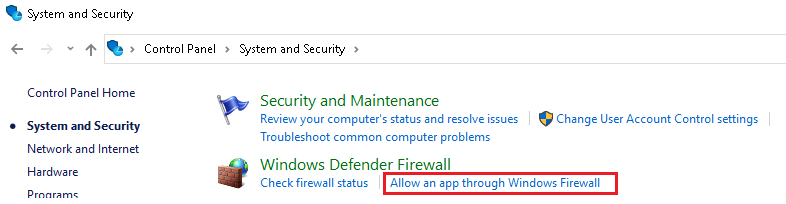

   

1. **[Allowed apps and features (許可されているアプリと機能)]** リストから、**[Remote Event Log Management (リモート イベント ログ管理)]** エントリを探し、**[Domain]** 列のチェックボックスをオンにしてから、**[OK]** をクリックします。 

   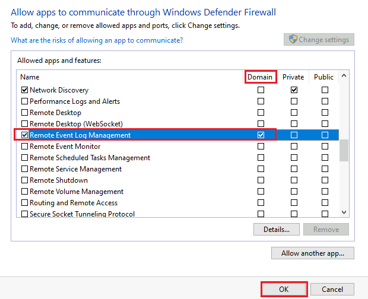

   

1.  **SEA-ADM1** から一度サインアウトし、以下のユーザーでサインインします。

   | ユーザー名     | CONTOSO\Ty   |
   | -------------- | ------------ |
   | **パスワード** | **Pa55w.rd** |

   ※サインイン画面では **[Other user]** を選択してから資格情報を入力してください。

1. タスク バーの検索ボックスに、「**Control Panel**」と入力して検索します。

1. **[Best match (最も一致する検索結果)]** リストで、**[Control Panel]** を選択します。

1. [コントロール パネル] の検索ボックスに「**Screen Saver**」と入力し、**[change Screen Saver (スクリーン セーバーの変更)]** を選択します  (オプションが表示されるまでに数分かかる場合があります)。

   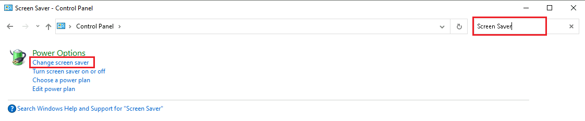

   

1. **[Screen Saver Settings]** ダイアログ ボックスで、**[Wait (待ち時間)]** オプションがグレーアウトされていることが確認できます。また **[On resume, display logon screen (再開時にログオン画面に戻る)]** オプションのチェックボックスにチェックが入り、設定を変更できないことが確認できます。設定を確認したら、ダイアログボックスは **[OK]** をクリックして閉じます。

   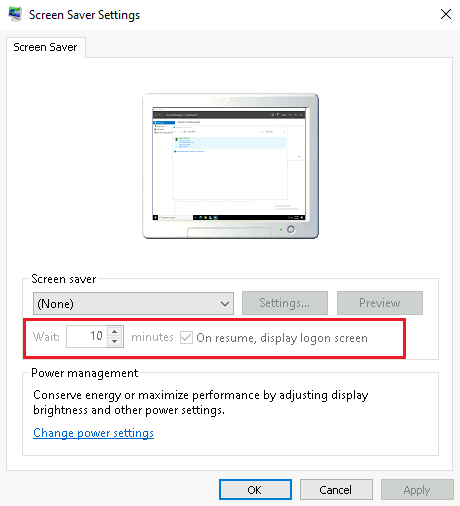

   > **注: Screen saver timeout (スクリーン セーバーのタイムアウト)ポリシーを有効化しているため、ユーザーはスクリーンセーバーの待ち時間等を変更することはできません。**
   >
   > **注: [再開時にログオン画面に戻る] オプションが選択されて淡色表示になっていない場合は、Windows PowerShellを起動し `gpupdate /force` を実行してから再度確認してください。**

1. タスク バーの検索ボックスに、**[regedit]** と入力し、検索結果に表示される **[Registry Editor]** をクリックします。**[Registry editing has been disabled by your administrator (レジストリ編集は、管理者によって使用不可にされています) ]**というエラー メッセージが表示されます。

   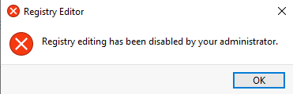

   > **注: Prevent access to registry editing tools (レジストリ編集ツールへアクセスできないようにする)ポリシーを有効化しているため、ユーザーはRegistry Editorを起動させることはできません。**

1. ダイアログ ボックスを **[OK]** をクリックして閉じます。

1.  **SEA-ADM1** からサインアウトし、 **CONTOSO\\Administrator** で再度サインインします。(パスワードは **Pa55w.rd** )

### オプション1 : GPO を新規作成時し、OUにリンクする

1. **SEA-ADM1** で、Server Managerから **[Tools (ツール)]** を選択し、**[Group Policy Management (グループ ポリシーの管理)]** をクリックします。

1. **[Group Policy Management (グループ ポリシーの管理)]** コンソールのナビゲーション ペインで、 **[Forest:Contoso.com] - [Domains] - [Contoso.com]**  の順に展開してから、**[Seattle]** を選択します。

1. **Seattle OU** のコンテキスト メニューを右クリックしてから、**[Create a GPO in this domain, and Link it here (このドメインに GPO を作成し、このコンテナーにリンクする)]** を選択します。

   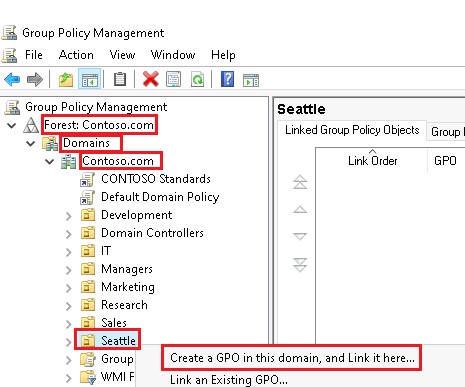

1. **[New GPO]** ダイアログ ボックスの **[Name]** テキスト ボックスに「**Seattle Application Override**」と入力し、**[OK]** を選択します。

   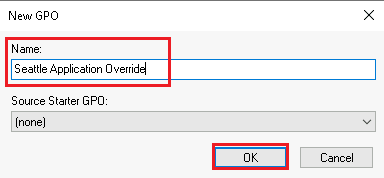

1.  **Seattle OU** を展開し、 **Seattle Application Override  GPO**  のコンテキスト メニューを右クリックし、**[Edit (編集)]** を選択します。

   ※確認メッセージが表示される場合がありますが、 **[OK]** をクリックして閉じて構いません。

1.  **[Group Policy Management Editor]** が起動したら、**[User Configuration (ユーザーの構成)] - [Policies (ポリシー)] - [Administrative Templates (管理用テンプレート)] - [Control Panel (コントロール パネル)]** を展開してから **[Personalization (個人用設定)]** をクリックします。

1. **[Screen saver timeout (スクリーン セーバーのタイムアウト)]** ポリシー設定をダブルクリックします。

1. **[Disabled (無効)]** を選択してから、**[OK]** をクリックします。

   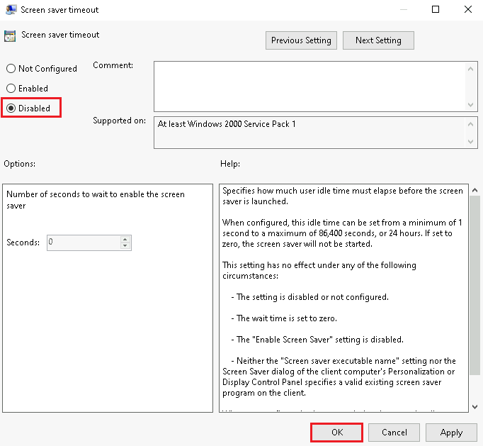

   > **注 : Contoso.com ドメインにリンク済みの、 [CONTOSO Standards GPO] では [Screen saver timeout (スクリーン セーバーのタイムアウト)] ポリシーを有効化し、600秒で設定しているため、競合が発生します。**

1. **[Group Policy Management Editor (グループ ポリシー管理エディター)]** ウィンドウを **×** で閉じます。

### オプション 2 : 優先順位を確認する

1. **[Group Policy Management (グループ ポリシーの管理)]**  画面に戻り、**Seattle OU** を確認します。

1. **[Group Policy Inheritance (グループ ポリシーの継承)]** タブを選択し、その内容を確認します。

   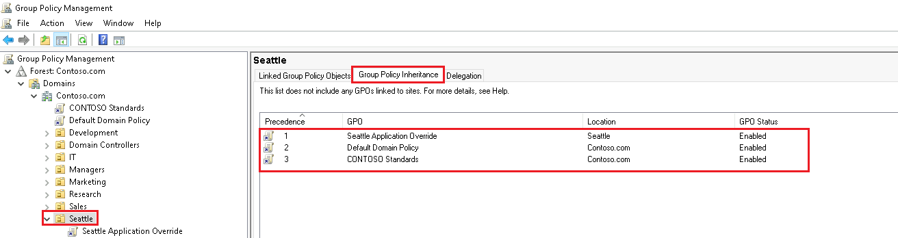

   > **注: Seattle Application Override GPO は CONTOSO Standards GPO より優先順位が高くなります。 Seattle Application Override GPO で構成したスクリーン セーバーのタイムアウト ポリシー設定は、CONTOSO Standards GPO の設定の後に適用されます。 そのため、 CONTOSO Standards GPO 設定は上書きされます。 Seattle Application Override GPO のスコープ内のユーザー(Ty Carlson)に対して、スクリーン セーバーのタイムアウトが無効になります。**

   ※余裕があれば、 **SEA-ADM1** からサインアウトし、 **CONTOSO\Ty**  ユーザーでサインインし、コントロールパネルからスクリーンセーバーの設定を確認してみてください。以下のように **[Wait (待ち時間)]** のグレーアウトが解除されていることが確認できます。

   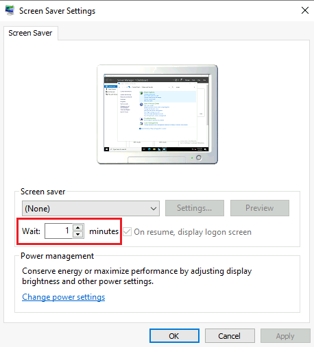

### オプション3: セキュリティ フィルター処理を使用して GPO のスコープを構成する

1. **SEA-ADM1** の **[Group Policy Management (グループ ポリシーの管理)]** コンソールのナビゲーション ペインで、 **Seattle OU** を展開し、**Seattle OU** にリンク済みの **Seattle Application Override GPO** を選択します。

   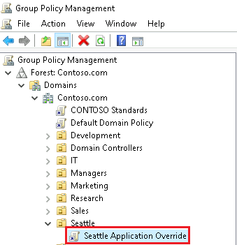

   

1. **「You have selected a link to a Group Policy Object (GPO). Except for changes to link properties, changes you make here are global to the GPO, and will impact all other locations where this GPO is linked.」 ([グループ ポリシー管理コンソール] ダイアログ ボックスで、グループ ポリシー オブジェクト (GPO) へのリンクを選択しました。リンク プロパティへの変更以外、ここで行われた変更は GPO にグローバルに適用され、この GPO がリンクされた他の場所すべてに影響します。)というメッセージが表示されたら、 [Do not show this message again(今後このメッセージを表示しない)]**にチェックを入れて  **[OK]** をクリックします。

1. **[Security Filtering (セキュリティ フィルター処理)]** セクションを確認し、**[Authenticated Users (認証されたユーザー)]** に GPO が既定で適用されることが確認できます。

   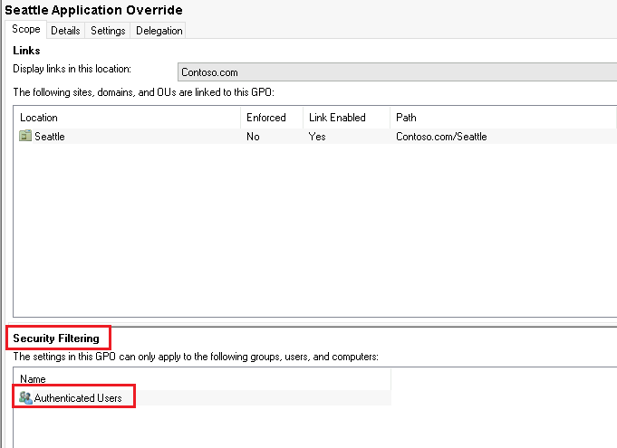

1. **[Security Filtering (セキュリティ フィルター処理)]** セクションで、**[Authenticated Users (認証されたユーザー)]** を選んでから **[Remove (削除)]** を選択します。

   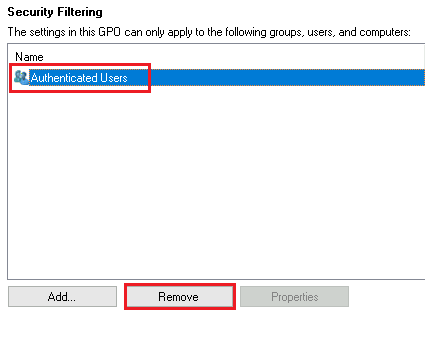

   **※削除を実行しようとすると、以下のような警告メッセージが表示されますが、そのまま [OK]をクリックします。**

   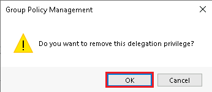

1.  更に、以下のような警告メッセージを確認してからもう一度 **[OK]** をクリックします。

   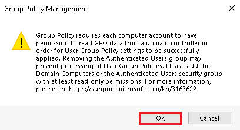

   > **注: 警告メッセージは、「グループ ポリシーでは、ユーザーの GPO 設定を正常に適用するために、各コンピューター アカウントにドメイン コントローラーから GPO データを読み取るアクセス許可が求められます。 GPO のセキュリティ フィルター処理設定を変更する場合は、注意してください。」と表示されています。**

1. **[Security Filtering (セキュリティ フィルター処理)]** セクションで、**[Add (追加)]** をクリックします。

   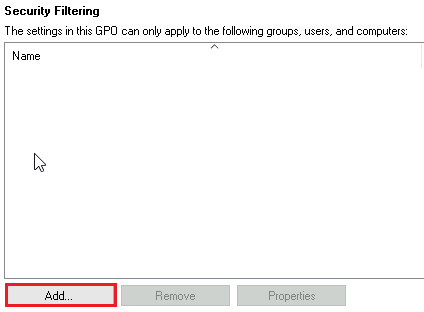

1. **[Select User, Computer, or Group (ユーザー、コンピューター、またはグループの選択)]** ダイアログ ボックスで、**[Enter the object name to select (選択するオブジェクト名を入力してください)]** テキスト ボックスに「**SeattleBranchUsers**」と入力してから、**[OK]** をクリックします。

   

1.  **[Security Filtering (セキュリティ フィルター処理)]** セクションに戻り、再度 **[Add (追加)]** をクリックします。

1. **[Select User, Computer, or Group (ユーザー、コンピューター、またはグループの選択)]** ダイアログ ボックスで、**[Object Types (オブジェクトの種類)]** をクリックします。

   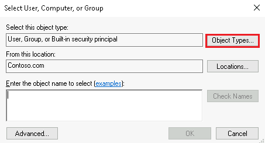

1. **[Object Types (オブジェクトの種類)]** ダイアログ ボックスで、**[Computers]** のチェックボックスをオンにしてから、**[OK]** をクリックします。

   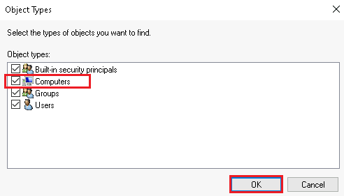

1. **[Select User, Computer, or Group (ユーザー、コンピューター、またはグループの選択)]** ダイアログ ボックスで、**[Enter the object name to select (選択するオブジェクト名を入力してください)]** ボックスに「**SEA-ADM1**」と入力してから **[OK]** をクリックします。

   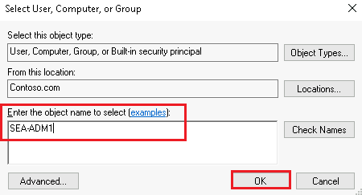

   ※Security Filtering に、コンピューターオブジェクトのSEA-ADM1とグループオブジェクトのSaettleBrunchUsersグループが追加されました。次のオプションの手順で必要なフィルター設定です。

### オプション4: 設定のシミュレーション結果を確認する

1.  **[Group Policy Management (グループ ポリシーの管理)]** で、**[Group Policy Modeling (グループ ポリシーのモデル作成)]** を選択します。

   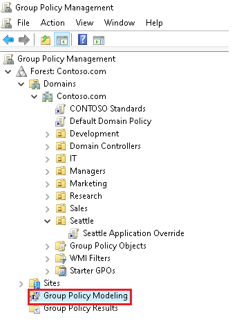

1. **[Group Policy Modeling (グループ ポリシーのモデル作成)]** のコンテキスト メニューを右クリックし、**[Group Policy Modeling Wizard (グループ ポリシーのモデル作成ウィザード)]** を選択します。

   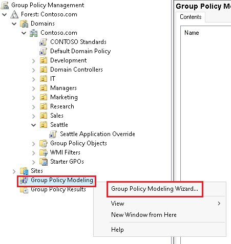

1. **[Group Policy Modeling Wizard (グループ ポリシーのモデル作成ウィザード)]**  画面では、**[Next (次へ)]** をクリックします。

1. **[Domain Controller Selection (ドメイン コントローラーの選択)]** 画面では、既定の設定のまま、**[Next  (次へ)]** をクリックします。

   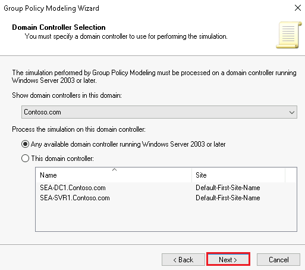

1. **[User and Computer Selection (ユーザーとコンピューターの選択)]** 画面の **[User information (ユーザー情報)]** セクションで、**[User]** を選択してから、テキスト ボックスに「**CONTOSO\Ty**」と入力するか、**[Browse (参照)]** ボタンを使用して **Ty** ユーザー アカウントを検索します。

   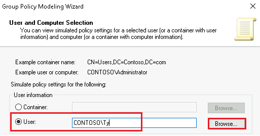

1. **[User and Computer Selection ユーザーとコンピューターの選択]** ページの **[Computer information (コンピューター情報)]** セクションで、**[Computer]** を選択し、テキスト ボックスに「**CONTOSO\SEA-ADM1**」と入力したあと、 **[Next (次へ)]** をクリックします。

   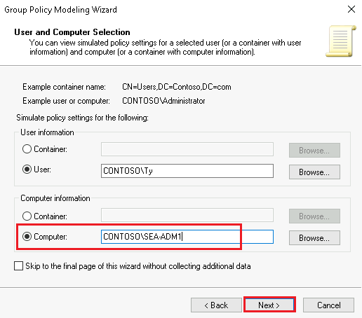

   

1. **[Advanced Simulation Options (詳細シミュレーション オプション)]** 画面では、既定の設定のまま、**[Next (次へ)]** をクリックします。

   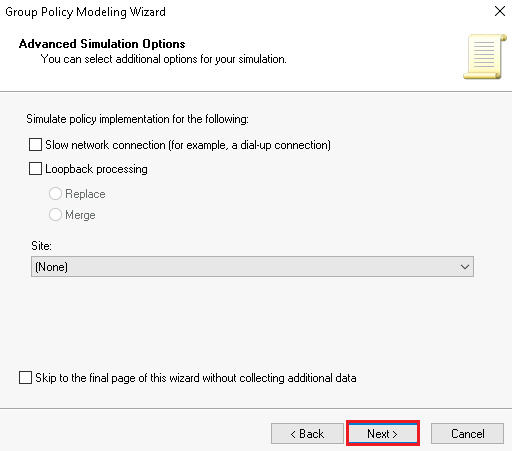

1. **[Alternate Active Directory Paths (代替 Active Directory パス)]** 画面の、ユーザーとコンピューターのロケーションを確認したら、 **[次へ]** をクリックします。(ユーザーロケーションはSeattle OU、コンピューターロケーションは Computers コンテナーが選択されているはずです。)

   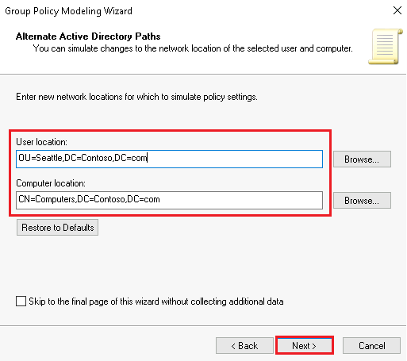

1. **[User Security Groups (ユーザー セキュリティ グループ)]** 画面で、グループのリストに **CONTOSO\\ SeattleBranchUsers** が含まれていることを確認してから、 **[Skip to the final page of this wizard without collecting additional data. (追加データを収集せずに、このウィザードの最終ページまでスキップします。)]**  のチェックボックスにチェックを入れ **[Next (次へ)]** を選択します。

   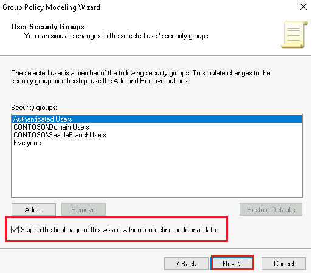

   

1. **[Summary of Selections (選択の要約)]** 画面で、**[Next (次へ)]** をクリックします。

1. メッセージが表示されたら、**[Finish (完了)]** をクリックします。

1. Group Policy Modeling に作成されたレポートの詳細ペインで、**[Details (詳細)]** タブを選択し、**[show all (すべて表示)]** を選択します。

   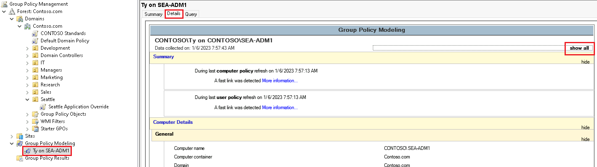

1. レポートで、 **[User Details (ユーザーの詳細)]** セクションが見つかるまで下にスクロールし、 **[Control Panel/Personalization (コントロールパネル/個人用設定)]** セクションを確認します。 **[Screen saver timeout]** 設定が無効になっており、優勢な GPO がSeattle Application Override GPO に設定されていることが確認できます。

   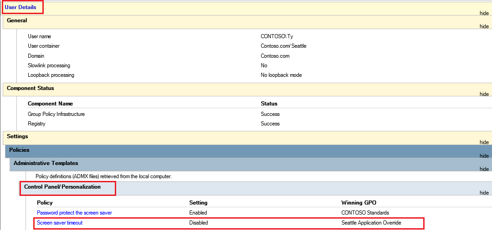

1. **[Group Policy Management (グループ ポリシーの管理)]** コンソールを閉じます。

**結果**: この演習が完了すると、GPO を正常に作成して構成し、結果を確認できたことになります。
