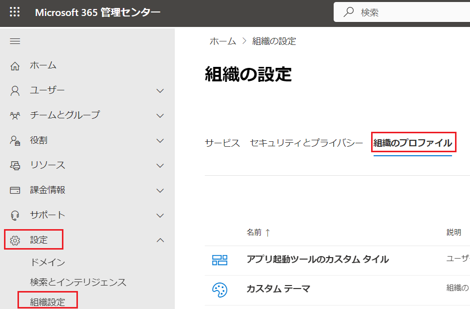
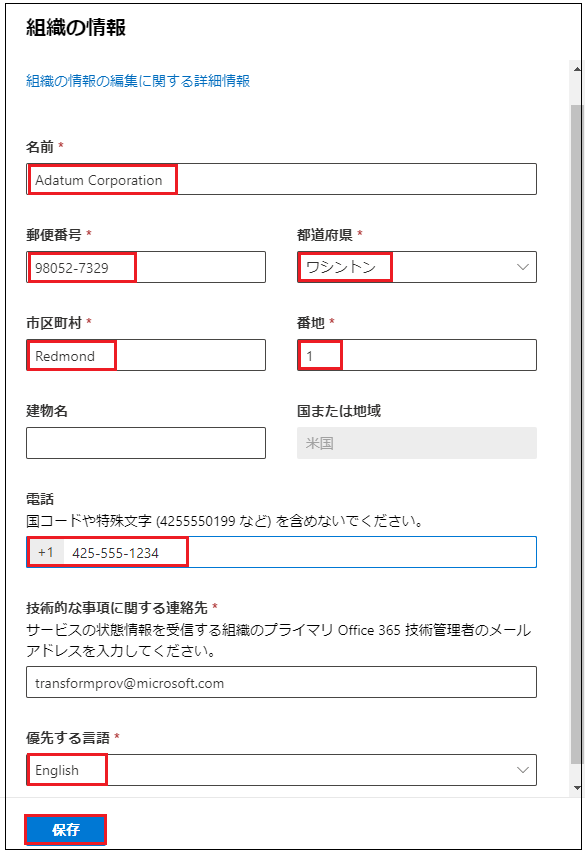
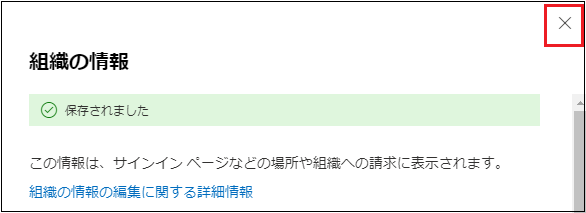
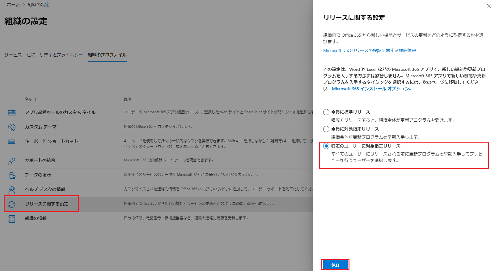
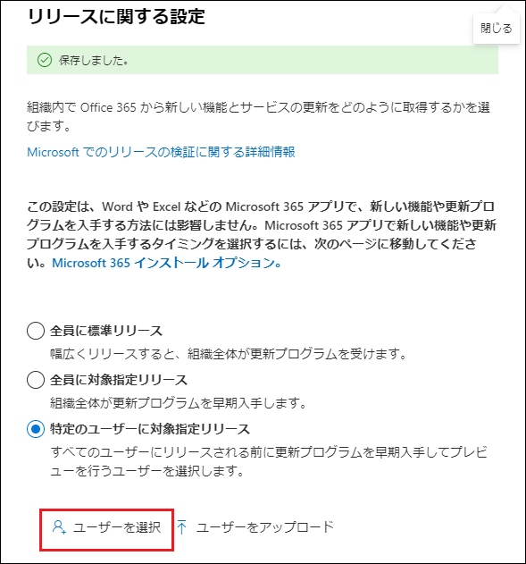
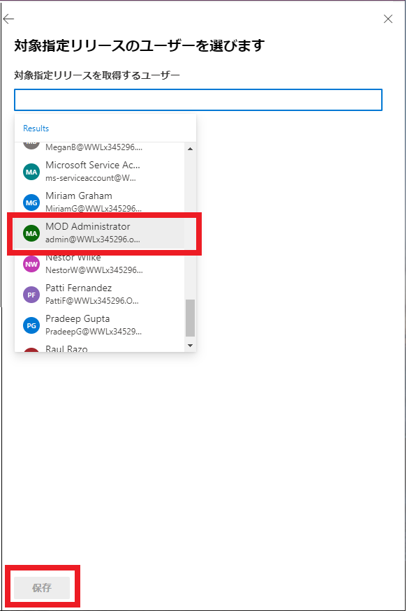
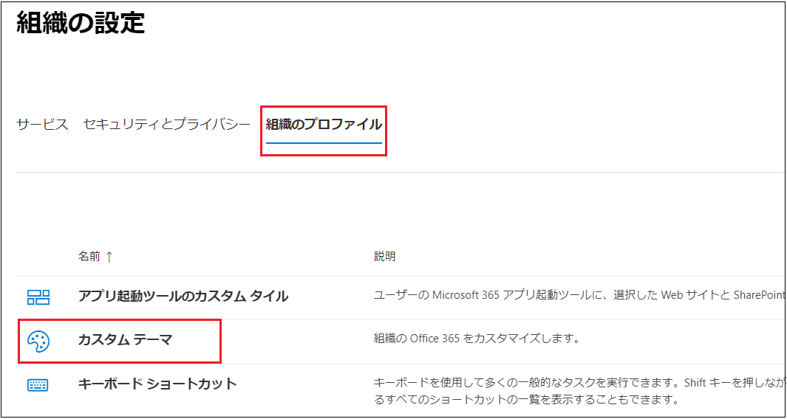
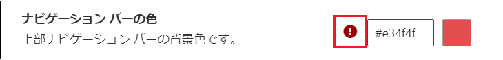

# Lab02: Microsoft 365 管理者アカウントの作成

## シナリオ

Holly Dicksonは、Adatum社のエンタープライズ管理者です。 Hollyは、Microsoft 365 MOD Administratorアカウントを使用して、Microsoft 365にサインインしていました。 但し、セキュリティの観点から、MOD Administratorアカウントを今後も使用し続けることは望ましくないため、Holly のMicrosoft 365ユーザーアカウントを作成し、グローバル管理者の役割を割り当てることにしました。

## 目標とタスク

このラボを完了すると、次のことができるようになります。

- Microsoft 365 ユーザーを作成する。

- Microsoft 365 ユーザーにライセンスを割り当てる。

- 作成したユーザーにMicrosoft 365 の管理者権限を割り当てる。

  

この演習の主なタスクは次のとおりです。

1. Microsoft 365 ユーザーの作成とライセンスの割り当て
2. Microsoft 365 管理センターで組織プロファイルを設定する

## 予想所要時間: 20 分

### タスク 1: Microsoft 365 ユーザーの作成とライセンスの割り当て

1. InPrivate ウィンドウ(Microsoft Edge) もしくは、シークレットウィンドウ (Google Chrome) で、Microsoft 365 管理センター (https://admin.microsoft.com) にアクセスし、Lab0 で取得した資格情報でサインインします。

   | 項目           | 値                                                           |
   | -------------- | ------------------------------------------------------------ |
   | **ユーザーID** | `admin@XXXXXXXXXXX.onmicrosoft.com`  @マーク以降のXXXXXXXXXは各自異なります。 |
   | **パスワード** | Lab 0でコピーしたパスワード                                  |

2. **[サインインの状態を維持しますか]** ページが表示された場合は、 **[いいえ]** をクリックします 。

3.  **[Microsoft 365管理センター]** の左ペインで、 **[ユーザー] - [アクティブなユーザー]** の順にクリックします。

   

4.  **[アクティブなユーザー]** ページで、 **[ユーザーの追加]** をクリックします。

5.  **[基本設定]** ページが表示されたことを確認し、次の情報を入力し、 **[次へ]** をクリックします。

   | 項目                                                         | 値                                                           |
   | ------------------------------------------------------------ | ------------------------------------------------------------ |
   | **姓**                                                       | Holly                                                        |
   | **名**                                                       | Dickson                                                      |
   | **表示名**                                                   | Holly Dickson  (このフィールドをクリックするとHolly Dickson と表示されるのでそのまま使用します) |
   | **ユーザー名**                                               | Holly                                                        |
   | **パスワードの設定**                                         | パスワードを自動作成する チェックボックスをオフ              |
   | **パスワード**                                               | Pa55w.rd1234                                                 |
   | **初回サインイン時にこのユーザーにパスワードの変更を要求する** | チェックボックスをオフ                                       |

   

6. **[製品ライセンスの割り当て]** ページで、次の情報を入力して、 **[次へ]** をクリックします。

   | 項目           | 値                      |
   | -------------- | ----------------------- |
   | **場所の選択** | 米国                    |
   | **ライセンス** | Microsoft 365 E5 をオン |

   

7. **[オプションの設定]** ページで、 **[役割(ユーザー：管理アクセス許可なし)]** の右横の **[∨]** をクリックして 展開し、 **[管理センターに対するアクセス許可]** のラジオボタンを選択します。

8.  **[グローバル管理者]** チェックボックスをオンにし、 **[次へ]** ボタンをクリックします。

9.  **「組織に全体管理者が5人います。」** というメッセージが表示されます。メッセージ内に表示される、 
      **「全体管理者を確認してください。」** のリンクをクリックします。

10.  **[グローバル管理者]** ページが表示されます。 **[割り当て済み]** タブ内に、グローバル管理者の権限が割り当てられているユーザーが5アカウント存在することが確認できます。

21. 

### タスク 2: Microsoft 365 管理センターで組織プロファイルを設定する

1. Microsoft 365 管理センターの左ペインから、 **[・・・すべて表示]** をクリックします。

   

2. **[設定] - [組織設定]** をクリックしてから、 **[組織のプロファイル]** タブを選択します。

   

3. **[組織のプロファイル]** タブ を下にスクロールし、 **[組織の情報]** をクリックします。

4. **[組織の情報]** ページで組織名が **[Contoso]** と表示されていることを確認したら、以下の項目を設定します。**※特に指示がないものは規定値のままで構いません。**
   入力したら、 **[保存]** をクリックします。

   | 項目                           | 値                                                           |
   | ------------------------------ | ------------------------------------------------------------ |
   | **名前**                       | Adatum Corporation ※Adatum と Corporation の間に半角スペースを入れてください。 |
   | **郵便番号**                   | 98052-7329                                                   |
   | **都道府県**                   | ワシントン                                                   |
   | **市区町村**                   | 規定値                                                       |
   | **番地**                       | 1                                                            |
   | **建物名**                     | なし                                                         |
   | **電話**                       | 425-555-1234                                                 |
   | **技術的な事項に関する連絡先** | 規定値                                                       |
   | **優先する言語**               | English                                                      |

   

5. **[組織の情報]** ページ上部に **「保存されました」** と表示されたことを確認し、 **[組織の情報]** ページを × で閉じます。

   

6. **[組織の設定]** ページで、 **[リリースに関する設定]** をクリックします。 **[リリースに関する]** ページで、 **[特定のユーザーに対象指定リリース]** を選択し、 **[保存]** をクリックします。

   

7. **[リリースに関する設定]** ページ上部に **「保存しました」** と表示されたことを確認したら、 下にスクロールし、 **[ユーザーを選択]** をクリックします。

   

8. **[対象指定リリースのユーザーを選びます]** ページで、 **[対象指定リリースを取得するユーザー]** ボックスをクリックし、一覧から以下のユーザーを順番に選択したら、 **[保存]** をクリックします。

   | 項目           | 値                |
   | -------------- | ----------------- |
   | **ユーザー名** | MOD Administrator |
   | **ユーザー名** | Alex Wilber       |
   | **ユーザー名** | Joni Sherman      |
   | **ユーザー名** | Lynne Robbin      |

   

9.  **[リリースに関する設定]** ページを、画面右上の  **[x]**  をクリックして閉じます。 

10.  **[組織のプロファイル]** タブが表示されていることを確認し、 **[カスタムテーマ]** をクリックします。

   

11.  **[組織のMicrosoft 365のカスタマイズ]** ページで、 **[ ＋ テーマを追加する]** をクリックします。 

12.  **[既定のテーマ]** ページで、 **[色]** タブをクリックし、 **[ナビゲーションバーの色]** の黒いボタンをクリックします。

13. カラーパレットから任意の色を選択します。 

    **※注意※以下のようにパレット内に警告マークが表示された場合、その色は推奨されないため、使用可能な色 (濃色)を選択してください。**

    

    色を選択したら、 **[保存]** ボタンをクリックします。

14.  **「変更内容が保存されました。」** というメッセージが表示されたことを確認して、 **[既定のテーマ]** ページを画面右上の **[x]** をクリックして閉じます。 

15.  **[F5] キー** を押して、ページを更新します。 

16. 画面上部のナビゲーションバーの色が変更されたことを確認します。

    

### **結果 : この演習を完了すると、Microsoft 365 管理ポータルの言語設定の変更や、組織プロファイルの設定変更ができるようになります。**
