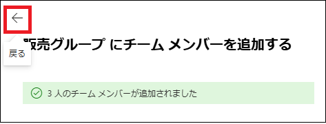

# Lab02: Microsoft 365 管理者アカウントの作成

## シナリオ

Holly Dicksonは、Adatum社のIT部門のエンタープライズ管理者です。 Hollyは、Microsoft 365 MOD Administratorアカウントを使用して、Microsoft 365にサインインしていました。 但し、セキュリティの観点から、MOD Administratorアカウントを今後も使用し続けることは望ましくないため、Holly のMicrosoft 365ユーザーアカウントを作成し、グローバル管理者の役割を割り当てることになりました。また、既にグローバル管理者の役割が割り当てられているNestor Wilkeは、別の部署に異動することとなったため、グローバル管理者の役割から外すことにします。Hollyにグローバル管理者の権限を割り当てた後、Holly のアカウントでサインインし、Microsoft 365 ユーザーとグループの作成、ユーザーにライセンスを割り当てができるか検証することにします。

## 目標とタスク

このラボを完了すると、次のことができるようになります。

- Microsoft 365 ユーザーを作成する。

- Microsoft 365 ユーザーにライセンスを割り当てる。

- 作成したユーザーにMicrosoft 365 の管理者権限を割り当てる。

  

この演習の主なタスクは次のとおりです。

1. Microsoft 365 ユーザーの作成とライセンスの割り当て
2. Microsoft 365グローバル管理者アカウントの確認
3. Microsoft 365ユーザーのパスワードリセットとグループを設定する

## 予想所要時間: 25 分

### タスク 1: Microsoft 365 ユーザーの作成とライセンスの割り当て

1. InPrivate ウィンドウ(Microsoft Edge) もしくは、シークレットウィンドウ (Google Chrome) で、Microsoft 365 管理センター (https://admin.microsoft.com) にアクセスし、事前に取得した資格情報でサインインします。

| 項目           | 値                                                           |
| -------------- | ------------------------------------------------------------ |
| **ユーザーID** | `admin@XXXXXXXXXXX.onmicrosoft.com`  @マーク以降のXXXXXXXXXは各自異なります。 |
| **パスワード** | 事前に取得したパスワード                                     |

2. **[サインインの状態を維持しますか]** ページが表示された場合は、 **[いいえ]** をクリックします 。

3. **[Microsoft 365管理センター]** の左ペインで、 **[ユーザー] - [アクティブなユーザー]** の順にクリックします。

4. **[アクティブなユーザー]** ページで、 **[ユーザーの追加]** をクリックします。

5. **[基本設定]** ページが表示されたことを確認し、次の情報を入力し、 **[次へ]** をクリックします。

| 項目                                                         | 値                                                           |
| ------------------------------------------------------------ | ------------------------------------------------------------ |
| **姓**                                                       | Holly                                                        |
| **名**                                                       | Dickson                                                      |
| **表示名**                                                   | Holly Dickson  (このフィールドをクリックするとHolly Dickson と表示されるのでそのまま使用します) |
| **ユーザー名**                                               | Holly                                                        |
| **パスワードを自動作成する**                                 | **オフ**                                                     |
| **パスワード**                                               | Pa55w.rd1234                                                 |
| **初回サインイン時にこのユーザーにパスワードの変更を要求する** | **オフ**                                                     |

6. **[製品ライセンスの割り当て]** ページで、次の情報を入力して、 **[次へ]** をクリックします。

| 項目           | 値                                                           |
| -------------- | ------------------------------------------------------------ |
| **場所の選択** | 米国                                                         |
| **ライセンス** | Microsoft 365 E5 (Teamsなし) と Microsoft Teams Enterprise をオン |

7. **[オプションの設定]** ページで、 **[役割(ユーザー：管理アクセス許可なし)]** の右横の **[∨]** をクリックして 展開し、 **[管理センターに対するアクセス許可]** のラジオボタンを選択します。

8. **[グローバル管理者]** チェックボックスをオンにし、 **[次へ]** ボタンをクリックします。

9. **[管理センターに対するアクセス許可]** の一覧で **[グローバル管理者]** のチェックボックスがオンになっていることを確認し、 **[次へ]** をクリックします。

10. **[確認と完了]** ページで設定内容を確認し、 **[追加の完了]** ボタンをクリックします。

11. **[Holly Dicksonがアクティブなユーザーに追加されました]** ページで、 **[閉じる]** ボタンをクリックします。

12. **[アクティブなユーザー]** の一覧で、 **[Holly Dickson]** をクリックします。

    (Holly Dickson が表示されていない場合、ブラウザーの画面更新が必要なことがあります。)

13. **[Holly Dickson]** の画面の **[アカウント]** タブに表示されている [`Holly@XXXXXXX.onmicrosoft.com`] をコピーし、メモ帳などに記録します。 

14. Microsoft 365 管理センターからサインアウトします。

### タスク 2: Microsoft 365グローバル管理者アカウントの確認

1. InPrivate ウィンドウ(Microsoft Edge) もしくは、シークレットウィンドウ (Google Chrome) で、Microsoft 365 管理センター (https://admin.microsoft.com) にアクセスし、以下の資格情報でサインインします。

| 項目           | 値                                                           |
| -------------- | ------------------------------------------------------------ |
| **ユーザー名** | `Holly@XXXXXXXXXXX.onmicrosoft.com`  @マーク以降のXXXXXXXXXは各自異なります。 |
| **パスワード** | Pa55w.rd1234                                                 |

2. **[サインインの状態を維持しますか]** ページが表示された場合は、 **[いいえ]** をクリックします 。

3.  > **※Microsoft 365管理センターが英語表記の場合は以下の3以降の手順で日本語表記に変更してください。日本語表記の場合は、このままタスク3に進んでください。**

4. 右上の **[Settings]** アイコンをクリックします。 

5. **[Settings]** ページで、 **[Language and time zone]** の **[Change your language]** をクリックします。 

6. **[My Account]** の **[Settings & Privacy]** ページが表示されたことを確認し、 **[Display Language]** をクリックします。

7. **[Change display language]** ボタンをクリックします。

8. **[Languages]** ページが表示されたことを確認し、 **[Search]** ボックスに **「Ja」** と入力します。 

9. 一覧から、 **[Japanese]** を選択します。

10. **[Select]** ボタンをクリックします。

11. **[Update display language]** メッセージボックスで、 **[Update]** ボタンをクリックします。 

12. **[日本語]** メッセージボックスで、 **[はい、今すぐサインアウト]** ボタンをクリックします。

13. **[Pick an account]** ページで、 **[Holly Dickson]** を選択します。 

14. Microsoft 365管理センターをサインアウトし、サインインし直します。

### タスク 3: Microsoft 365ユーザーのパスワードリセットとグループを設定する

1. Holly Dickson でMicrosoft 365管理センターにサインインした状態で、Microsoft 365 管理センター の左ペインから、 **[ユーザー] - [アクティブなユーザー]** を選択します。

2. **[アクティブなユーザー]** ページで、Alex Wilber の表示名にマウスを合わせた時に表示される、鍵アイコンをクリックします。

   

3. Alexの **[パスワードのリセット]** ページで、 **[パスワードを自動作成する]** と **[初回サインイン時にこのユーザーにパスワードの変更を要求する]** のチェックボックスをオフにします。

4. **[パスワード]** ボックスに **「Pa55w.rd1234」** と入力して、 **[パスワードのリセット]** をクリックします。 

5. **「パスワードがリセットされました」** と表示されたことを確認し、 **[閉じる]** ボタンをクリックします。 

6.  **[Joni Sherman]**  と **[Lynne Robbins]**  のアカウントでも、1 ～ 6 の手順を繰り返し、パスワードをリセットします。 

   > **注 : この設定をしていない場合、以降の手順で作業が進められない場合があります。**

7. Microsoft 365 管理センターの左ペインから、 **[チームとグループ] - [アクティブなチームとグループ]** を選択します。

8. **[アクティブなチームとグループ]** ページの、  **[TeamsとMicrosoft365のグループ]** タブの下にある **[チームを追加する]** をクリックします。

9.  **[基本設定]** ページが表示されたら、 **[名前]** ボックスに以下を入力して、 **[次へ]** をクリックします。**※ [説明] ボックスの入力は不要です。**

| 項目             | 値           |
| ---------------- | ------------ |
| **チームの名前** | 販売グループ |

10.  **[所有者の追加]** ページで、 **[所有者]** の下の枠をクリックします。 

11. 表示されるユーザーリストにて、次のユーザーを選択し、 **[次へ]** ボタンをクリックします。

| 項目       | 値           |
| ---------- | ------------ |
| **所有者** | Joni Sherman |

12. **[メンバーの追加]** ページでは何も選択せず、 **[次へ]** ボタンをクリックします。

13.  **[設定の編集]** ページで、次のように設定して、 **[次へ]** ボタンをクリックします。

| 項目                       | 値                                    |
| -------------------------- | ------------------------------------- |
| **チームのメールアドレス** | salesgroup (ドメイン名は変更しません) |
| **プライバシー**           | パブリック                            |

14. **[確認とチームの追加の完了]** ページで、 **[チームを追加]** ボタンをクリックします。 

15.  **「新しいチームが作成されました」** と表示されたことを確認し、 **[閉じる]** ボタンをクリックします。

16.  **[更新]** をクリックし、作成したグループが表示されたことを確認します。 

17.  **[アクティブなチームとグループ]** ページで、 **[販売グループ]** をクリックします。 

18. **[販売グループ]** ページで **[メンバーシップ]** タブおよび **[メンバー]** タブをクリックし、  **[メンバーの追加]** ボタンをクリックします。 

19. 検索欄に **[Alex]**  と入力し、リストされた **[Alex Wilber]** をクリックします。

20. **[Joni Sherman] 、 [Lynne Robbins]** も同様に検索し、結果をクリックします。

21.  **[追加(3)]** ボタンをクリックします。

22. 3人のメンバーが追加されたことを確認し、 **[販売グループにメンバーを追加する]** ページで、  **[ ← ]**  **(戻る)** をクリックします。

23. 再度 **[販売グループ]** を表示し、 前の手順で追加したユーザーがメンバーとして追加されていることを確認します。 

### **結果 : この演習を完了すると、Microsoft 365 ユーザーの作成、役割の割り当て、グループの設定ができます。**
