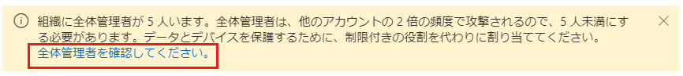
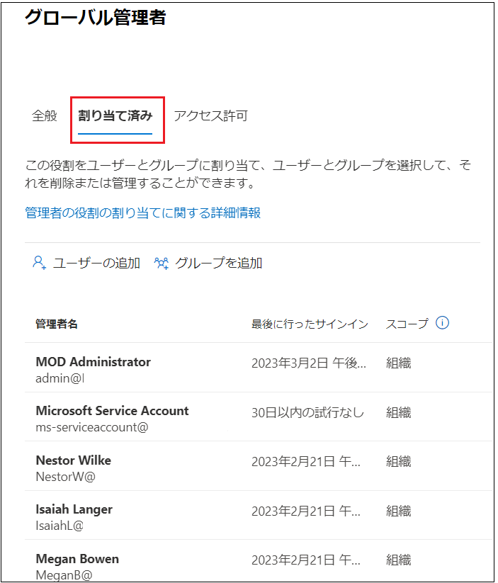
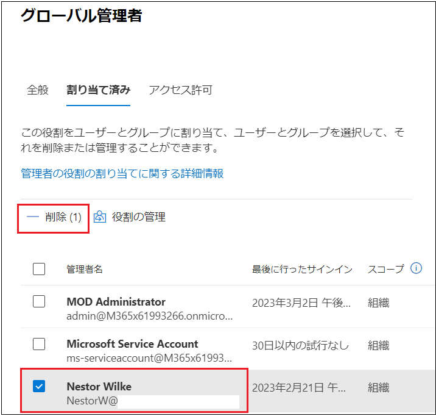

# Lab02: Microsoft 365 管理者アカウントの作成

## シナリオ

Holly Dicksonは、Adatum社のエンタープライズ管理者です。 Hollyは、Microsoft 365 MOD Administratorアカウントを使用して、Microsoft 365にサインインしていました。 但し、セキュリティの観点から、MOD Administratorアカウントを今後も使用し続けることは望ましくないため、Holly のMicrosoft 365ユーザーアカウントを作成し、グローバル管理者の役割を割り当てることになりました。その後、グローバル管理者の権限を割り当てたHolly のアカウントでサインインし、Microsoft 365 ユーザーとグループの作成、ユーザーにライセンスを割り当てができるか検証することにします。

## 目標とタスク

このラボを完了すると、次のことができるようになります。

- Microsoft 365 ユーザーを作成する。

- Microsoft 365 ユーザーにライセンスを割り当てる。

- 作成したユーザーにMicrosoft 365 の管理者権限を割り当てる。

  

この演習の主なタスクは次のとおりです。

1. Microsoft 365 ユーザーの作成とライセンスの割り当て
2. Microsoft 365グローバル管理者アカウントの確認
3. Microsoft 365ユーザーのパスワードリセットとグループを設定する

## 予想所要時間: 20 分

### タスク 1: Microsoft 365 ユーザーの作成とライセンスの割り当て

1. InPrivate ウィンドウ(Microsoft Edge) もしくは、シークレットウィンドウ (Google Chrome) で、Microsoft 365 管理センター (https://admin.microsoft.com) にアクセスし、Lab0 で取得した資格情報でサインインします。

   | 項目           | 値                                                           |
   | -------------- | ------------------------------------------------------------ |
   | **ユーザーID** | `admin@XXXXXXXXXXX.onmicrosoft.com`  @マーク以降のXXXXXXXXXは各自異なります。 |
   | **パスワード** | Lab 0でコピーしたパスワード                                  |

2. **[サインインの状態を維持しますか]** ページが表示された場合は、 **[いいえ]** をクリックします 。

3.  **[Microsoft 365管理センター]** の左ペインで、 **[ユーザー] - [アクティブなユーザー]** の順にクリックします。

   

4.  **[アクティブなユーザー]** ページで、 **[ユーザーの追加]** をクリックします。

5.  **[基本設定]** ページが表示されたことを確認し、次の情報を入力し、 **[次へ]** をクリックします。

   | 項目                                                         | 値                                                           |
   | ------------------------------------------------------------ | ------------------------------------------------------------ |
   | **姓**                                                       | Holly                                                        |
   | **名**                                                       | Dickson                                                      |
   | **表示名**                                                   | Holly Dickson  (このフィールドをクリックするとHolly Dickson と表示されるのでそのまま使用します) |
   | **ユーザー名**                                               | Holly                                                        |
   | **パスワードの設定**                                         | パスワードを自動作成する チェックボックスをオフ              |
   | **パスワード**                                               | Pa55w.rd1234                                                 |
   | **初回サインイン時にこのユーザーにパスワードの変更を要求する** | チェックボックスをオフ                                       |

   

6. **[製品ライセンスの割り当て]** ページで、次の情報を入力して、 **[次へ]** をクリックします。

   | 項目           | 値                      |
   | -------------- | ----------------------- |
   | **場所の選択** | 米国                    |
   | **ライセンス** | Microsoft 365 E5 をオン |

   

7. **[オプションの設定]** ページで、 **[役割(ユーザー：管理アクセス許可なし)]** の右横の **[∨]** をクリックして 展開し、 **[管理センターに対するアクセス許可]** のラジオボタンを選択します。

8.  **[グローバル管理者]** チェックボックスをオンにし、 **[次へ]** ボタンをクリックします。

9.  **「組織に全体管理者が5人います。」** というメッセージが表示されます。メッセージ内に表示される、 
      **「全体管理者を確認してください。」** のリンクをクリックします。

10.  **[グローバル管理者]** ページが表示されます。 **[割り当て済み]** タブ内に、グローバル管理者の権限が割り当てられているユーザーが5アカウント存在することが確認できます。

11.  **[管理者名]** の一覧から **[Nestor Wilke]** のチェックボックスをオンにし、 **[削除]** をクリックします。

　　

12. **[Nestor Wilke さんを外しますか?]** という画面が表示されたら、 **[削除]** をクリックします。

13. **[グローバル管理者]** 画面で、 **「Nestor Wilke さんがこの役割から削除されました。」** というメッセージが表示されていることを確認できたら、画面右上の **[×]** をクリックして画面を閉じます。

14. **[ユーザーを追加]** ページが表示されているブラウザーのタブに切り替えます。※Holly Dickson のアカウントにグローバル管理者の役割を割り当てる画面です。

15. **[管理センターに対するアクセス許可]** の一覧で **[グローバル管理者]** のチェックボックスがオンになっていることを確認し、 **[次へ]** をクリックします。

16. **[確認と完了]** ページで設定内容を確認し、 **[追加の完了]** ボタンをクリックします。

17. **[Holly Dicksonがアクティブなユーザーに追加されました]** ページで、 **[閉じる]** ボタンをクリックします。

18. **[アクティブなユーザー]** の一覧で、Holly Dickson をクリックします。

19. [Holly Dickson] の画面の [アカウント] タブに表示されている [`Holly@XXXXXXX.onmicrosoft.com`] をコピーし、メモ帳などに記録します。 

20. Microsoft 365 管理センターからサインアウトします。

### タスク 2: Microsoft 365グローバル管理者アカウントの確認

1. InPrivate ウィンドウ(Microsoft Edge) もしくは、シークレットウィンドウ (Google Chrome) で、Microsoft 365 管理センター (https://admin.microsoft.com) にアクセスし、以下の資格情報でサインインします。

   | 項目           | 値                                                           |
   | -------------- | ------------------------------------------------------------ |
   | **ユーザー名** | `Holly@XXXXXXXXXXX.onmicrosoft.com`  @マーク以降のXXXXXXXXXは各自異なります。 |
   | **パスワード** | Pa55w.rd1234                                                 |

2. **[サインインの状態を維持しますか]** ページが表示された場合は、 **[いいえ]** をクリックします 。

   > **※Microsoft 365管理センターが英語表記の場合は以下の3以降の手順で日本語表記に変更してください。日本語表記の場合は、このままタスク3に進んでください。**

3. 右上の **[Settings]** アイコンをクリックします。 

4. **[Settings]** ページで、 **[Language and time zone]** の **[Change your language]** をクリックします。 

5. **[My Account]** の **[Settings & Privacy]** ページが表示されたことを確認し、 **[Display Language]** をクリックします。

6. **[Change display language]** ボタンをクリックします。

7. **[Languages]** ページが表示されたことを確認し、 **[Search]** ボックスに **「Ja」** と入力します。 

8. 一覧から、 **[Japanese]** を選択します。

9. **[Select]** ボタンをクリックします。

10. **[Update display language]** メッセージボックスで、 **[Update]** ボタンをクリックします。 

11. **[日本語]** メッセージボックスで、 **[はい、今すぐサインアウト]** ボタンをクリックします。

12. **[Pick an account]** ページで、 **[Holly Dickson]** を選択します。 

13. Microsoft 365管理センターをサインアウトし、サインインし直します。

### タスク 3: Microsoft 365ユーザーのパスワードリセットとグループを設定する

1. Holly Dickson でMicrosoft 365管理センターにサインインした状態で、Microsoft 365 管理センター の左ペインから、 **[ユーザー] - [アクティブなユーザー]** を選択します。

2. **[アクティブなユーザー]** ページで、Alex Wilber の表示名にマウスを合わせた時に表示される、鍵アイコンをクリックします。

   

3. Alexの **[パスワードのリセット]** ページで、 **[パスワードを自動作成する]** チェックボックスをオフにします。

4. **[パスワード]** ボックスに **「Pa55w.rd1234」** と入力して、 **[初回サインイン時にこのユーザーにパスワードの変更を要求する]** チェックボックスをオフにします。 

5. **[パスワードのリセット]** をクリックします。

6. **「パスワードがリセットされました」** と表示されたことを確認し、 **[閉じる]** ボタンをクリックします。 

7.  **[Joni Sherman]**  と **[Lynne Robbins]**  のアカウントでも、1 ～ 6 の手順を繰り返し、パスワードをリセットします。 

   > **注 : この設定をしていない場合、以降の手順で作業が進められない場合があります。**

8. Microsoft 365 管理センターの左ペインから、 **[チームとグループ] - [アクティブなチームとグループ]** を選択します。

9.  **[アクティブなチームとグループ]** ページで、 **[グループの追加]** をクリックします。

10.  **[グループの種類の選択]** ページで、 **[Microsoft 365(推奨)]** が選択されていることを確認し、  **[次へ]** ボタンをクリックします。 

11.  **[基本設定]** ページが表示されたら、 **[名前]** ボックスに以下を入力して、 **[次へ]** をクリックします。**※ [説明] ボックスの入力は不要です。**

    | 項目     | 値           |
    | -------- | ------------ |
    | **名前** | 販売グループ |

12.  **[所有者の割り当て]** ページで、 **[ ＋ 所有者の割り当て]** をクリックします。 

13. ユーザー一覧から、次のユーザーのチェックボックスをオンにし、 **[追加(1)]** ボタンをクリックします。

    | 項目   | 値           |
    | ------ | ------------ |
    | 所有者 | Joni Sherman |

 **[所有者の割り当て]** ページに戻ったら、 **[次へ]** ボタンをクリックします。

14. **[メンバーの追加]** ページで、 **[次へ]** ボタンをクリックします。

15.  **[設定の編集]** ページで、次のように設定して、 **[次へ]** ボタンをクリックします。

    | 項目                                     | 値                                    |
    | ---------------------------------------- | ------------------------------------- |
    | **グループのメールアドレス**             | salesgroup (ドメイン名は変更しません) |
    | **プライバシー **                        | パブリック                            |
    | **グループへのMicrosoft Teams への追加** | 規定値                                |

16. **[確認とグループの追加の完了]** ページで、 **[グループを作成]** ボタンをクリックします。 

17.  **「新しいグループが作成されました」** と表示されたことを確認し、 **[閉じる]** ボタンをクリックします。

18.  **[更新]** をクリックし、作成したグループが表示されたことを確認します。 

19.  **[アクティブなチームとグループ]** ページで、 **[販売グループ]** をクリックします。 

20. **[販売グループ]** ページで **[メンバーシップ]** タブおよび **[メンバー]** タブをクリックし、  **[メンバーの追加]** ボタンをクリックします。 

21. 検索欄に **[Alex]**  と入力し、リストされた **[Alex Wilber]** をクリックします。

22. **[Joni Sherman] 、 [Lynne Robbins]** も同様に検索し、結果をクリックします。

23.  **[追加(3)]** ボタンをクリックします。

24. 3人のメンバーが追加されたことを確認し、 **[販売グループにメンバーを追加する]** ページで、  **[閉じる]** ボタンをクリックします。 

25. **[販売グループ]** ページの **[メンバーシップ]** タブに、 **[Alex Wilber] 、 [Joni Sherman] 、 [Lynne Robbin]** がメンバーに追加されているのが確認できたら、画面右上の **[ × ]** で閉じます。

### **結果 : この演習を完了すると、Microsoft 365 ユーザーの作成、。**
