---
lab:
  title: 'ラボ: AD DS と Azure AD の統合の実装'
  module: 'Module 2: Implementing Identity in Hybrid Scenarios'
---

# Lab2b: Azure AD 統合のためのオンプレミス AD DS の準備

## シナリオ

あなたは、既存の Active Directory 環境で Azure AD との統合の準備ができていることを確認する必要があります。 そのため、IdFix ツールを実行し、Active Directory ユーザーの UPN が Azure AD テナントのカスタム ドメイン名と一致することを確保します。

## 目標とタスク

このラボを完了すると、次のことができるようになります。

- IdFix DirSync エラー修復ツールの実行を含め、オンプレミス AD DS と Azure AD の統合の準備を行う。

この演習の主なタスクは次のとおりです。

1. IdFix をインストールする。
1. IdFix を実行する。

## 予想所要時間: 10 分

## アーキテクチャの図

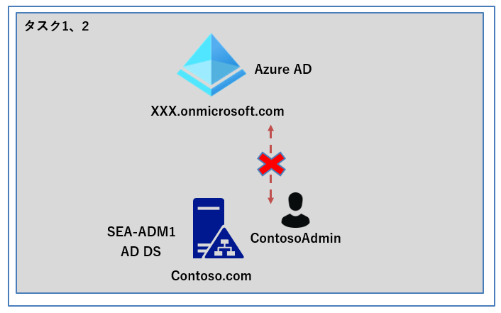

## ラボのセットアップ

使用する仮想マシン: **SEA-ADM1**  

1. **SEA-ADM1** を選択します。
1. **SEA-ADM1** に次の資格情報を使用してサインインします。
   - ユーザー名: **Administrator**
   - パスワード: **Pa55w.rd**
   - ドメイン: **CONTOSO**

このラボでは、仮想マシンと Azure AD テナントを使用します。 

### **事前準備 : ContosoAdminの [Display Name 属性] を確認する。**

1.  **SEA-ADM1** に CONTOSO\Administrator でサインインしている状態で、 **[Server Manager]** を起動し、 **[Tools (ツール)] - [Active Directory Users and Computers (Active Directory ユーザーとコンピューター)]** を選択します。

2.   **[Contoso.com] - [Users]** の順に展開し、「 **ContosoAdmin** 」をダブルクリックしてプロパティを確認します。

   

3.  **[General(全般)]** タブの **[Display Name (表示名)]** の属性が空欄になっていることを確認したら、 [OK] をクリックしてプロパティを閉じます。

   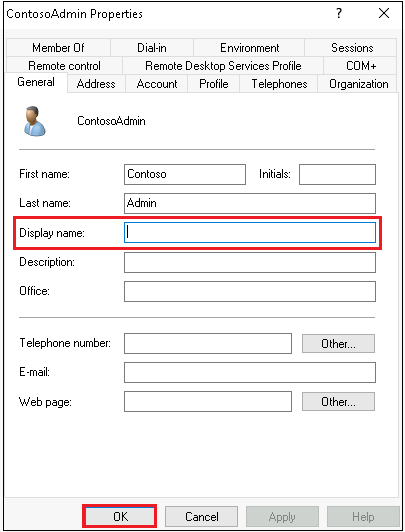

### タスク 1: IdFix をインストールする

1. **SEA-ADM1** に CONTOSO\Administraor でサインインし Microsoft Edge を起動します。 Microsoft Edge が起動したら、`https://github.com/microsoft/idfix` にアクセスします。

1. **Github** ページを下にスクロールし、 **[ClickOnce Launch]** で、**[launch]** のリンク をクリックします。

   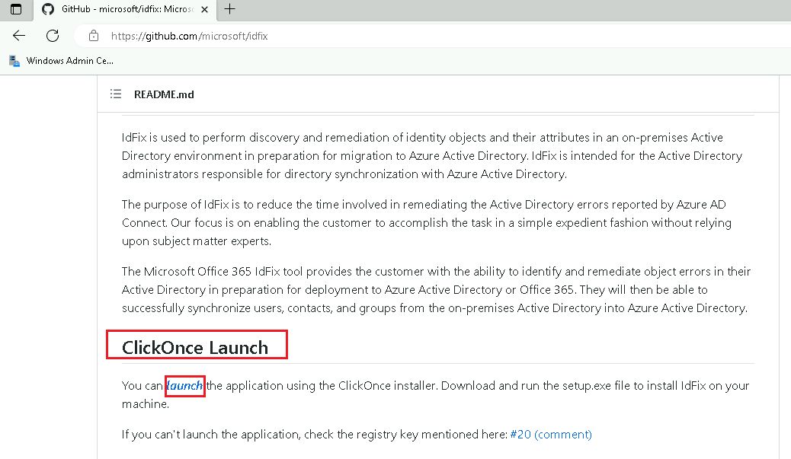

1. Microsoft Edge のステータスバーに表示される **[Open file]** をクリックします。

   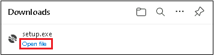

1. [Application Install - Security Warning] ダイアログボックスで [Install] をクリックします。

   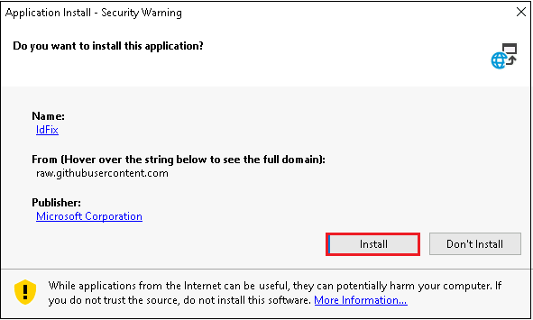

1. **[ IdFix Privacy Statement ]** ダイアログ ボックスで、免責事項を確認し、**[OK]** を選択します。

   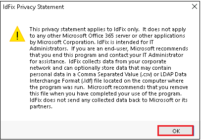

### タスク 2: IdFix を実行する

1. **IdFix** が起動したら、ウィンドウから **[Query]** を選択します。

   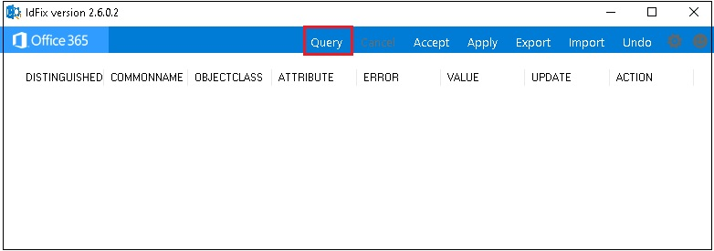

   **※ [Schema Warning] の警告ダイアログボックスが表示された場合は、 [Yes] をクリックして閉じてください。** 

1. オンプレミス Active Directory のオブジェクトの一覧で **[ERROR]** 列 および **[ATTRIBUTE (属性)]** 列を確認します。 

   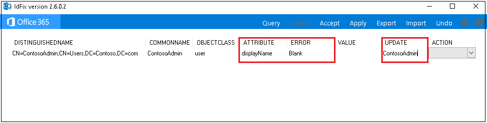

   > **注 :** このシナリオでは、**ContosoAdmin** の **displayName** の値が **空白 (Blank)** となっており、ツールが推奨する値 (ContosoAdmin) が **[UPDATE]** 列に表示されます。
   >
   > **注 : ERROR 列の Blank は、必要な個所(DisplayName) に値が入力されていないことを意味します。** 事前準備で確認した通り、ContosoAdminのDisplayName 属性は未入力の状態のため、入力を促されるエラーが表示されました。

   

1. **IdFix** ウィンドウの、**[ACTION] **ドロップダウン メニューで **[Edit (編集)]** を選択し、**[Apply (適用]** をクリックすると、推奨される値の変更が自動的に実装されます。

   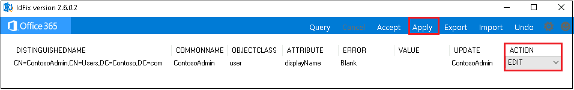

1. **[Apply Pending (保留中の適用)]** ダイアログボックスが表示されたら、 **[Yes]** をクリックします。

   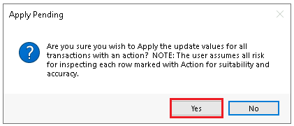

1. **IdFix** ウィンドウの、 **[ACTION]** ドロップダウン メニューが **[COMPLETE]** に変更されたことを確認し、ウィンドウを × で閉じます。

   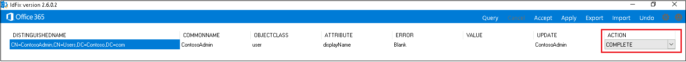

1. **[Active Directory Users and Computers (Active Directory ユーザーとコンピューター)]** に戻り、ContosoAdminのプロパティを再度確認すると、IdFixツールで更新した、**[Display Name (表示名)]** 属性に **「ContosoAdmin」** と入力されていることが確認できます。確認できたら、**[OK]** をクリックしてプロパティと、 **[Active Directory Users and Computers (Active Directory ユーザーとコンピューター)]** を閉じます。

   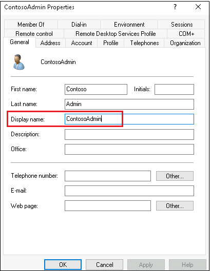

**※ 結果が確認出来たら、次の演習に進んでください。**
