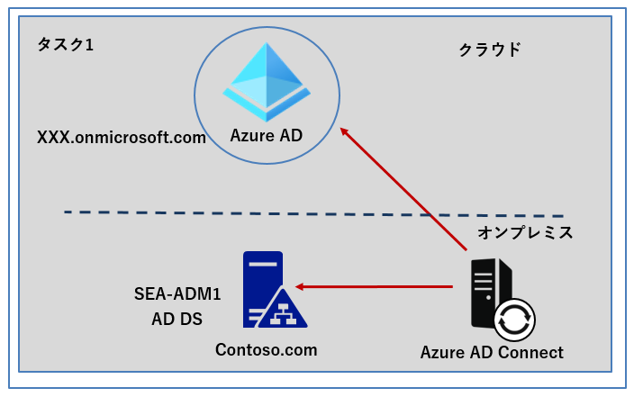
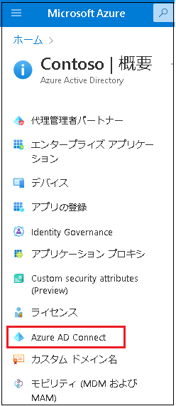
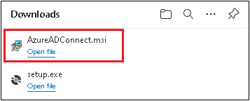
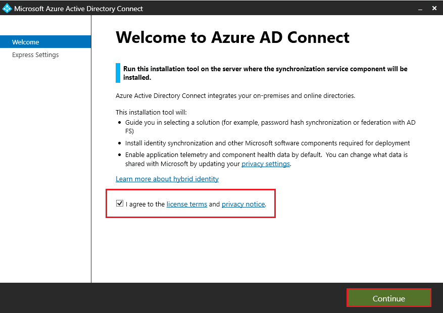
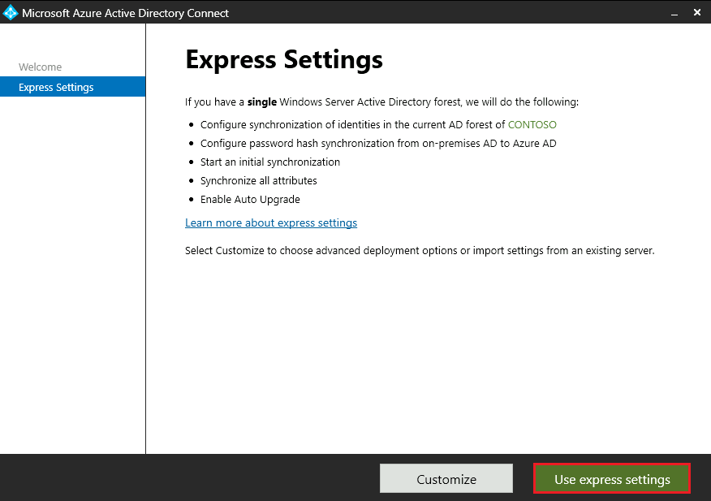
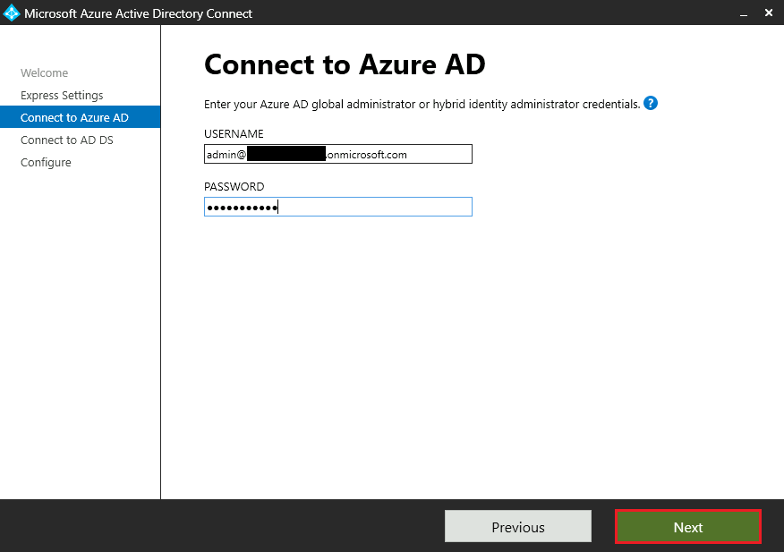
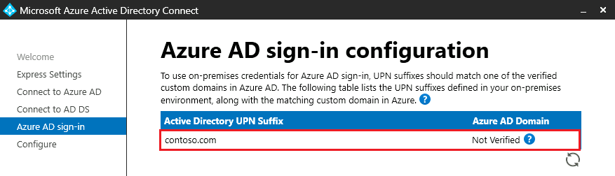
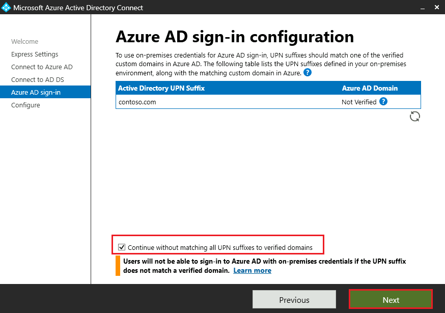
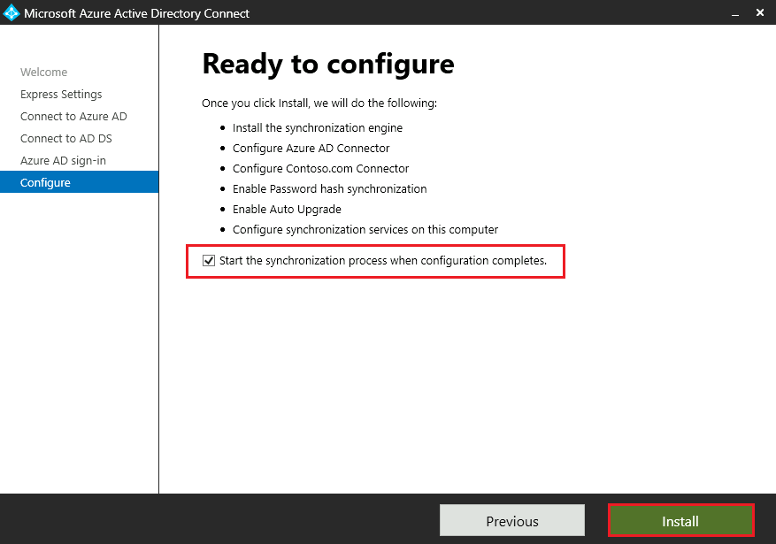

---
lab:
  title: 'ラボ: AD DS と Azure AD の統合の実装'
  module: 'Module 2: Implementing Identity in Hybrid Scenarios'
---

# Lab2c : Azure AD Connect のダウンロード、インストール、構成

## シナリオ

Azure AD Connect をダウンロードし、**SEA-ADM1** にインストールし、設定を構成します。

## 目標とタスク

このラボを完了すると、次のことができるようになります。

- Azure AD Connect をインストールし、構成する。

  

この演習の主なタスクは次のとおりです。

1. Azure AD Connect をインストールし、構成する。

## 予想所要時間: 15 分

## アーキテクチャの図

## ラボのセットアップ

使用する仮想マシン: **SEA-ADM1**  

1. **SEA-ADM1** を選択します。
1. **SEA-ADM1** に次の資格情報を使用してサインインします。
   - ユーザー名: **Administrator**
   - パスワード: **Pa55w.rd**
   - ドメイン: **CONTOSO**

このラボでは、仮想マシンと Azure AD テナントを使用します。 

### タスク 1: Azure AD Connect のインストールと構成

1. **SEA-ADM1** で Microsoft Edge を起動し 、Azure Portal  `https://portal.azure.com`にログインします。(ログイン情報は、ラボ内で提供されているものを使用してください。) Azure Portal の検索ボックスで **[Azure Active Directory]** を検索し、左のナビゲーションペインの一覧から  **[Azure AD Connect]** を参照します。

   ※必要に応じ、Azure Portal の右上にある歯車マーク(設定)から、言語を日本語に変更してください。

   

   

1. **[Azure AD Connect]** ページの左ペインから **[Connect 同期]** を選択し、**[Azure AD Connect のダウンロード]** リンクをクリックします。

1. **[Microsoft Azure Active Directory Connect]** ページで、 **[Download]** をクリックします。

   

1. ステータス バーで、**[AzureAD Connect.msi]** ファイルの  **[Open file]** を選択します。

   

1. Azure AD Connect インストール バイナリーをダウンロードし、インストールを開始します。

1. **[Welcome to Azure AD Connect]** 画面で、**[ I agree to the license terms and privacy notice (ライセンス条項とプライバシーに関する声明に同意します)]** チェックボックスをオンにし、**[Continue (続行)]** を選択します。

   

1. **[Express Settings (簡易設定)]** ページで、**[Use express settings (簡易設定を使用する)]** をクリックします。

   

1. **[Connect to Azure AD (Azure AD への接続)]** 画面で、Azure AD のグローバル管理者アカウントの資格情報を入力、 **[Next (次へ)]** をクリックします。(資格情報はラボの [Home] 上で提供されているものを使用してください。)

   

1. **[Connect to AD DS (AD DS への接続)]** ページで、次の資格情報を入力し、 **[Next (次へ)]** をクリックします。

   | 設定                  | 値                         |
   | --------------------- | -------------------------- |
   | USERNAME (ユーザー名) | **CONTOSO\\Administrator** |
   | PASSWORD (パスワード) | **Pa55w.rd**               |

1. **[Azure AD sign-in configuration (Azure AD サインイン構成)]** ページで、追加した新しいドメイン  **(contoso.com)** が Active Directory UPN サフィックスの一覧に含まれていることを確認します。

   

   > **注**:追加したドメインは、 演習1のタスク1で追加したカスタムドメイン名です。状態が [Not Verified (未確認)] と表示されますが、検証済みドメインである必要はありません。 尚、通常は Azure AD Connect をインストールする前にドメインの検証しますが、このラボでは検証手順は不要です。カスタムドメイン名の検証については、ドメインレジストラーへのDNSのレコードの登録等が必要です。詳細は [参考URL](https://learn.microsoft.com/ja-jp/azure/active-directory/fundamentals/add-custom-domain#add-your-dns-information-to-the-domain-registrar) をご参照ください。

1. **[Continue without matching all UPN suffixes to verified domains (一部の UPN サフィックスが検証済みドメインに一致していなくても続行する)]** チェックボックスをオンにして、 **[Next (次へ)]** をクリックします。

    

1. **[Ready to configure (構成の準備完了)]** 画面が表示された後、アクションの一覧を確認し、**[Start the synchronaization process when configuration completes. (構成が完了したら、同期プロセスを開始します。)]** のチェックボックスにチェックが入っていることを確認してから、インストールを開始します。

    **※インストールが完了するまでに5分程度要します。**

    

1. **[Configuration complete (設定完了)]** 画面が表示されたら、 **[Exit]** をクリックして終了します。

>  **注 : インストールが完了するまでに、5分以上かかる場合があります。**
>

※ インストールが完了したら演習は終了です。お疲れさまでした。
