---
lab:
  title: 'ラボ: AD DS と Azure AD の統合の実装'
  module: 'Module 2: Implementing Identity in Hybrid Scenarios'
---

# <a name="lab-implementing-integration-between-ad-ds-and-azure-ad"></a>Lab2d: AD DS と Azure AD の統合の検証

## <a name="scenario"></a>シナリオ

Azure AD Connect をインストールして構成したので、同期のメカニズムを確認できるようになりました。 あなたは、同期をトリガーするオンプレミスのユーザー アカウントに変更を加える予定です。 次に、対応する Azure AD ユーザー オブジェクトに変更がレプリケートされていることを確認します。

## <a name="objectives"></a>目標とタスク

このラボを完了すると、次のことができるようになります。

- 同期プロセスをテストして、AD DS とAzure AD の統合を検証する。

この演習の主なタスクは次のとおりです。

1. Azure portal で同期を検証する。
1. Synchronization Service Manager で同期を検証する。
1. Active Directory でユーザー アカウントを更新する。
1. Active Directory でユーザー アカウントを作成する。
1. Azure AD に変更を同期する。
1. Azure AD での変更を検証する。

## <a name="estimated-time-60-minutes"></a>予想所要時間: 25 分

## <a name="architecture"></a>アーキテクチャの図

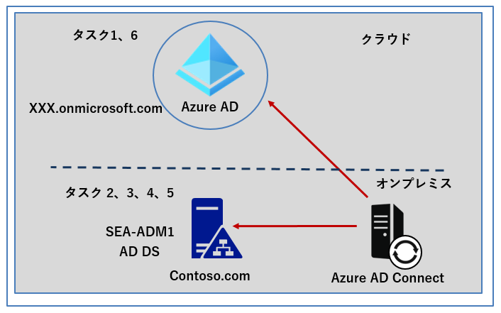

## <a name="lab-setup"></a>ラボのセットアップ

使用する仮想マシン: **SEA-ADM1**  

1. **SEA-ADM1** を選択します。
1. **SEA-ADM1** に次の資格情報を使用してサインインします。
   - ユーザー名: **Administrator**
   - パスワード: **Pa55w.rd**
   - ドメイン: **CONTOSO**

このラボでは、仮想マシンと Azure AD テナントを使用します。 

   

### <a name="task-1-verify-synchronization-in-the-azure-portal"></a>タスク 1: Azure portal で同期を検証する

1. **SEA-ADM1** で、Azure portal が表示されている Microsoft Edge ウィンドウに切り替えます。 

1. **Azure AD Connect** ページを更新し、左ナビゲーションペイン **[Connect同期]** ページを選択し、 **[Active Directory からのプロビジョニング]** の下の情報の **[同期状態]** が **[有効]** となっていることを確認します。※有効が確認できない場合は、ブラウザ更新を実行してください。

   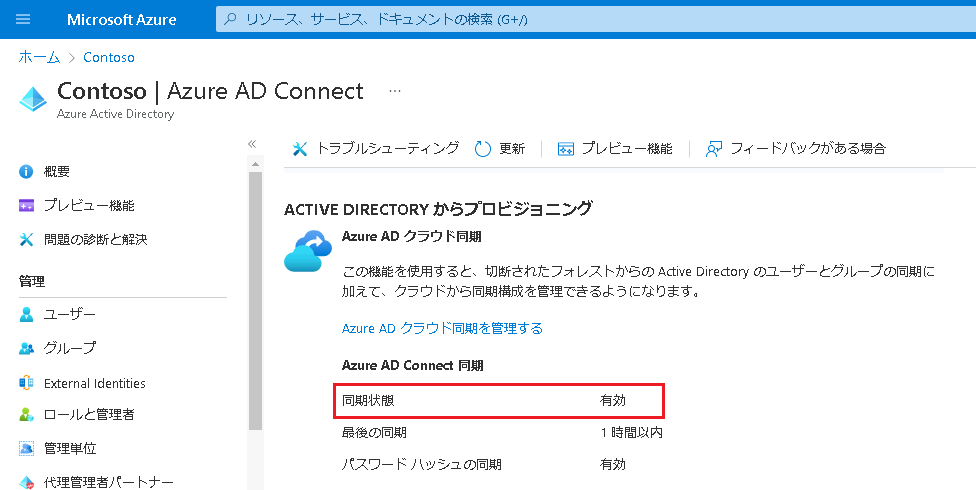

1.  **[Azure Active Directory]** に戻り、 **[ユーザー]** を選択します。

1. Active Directory の Contoso.com ドメインから同期されたユーザーの一覧が表示されます。

   > **注**: ディレクトリ同期が開始されると、Active Directory オブジェクトが Azure AD Portalに表示されるまでに 15 分以上要する場合があります。

1. Azure Active Directory に戻り、左ナビゲーションペインの一覧から **[グループ]**  を参照します。

   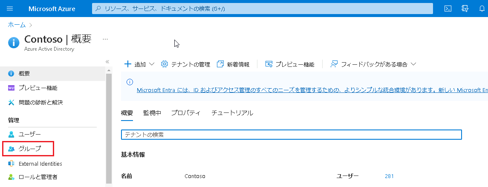

1. Active Directory の Contoso.com ドメインから同期されたグループの一覧を確認します。

   **注: オンプレミスドメインの OU が、Azure AD のグループとして同期されていることが確認できます。(例 : Sales OU、Research OU などがセキュリティグループとして同期されています。)**

### <a name="task-2-verify-synchronization-in-the-synchronization-service-manager"></a>タスク 2: Synchronization Service Manager で同期を検証する

1. **SEA-ADM1** の **[スタート]** メニューで、**[Azure AD Connect]** を展開し、**[Synchronization Service (同期サービス)]** を選択します。

   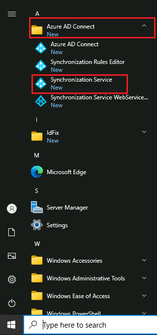

1. **[Synchronization Service Manager]** ウィンドウの **[Operations (操作)]** タブで、Active Directory オブジェクトを同期するために実行されたタスクが確認できます。

   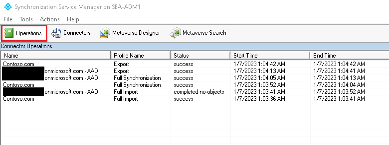

1. **[Connectors (コネクタ)]** タブを選択し、2 つのコネクタが存在することを確認します。

   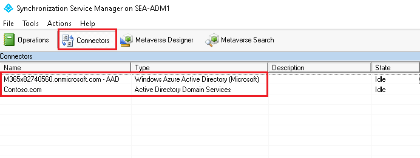

   > **注: 1 つのコネクタが AD DS 用で、もう 1 つは Azure AD テナント用です。** 

1. コネクタを確認したら、 **[Synchronization Service Manager]** ウィンドウを閉じます。

### <a name="task-3-update-a-user-account-in-active-directory"></a>タスク 3: Active Directory でユーザー アカウントを更新する

1. **SEA-ADM1** の **[Server Manager (サーバー マネージャー)]** で  **[Active Directory Users and Computers (Active Directory ユーザーとコンピューター)]** を起動します。

1. **[Active Directory ユーザーとコンピューター]** で、**Sales** 組織単位 (OU) を展開し、ユーザーの **Ben Miller** をダブルクリック、もしくは右クリックをしてプロパティを表示させます。

   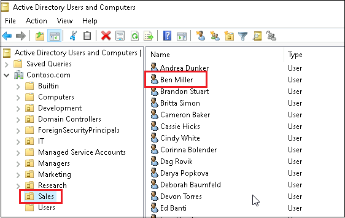

1. ユーザーのプロパティで、 **[Organization (組織)]** タブを選択します。

1. **[Job Title (役職)]** テキストボックスに「**Manager**」と入力し、**[OK]** をクリックします。

   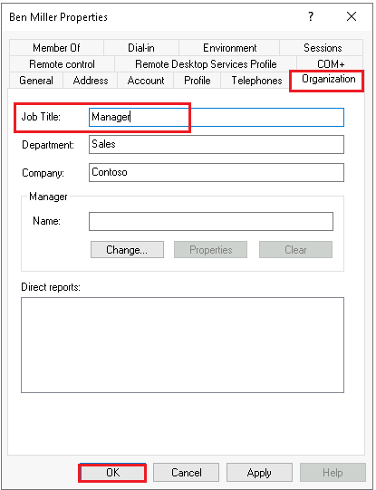

### <a name="task-4-create-a-user-account-in-active-directory"></a>タスク 4: Active Directory でユーザー アカウントを作成する

1.   **SEA-ADM1** の **[Server Manager (サーバー マネージャー)]** で  **[Active Directory Users and Computers (Active Directory ユーザーとコンピューター)]** を起動します。

2.  Sales OU を右クリックして、 **[New] - [User]** の順に選択します。

   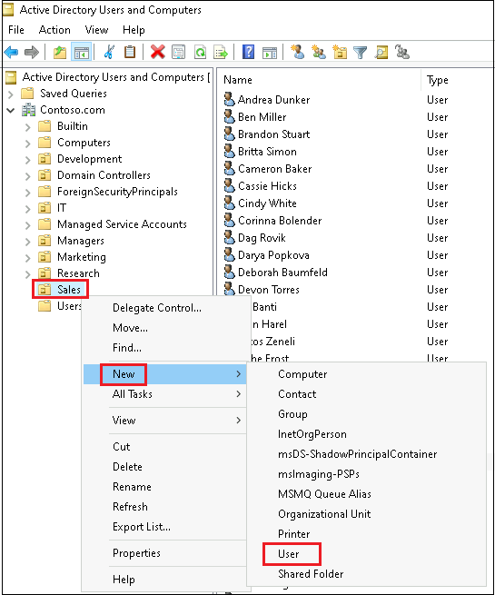

3. [New Object - User] ダイアログボックスに以下を入力して、 **[Next]** をクリックします。

   | First name          | Jordan       |
   | ------------------- | ------------ |
   | **Last name**       | **Mitchell** |
   | **User logon name** | **Jordan**   |

   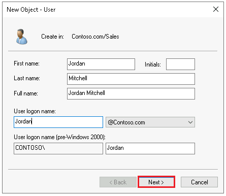

4. パスワードを **Pa55w.rd** と設定して **[Next]** をクリックします。

   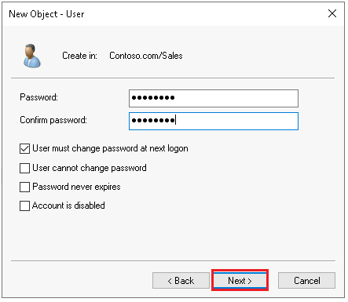

5. 作成したら、 **[Finish]** をクリックしてダイアログボックスを閉じます。

### <a name="task-5-sync-changes-to-azure-ad"></a>タスク 5: Azure AD に変更を同期する

1. **SEA-ADM1** で、管理者として **Windows PowerShell** を起動します。
1. **Windows PowerShell** コンソールで、次のコマンドレットを実行し、Contoso.com ドメインで変更したユーザー情報や作成したユーザーアカウントを同期します。

   ```powershell
   Start-ADSyncSyncCycle
   ```

   > **注**: 同期サイクルの開始後、Active Directory オブジェクトが Azure AD ポータルに表示されるまでに 15 分程度要することがあります。

3. 実行結果に **[Success]** と返ってきたら、Windows PowerShell コンソールを × で閉じて終了します。

### <a name="task-6-verify-changes-in-azure-ad"></a>タスク 6: Azure AD での変更を検証する

1. **SEA-ADM1** で、Microsoft Edge ウィンドウに切り替えて Azure portal を表示し、**[Azure Active Directory]** ページに戻ります。

1. **[Azure Active Directory]** ページから **[ユーザー]** ページを参照します。

1. **[すべてのユーザー]** ページで、ユーザー **Ben Miller** を検索します。

   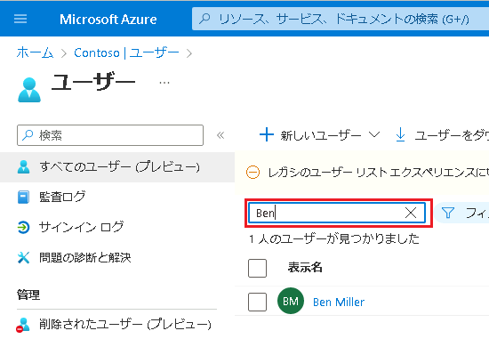

1. ユーザー **Ben Miller** のプロパティ ページを開き、**役職**の属性が Active Directory から同期されたことを確認します。※Ben Miller の役職 [Manager] が同期されます。

   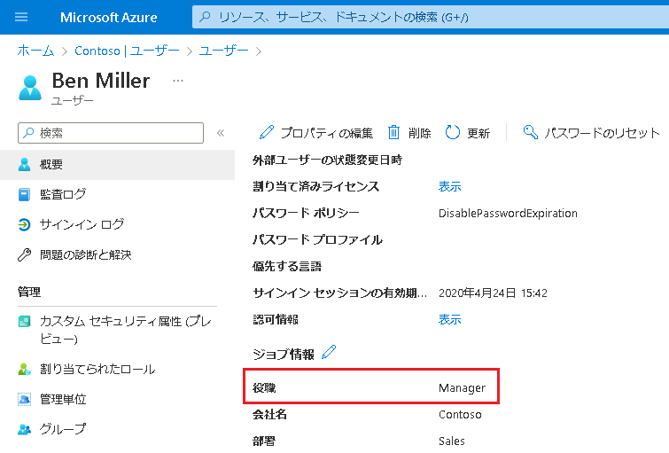

1. Microsoft Edge で、 **[すべてのユーザー]** ページに戻ります。

1. **[すべてのユーザー]** ページで、ユーザーを **Jordan** 検索します。

   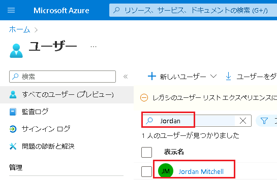

1. Active Directory で作成した、Jordan Mitchell が同期されていることが確認できます。

※ 以上で演習は終了です。お疲れさまでした。
