---
lab:
  title: 'ラボ: AD DS と Azure AD の統合の実装'
  module: 'Module 2: Implementing Identity in Hybrid Scenarios'
---

# <a name="lab-implementing-integration-between-ad-ds-and-azure-ad"></a>Lab2e: AD DS での Azure AD 統合機能の実装

## <a name="scenario"></a>シナリオ

オンプレミスの Azure Active Directory のセキュリティをさらに強化し、管理オーバーヘッドを最小限に抑えることができる Azure AD 統合機能を検証します。 また、Windows Server Active Directory 用の Azure AD パスワード保護と、パスワード ライトバックを使用するセルフサービス パスワード リセットを実装も検討することにしました。

## <a name="objectives"></a>目標とタスク

このラボを完了すると、次のことができるようになります。

- Active Directory に Azure AD 統合機能を実装する。これには Windows Server Active Directory 用の Azure AD パスワード保護や、パスワード ライトバックを使用した SSPR が含まれます。

この演習の主なタスクは次のとおりです。

1. Azure でセルフサービス パスワード リセットを有効にする。
2. Azure AD Connect でパスワード ライトバックを有効にする。
3. Azure AD Connect でパススルー認証を有効にする。
4. Azure でパススルー認証を検証する。
5. Azure AD パスワード保護プロキシ サービスと DC エージェントをインストールして登録する。
6. Azure でパスワード保護を有効にする。

## <a name="estimated-time-60-minutes"></a>予想所要時間: 50 分

## <a name="architecture"></a>アーキテクチャの図

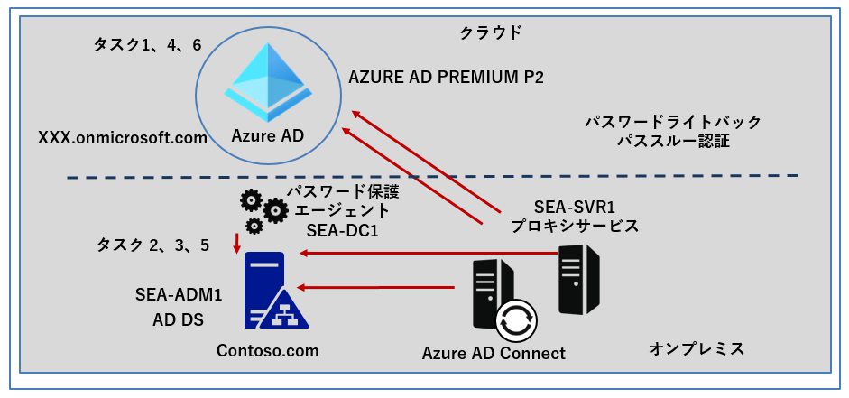

## <a name="lab-setup"></a>ラボのセットアップ

使用する仮想マシン: **SEA-DC1**、**SEA-SVR1**、**SEA-ADM1**  

1. **SEA-ADM1** を選択します。
1. **SEA-ADM1** に次の資格情報を使用してサインインします。
   - ユーザー名: **Administrator**
   - パスワード: **Pa55w.rd**
   - ドメイン: **CONTOSO**

このラボでは、仮想マシンと Azure AD テナントを使用します。 


### <a name="task-1-enable-self-service-password-reset-in-azure"></a>タスク 1: Azure でセルフサービス パスワード リセットを有効にする

1. **SEA-ADM1** で、Microsoft Edge でAzure portal にグローバル管理者としてサインインします。Azure AD(Azure Active Directory) の 左のナビゲーションペインの一覧から **[ライセンス]** を参照します。

   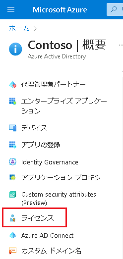

1. **[ライセンス]** ページで、 **[すべての製品]** を選択します。

   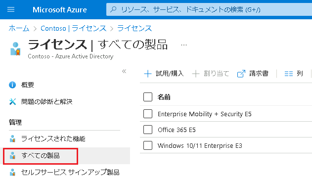

1.  **[すべての製品]** ページで、 **[ + 試用/購入]** を選択します。

   

1.  **[アクティブ化]** ページの **[ AZURE AD PREMIUM P2 ]** で、 **[無料試用版]** を選択し、 **[アクティブ化]** をクリックします。 

   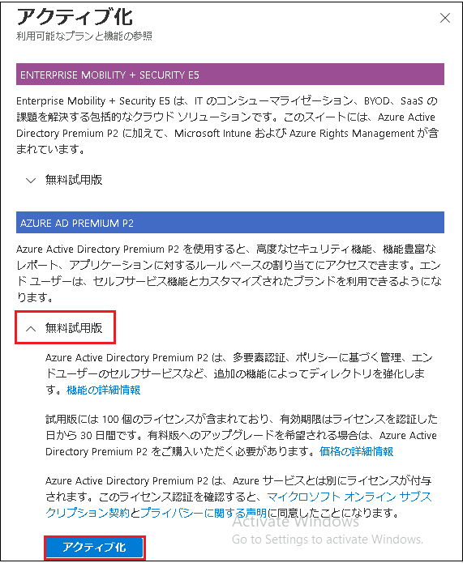

1. ブラウザを更新し、**[Azure Active Directory Premium P2]** を選択します。

   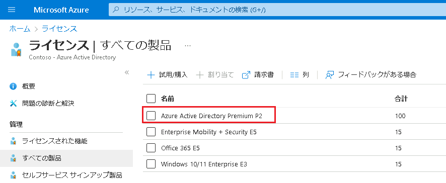

1.  **[Azure Active Directory Premium P2 | ライセンス]** ユーザーページで、 **[ + 割り当て]** を選択します。

   

1.  **[ライセンスの割り当て]** ページで、 **[ + ユーザーとグループの追加]** を選択します。

   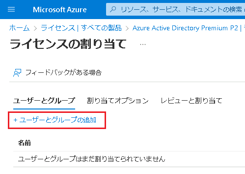

1.  **[ユーザーとグループの追加]** ページで、**admin**を検索し、結果の一覧から **Mod Administrator** を選択してた後、  **[選択]** をクリックします。

   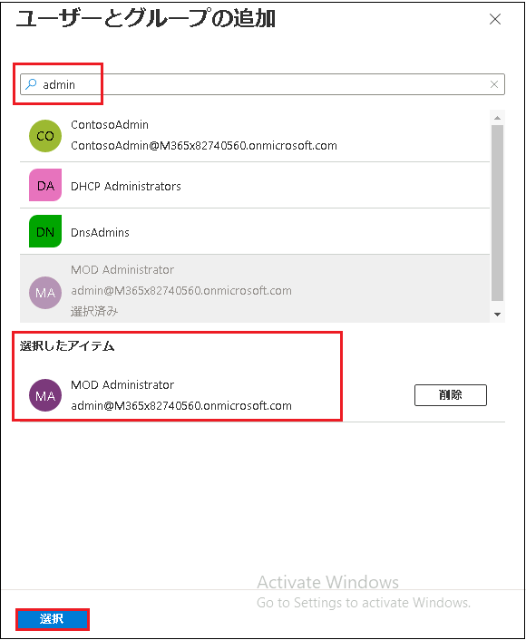

1. **[ライセンスの割り当て]** ページに戻り、 Mod Administrator が選択されていることを確認したら、 **[レビューと割り当て]** をクリックします。

   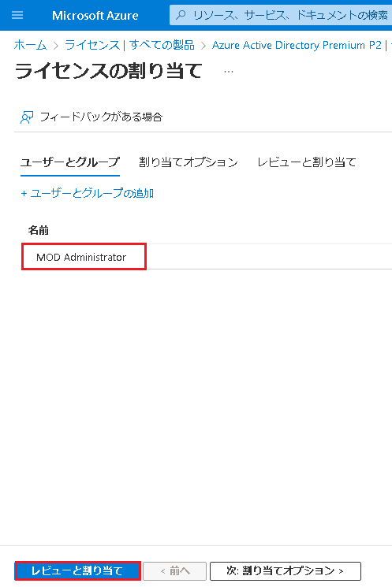

1. **[ライセンスの割り当て]** ページに戻り、 **[割り当て]** をクリックします。

1. **Azure Active Directory** ページに戻り、左のナビゲーションペイン一覧から、 **[パスワードのリセット]** を選択します。

   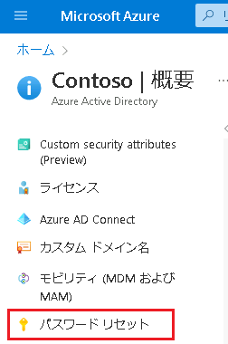

1. **[パスワードのリセット]** ページで、 **[パスワードリセットのセルフパスワードが有効]** の横にある **[!]** マークをクリックし、 メッセージを確認します。※メッセージには、構成を適用するユーザーの範囲を選択できる旨の説明が記載されています。

    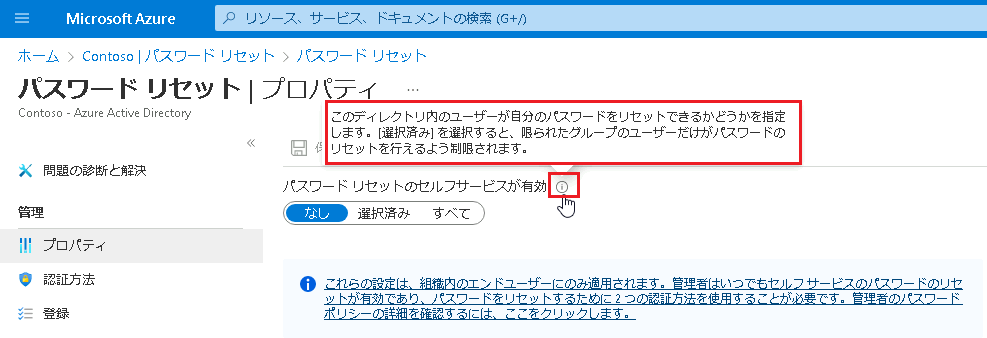

    > **注**: パスワード リセット機能は、有効にしないでください。

1. パスワードリセットのセルフサービスは **[なし]** の状態で、タスク2に進みます。

### <a name="task-2-enable-password-writeback-in-azure-ad-connect"></a>タスク 2: Azure AD Connect でパスワード ライトバックを有効にする

1. **SEA-ADM1** で、[スタート] メニューから、 **Azure AD Connect** を展開し、**[Azure AD Connect]** を起動します。

   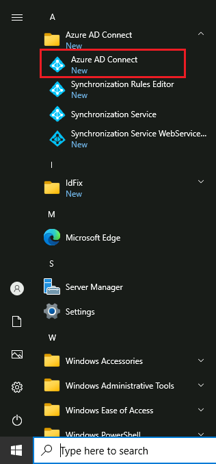

1.  **[Microsoft Azure Active Directory Connect]** ウィンドウで、**[Configure (構成)]** をクリックします。

   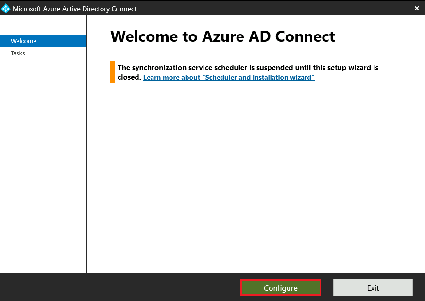

1.  **[Additional tasks (追加のタスク)]** 画面で、**[Customize synchronization options (同期オプションのカスタマイズ)]** を選択し、 **[Next (次へ)]** をクリックします。

   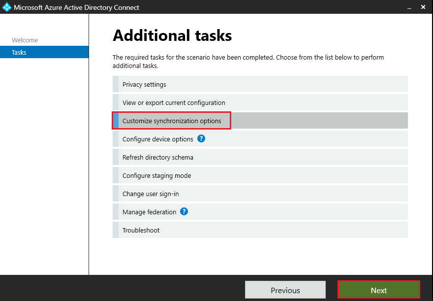

1.  **[Connect to Azure AD (Azure AD への接続)]** 画面で、Azure AD グローバル管理者ユーザー アカウントのユーザー名とパスワードを入力し、 **[Next (次へ)]** をクリックします。※資格情報は、ラボの [Home] タブで提供されているアカウントを使用してください。

   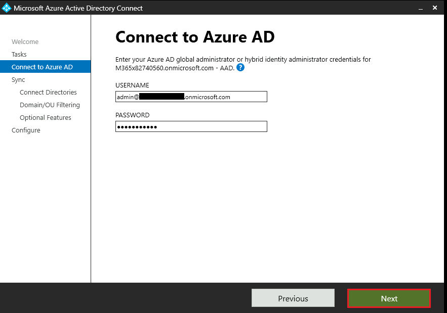

   

1.  **[Connect your directories]** 画面では、規定値のまま **[Next (次へ)]** をクリックします。

1. **[Domain and OU filtering]** 画面では、規定値のまま **[Next (次へ)]** をクリックします。

1. **[Optional features (オプション機能)]** 画面で、**[Password writeback (パスワード ライトバック)]** にチェックを入れ、 [Next (次へ)] をクリックします。

   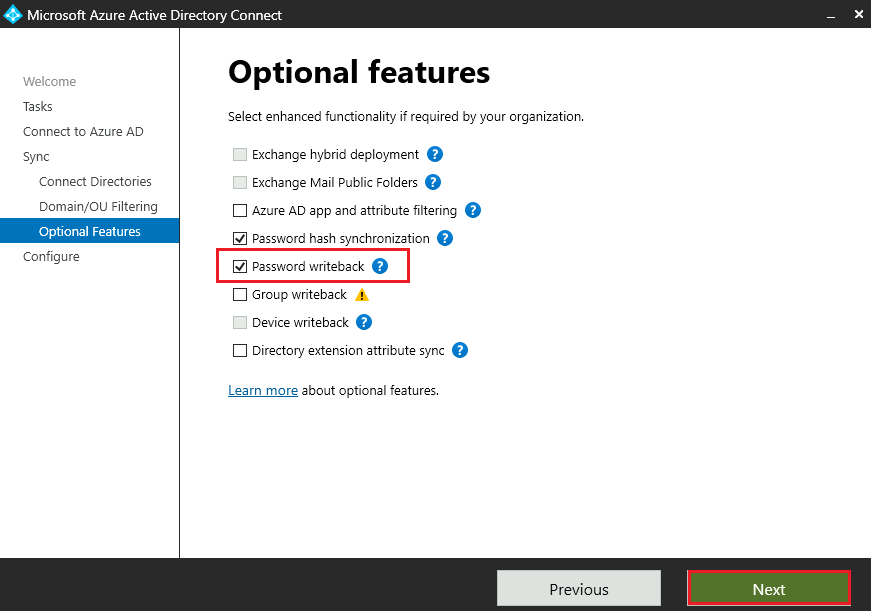

   > **注**: **Active Directory ユーザーのセルフサービス パスワード リセットには、パスワード ライトバックが必要です。 パスワードライトバックによって、Azure AD 内のユーザーによってパスワードが変更され、Active Directory に同期されます。**

1. **[Ready to configure (構成の準備完了)]** 画面が表示されたら、**[Configure (構成)]** をクリックします。

   ※構成が完了するまでに数分かかります。

1. 構成が完了したら、 **[Exit]** をクリックし、 **[Microsoft Azure Active Directory Connect]** ウィンドウを閉じます。

### <a name="task-3-enable-pass-through-authentication-in-azure-ad-connect"></a>タスク 3: Azure AD Connect でパススルー認証を有効にする

1. **SEA-ADM1** の **[スタート]** メニューで、**[Azure AD Connect]** を展開し、**[Azure AD Connect]** を起動します。

1. **[Microsoft Azure Active Directory Connect]** ウィンドウで、**[Configure (構成)]** をクリックします。

1. **[Additional tasks (追加のタスク)]** 画面で、**[Change user sign-in (ユーザー サインインの変更)]** を選択し、 **[Next (次へ)]** をクリックします。

   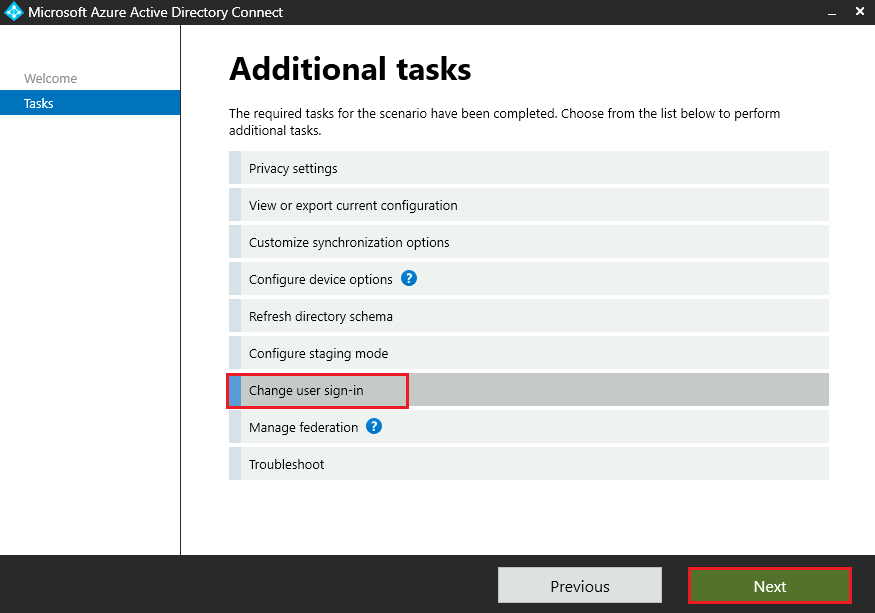

1. **[Connect to Azure AD (Azure AD への接続)]** 画面で、 Azure AD グローバル管理者 アカウントのユーザー名とパスワードを入力して、 **[Next (次へ)]** をクリックします。

1. **[User sign-in (ユーザー サインイン)]** 画面で、**[Pass-through authentication (パススルー認証)]** を選択し、 **[Enable single sign-on (シングル サインオンを有効にする)]** のチェックボックスがオンになっていることを確認したら、 **[Next (次へ)]** をクリックします。

   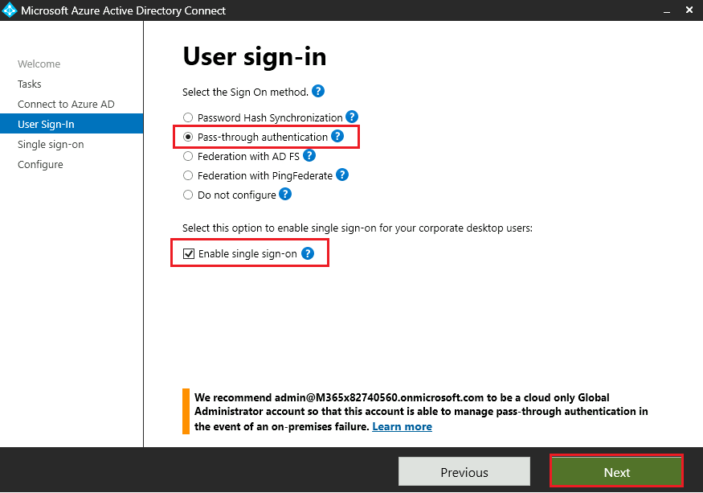

   

1. **[Enable single sign-on (シングル サインオンを有効にする)]** 画面で、**[Enter credentials (資格情報の入力)]** をクリックします。

   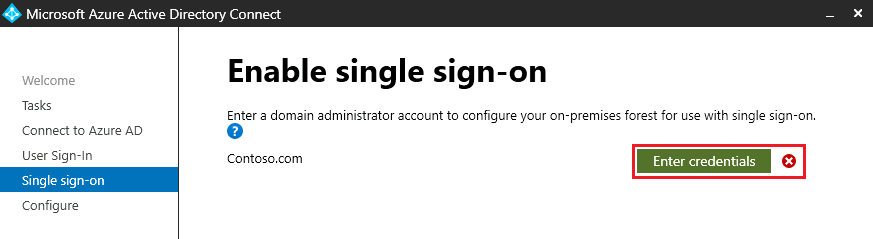

1. **[Forest credentials]** ダイアログ ボックスで、次の資格情報を入力し、 **[OK]** をクリックします。

   - Username: **Administrator**
   - Password: **Pa55w.rd**

1. **[Enable single sign-on (シングル サインオンを有効にする)]** ページで、**[Enter credentials (資格情報の入力)]** の横に緑色のチェック マークが表示されているのを確認したら、 [Next (次へ)] をクリックします。

   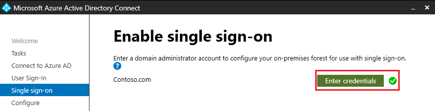

1. **[Ready to configure (構成の準備完了)]** 画面で、実行するアクションの一覧を確認し、**[Configure (構成)]** をクリックします。※構成が完了するまでに数分かかります。

1. 構成が完了したら、 **[Exit]** をクリックし、 **[Microsoft Azure Active Directory Connect]** ウィンドウを閉じます。

### <a name="task-4-verify-pass-through-authentication-in-azure"></a>タスク 4: Azure でパススルー認証を検証する

1. **SEA-ADM1** の、Azure portal で **[Azure Active Directory]** の左ナビゲーションペインの一覧から、 **[Azure AD Connect]** を選択します。

1. **[Azure AD Connect]** ページの、**[ユーザー サインイン]** の下に表示されている、**[シームレス なシングル サインオン]** を選択します。

   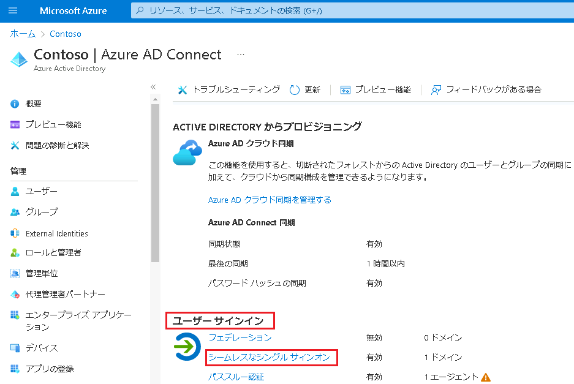

1. **[シームレス シングル サインオン]** ページで、オンプレミスのドメイン名を確認します。※オンプレミスドメイン名は、Contoso.com になっています。

   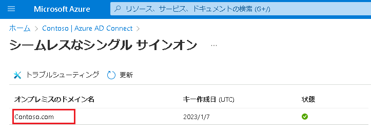

1. **[Azure AD Connect]** ページ に戻り、 **[ユーザーサインオン]** から、 **[パススルー認証]** を選択します。

   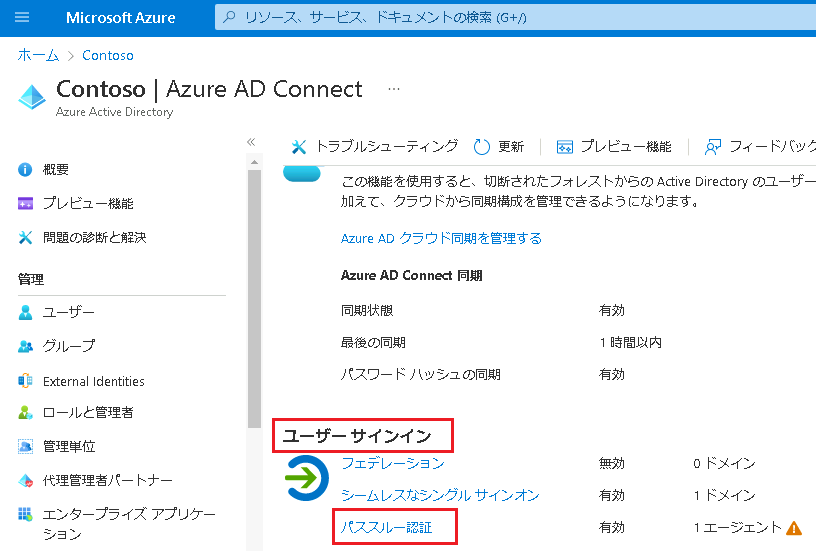

1. **[パススルー認証]** ページで、 **[認証エージェント]** の下にあるサーバー名を確認します。

   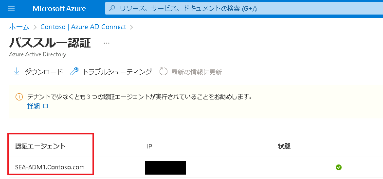

   > **注**: Azure AD Authentication エージェントを環境内の複数のサーバーにインストールするには、Azure portal の **[パススルー認証]** ページからバイナリーをダウンロードします。

### <a name="task-5-install-and-register-the-azure-ad-password-protection-proxy-service-and-dc-agent"></a>タスク 5: Azure AD パスワード保護プロキシ サービスと DC エージェントをインストールして登録する

1. **SEA-ADM1** の Microsoft Edge で、Azure Portal とは別のタブを開き、Microsoft ダウンロード Web サイトを`https://www.microsoft.com/en-us/download/details.aspx?id=57071`を参照します。

1. Microsoft ダウンロード Web サイトにある、「**Azure AD Password Protection for Windows Server Active Directory**」の、**[Download]** をクリックします。

   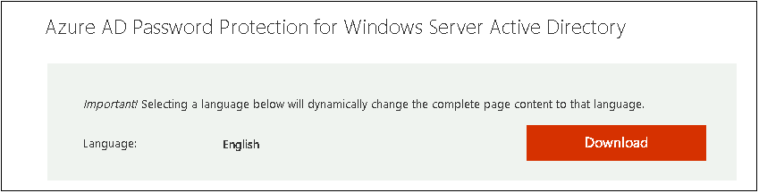

1. **AzureADPasswordProtectionProxySetup.exe** と **AzureADPasswordProtectionDCAgentSetup.msi** を選択し、 **[Next]** をクリックします。

   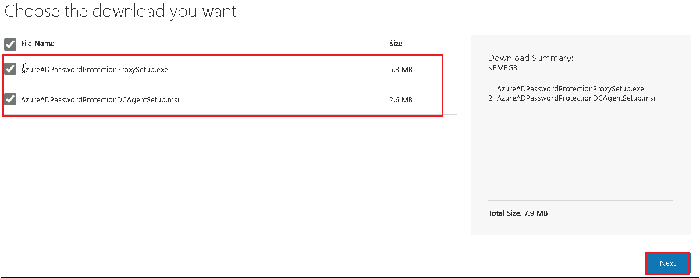

   > **注: プロキシ サービスは、ドメインコントローラー以外のサーバーにインストールすることが推奨されています。 また、プロキシ サービスは、Azure AD Connect エージェントと同じサーバーにはインストールできません。 このラボでは、プロキシ サービスは SEA-SVR1 、パスワード保護 DC エージェントは SEA-DC1 にインストールします。**

1. ブラウザに表示される、「Download multipul files (複数のファイルをダウンロード)」ダイアログボックスで [Allow (許可)] をクリックします。

   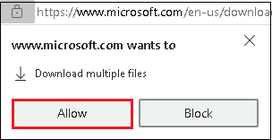

1. **SEA-ADM1** の**Windows PowerShell(管理者)** で次のコマンドレットを実行し、インターネットからファイルがダウンロードされたことを示す Zone.Identifier 代替データ ストリームを削除します。

   ```powershell
   Get-ChildItem -Path "$env:USERPROFILE\Downloads" -File | Unblock-File
   ```

1. 次のコマンドレットを実行して **SEA-SVR1** に **C:\Temp** ディレクトリを作成し、**AzureADPasswordProtectionProxySetup.exe** インストーラーをそのディレクトリにコピーして、インストールを実行します。

   ```powershell
   New-Item -Type Directory -Path '\\SEA-SVR1.contoso.com\C$\Temp' -Force
   
   Copy-Item -Path "$env:USERPROFILE\Downloads\AzureADPasswordProtectionProxySetup.exe" -Destination '\\SEA-SVR1.contoso.com\C$\Temp\'
   
   Invoke-Command -ComputerName SEA-SVR1.contoso.com -ScriptBlock { Start-Process -FilePath C:\Temp\AzureADPasswordProtectionProxySetup.exe -ArgumentList '/quiet /log C:\Temp\AzureADPPProxyInstall.log' -Wait }
   ```

1. 次のコマンドレットを実行して **SEA-DC1** に **C:\Temp** ディレクトリを作成し、**AzureADPasswordProtectionDCAgentSetup.msi** インストーラーをそのディレクトリにコピーし、インストールを実行します。インストールが完了したらドメイン コントローラーを再起動します。

   ```powershell
   New-Item -Type Directory -Path '\\SEA-DC1.contoso.com\C$\Temp' -Force
   
   Copy-Item -Path "$env:USERPROFILE\Downloads\AzureADPasswordProtectionDCAgentSetup.msi" -Destination '\\SEA-DC1.contoso.com\C$\Temp\'
   
   Invoke-Command -ComputerName SEA-DC1.contoso.com -ScriptBlock { Start-Process msiexec.exe -ArgumentList '/i C:\Temp\AzureADPasswordProtectionDCAgentSetup.msi /quiet /qn /norestart /log C:\Temp\AzureADPPInstall.log' -Wait }
   
   Restart-Computer -ComputerName SEA-DC1.contoso.com -Force
   ```

1. 次のコマンドレットを実行して、 Azure AD パスワード保護を実装するために必要なサービスが作成されたことを確認します。※結果が返ってくるまでに数分かかります。

   ```powershell
   Get-Service -Computer SEA-SVR1 -Name AzureADPasswordProtectionProxy | fl
   Get-Service -Computer SEA-DC1 -Name AzureADPasswordProtectionDCAgent | fl
   ```

   > **注**: **[Status]** が **[Running]** であることを確認します。

1. 以下のコマンドレットを実行し、 **SEA-SVR1** への PowerShell リモート処理セッションを確立します。

   ```powershell
   Enter-PSSession -ComputerName SEA-SVR1
   ```

1. PowerShell リモート処理セッション内で次のコマンドを入力し、プロキシ サービスを Active Directory に登録します (-AccountUpn パラメーターの値、 `<Azure_AD_Global_Admin>` は、 Azure AD グローバル管理者ユーザー アカウントのユーザー プリンシパル名に置き換えます)。

   ```powershell
   Register-AzureADPasswordProtectionProxy -AccountUpn <Azure_AD_Global_Admin> -AuthenticateUsingDeviceCode
   ```

1. Microsoft Edgeから、https://microsoft.com/devicelogin、にアクセスし、実行結果に表示された [code] を入力して認証します。

1. プロンプトが表示されたら、Azure AD グローバル管理者ユーザー アカウントの資格情報を使用して認証します。

1. Windows PowerShell コンソールに戻り、次のコマンドレットを実行して、SEA-SVR1へのPowerShell リモート セッションを終了します。

   ```powershell
   Exit-PSsession
   ```

   

1. **Windows PowerShell** コンソールで、次のコマンドレットを実行して、**SEA-DC1** への PowerShell リモート処理セッションを開始します。

    ```powershell
    Enter-PSSession -ComputerName SEA-DC1
    ```

1. PowerShell リモート処理セッション内で次のコマンドレットを実行し、プロキシ サービスを Active Directory に登録します (-AccountUpn の値、 `<Azure_AD_Global_Admin>` は、 Azure AD グローバル管理者ユーザー アカウントのユーザー プリンシパル名に置き換えます)。

    ```powershell
    Register-AzureADPasswordProtectionForest -AccountUpn <Azure_AD_Global_Admin> -AuthenticateUsingDeviceCode
    ```

1. Microsoft Edgeから、https://microsoft.com/devicelogin、にアクセスし、実行結果に表示された [code] を入力して認証します。

1. Windows PowerShell コンソールに戻り、次のコマンドレットを実行して、SEA-DC1へのPowerShell リモート セッションを終了します。

   ```powershell
   Exit-PSsession
   ```

### <a name="task-6-enable-password-protection-in-azure"></a>タスク 6: Azure でパスワード保護を有効にする

1. **SEA-ADM1** で、Azure portal が表示されている Microsoft Edge ウィンドウに切り替え、**[Azure Active Directory]** の左ナビゲーションペインの一覧から、**[セキュリティ]** を選択します。

   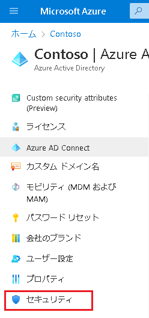

1. **[セキュリティ]** ページの一覧から、**[認証方法]** を選択します。

   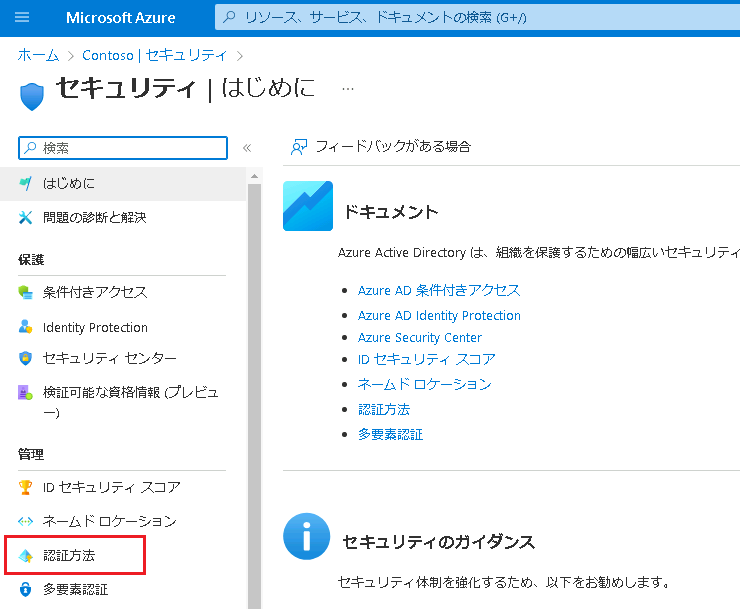

1. **[認証方法]** ページの一覧から、**[パスワード保護]** を選択します。

   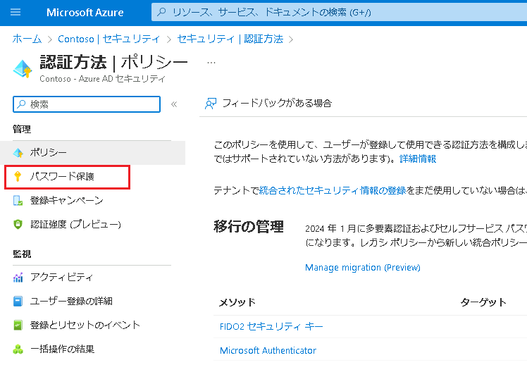

1.  **[パスワード保護]** ページで、 **[カスタム リストの適用]** のスライダーを **[はい]** に変更し、カスタム禁止パスワードの一覧に以下の単語を入力します。

   - **Contoso**
   - **ロンドン**

   > **注**: 禁止パスワードの一覧は、ご自分の組織に関連する単語である必要があります。

1.  **[Windows Server Active Directory でパスワード保護を有効にする]**  のスライダーが **[はい]** に設定されていることを確認します。 

1. **[モード]** が **[監査]** に設定されていることを確認し、変更を保存します。

   ※カスタム禁止パスワードリストが適用されるまでに、数時間要する場合があります。

   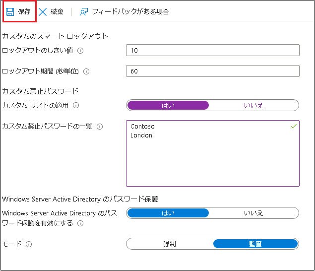

## <a name="exercise-6-cleaning-up"></a>オプション: クリーンアップ

### <a name="scenario"></a>シナリオ

オンプレミスの Active Directory から Azure への同期を無効にします。 

この演習の主なタスクは次のとおりです。

1. Azure AD Connect をアンインストールする。
1. Azure でディレクトリ同期を無効にする。

### <a name="task-1-uninstall-azure-ad-connect"></a>タスク 1 Azure AD Connect のアンインストール

1. **SEA-ADM1** のスタートメニュー横の検索ボックスで、 **[Control Panel (コントロールパネル)]** を検索し、検索結果に表示された **[Control Panel]** を選択します。

1. **[Programs (プログラム)]** の **[Uninstall a program(プログラムのアンインストール)]** を選択します。

   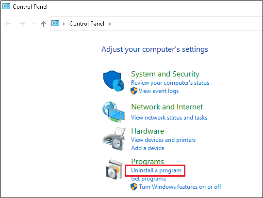

1.  **[Uninstall or change a program(プログラムのアンインストールまたは変更)]**  の一覧から、**[Microsoft Azure AD Connect]** を右クリックし、アンインストールをクリックします。

   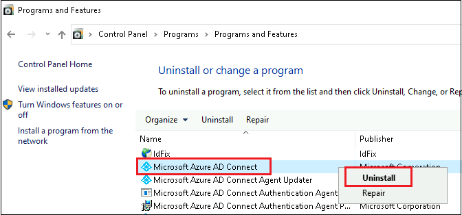

4.  **[Programs and features (プログラムと機能)]** ダイアログボックスで確認メッセージが表示されたら、 **[Yes]** をクリックします。

   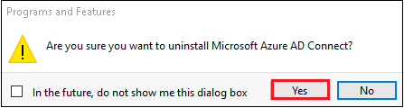

5.  **[Uninstall Azure AD Connect (プログラムと機能)]** ウィンドウで、 **[Remove (削除)]** を選択します。

   ※アンインストールが完了するまでに数分要します。

6.  **Azure AD Connect**  がアンインストールされたら、 **[Exit (終了)]** をクリックします。

### <a name="task-2-disable-directory-synchronization-in-azure"></a>タスク 2: Azure でディレクトリ同期を無効にする

1. **SEA-ADM1** で、**Windows PowerShell** ウィンドウに切り替えます。

1. **Windows PowerShell** コンソールで、次のコマンドレットを実行し、Azure AD 用の Microsoft Online モジュールをインストールします。

   ```powershell
   Install-Module -Name MSOnline
   ```

   ※プロンプトにNuGet プロバイダーをインストールするメッセージが表示されたら、 **[Y]** と入力し、Enter キーを押します。

   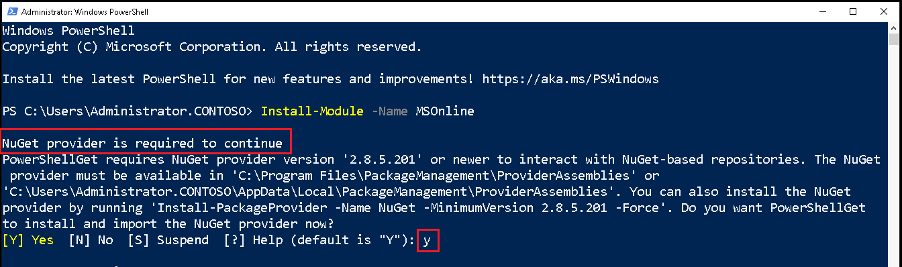

   ※信頼されていないリポジトリからモジュールをインストールするように求められたら、Aと入力し、Enter キーを押します。

   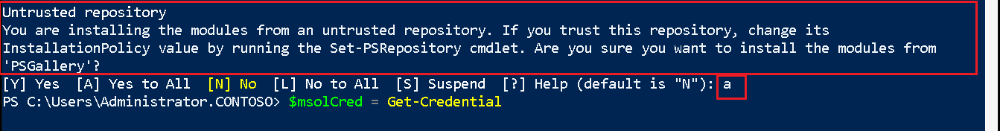

   

1. 次のコマンドレットを実行して、資格情報を Azure に提供します。

   ```powershell
   $msolCred = Get-Credential
   ```

1.  **[Windows PowerShell 資格情報要求]** ダイアログ ボックスで、Azure AD グローバル管理者ユーザー アカウントの資格情報を入力します。(資格情報は、ラボの [Home] タブに記載の情報を使用してください。)

1. 次のコマンドレットを実行して Azure に接続します。

   ```powershell
   Connect-MsolService -Credential $msolcred
   ```

1. 次のコマンドレットを実行して、Azure でディレクトリ同期を無効にします。

   ```powershell
   Set-MsolDirSyncEnabled -EnableDirSync $false
   ```

7. 確認を求めるプロンプトが表示されたら、 **[Y]** と入力し、Enter キーを押下します。

   

※ 以上で演習は終了です。お疲れさまでした。
