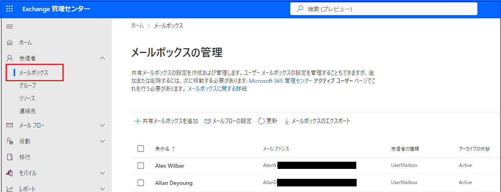

# Lab03: Exchange Online の主な機能の確認

## シナリオ

Holly Dickson は、Adatum のエンタープライズ管理者です。Holly DicksonのMicrosoft 365 アカウントにグローバル管理者の役割が割り当てられたので、Exchange Onlineの主要な管理機能を確認するよう上司から指示が出ました。

> **補足 : グローバル管理者の役割には Exchange 管理者の役割が含まれているため、Holly は Exchange 関連のすべてのタスクを実行できます。**

## 目標とタスク

このラボを完了すると、次のことができるようになります。

- メールボックスの管理

- 配布グループの作成

  

この演習の主なタスクは次のとおりです。

1. 受信者の管理
2. グループの管理

オプション. メーリングリストの検証

## 予想所要時間: 30 分

### タスク 1: 受信者の管理

1. InPrivate ウィンドウ(Microsoft Edge) もしくは、シークレットウィンドウ (Google Chrome) で、Microsoft 365 管理センター ([https://admin.microsoft.com](https://admin.microsoft.com/)) にアクセスし、以下の資格情報でサインインします。

| 項目           | 値                                                           |
| -------------- | ------------------------------------------------------------ |
| **ユーザーID** | `Holly@XXXXXXXXXXX.onmicrosoft.com`  @マーク以降のXXXXXXXXXは各自異なります。 |
| **パスワード** | Pa55w.rd1234                                                 |

2. **[サインインの状態を維持しますか]** ページが表示された場合は、 **[いいえ]** をクリックします 。

3. **[Microsoft 365管理センター]** の左ペインで、 **[ ・・・すべて表示]**  をクリックし、 **[管理センター] - [Exchange]** を選択します。

   ※ブラウザーの新しいタブに、 **[Exchange 管理センター]** が表示されます。 **[新しいメニューについて学ぶ]** ウィンドウが表示された場合は、 **[ X ]** を選択してウィンドウを閉じます。

4. Exchange 管理センターの左ナビゲーションペインから、 **[受信者]** を選択し、 **[グループ]** をクリックします。

   

5. **[メールボックス]** を選択します。このビューに表示されるメールボックスには、演習用としてテナント内に予め作成されているすべてのユーザーアカウントと、Lab2 で作成 した Holly Dickson のメールボックスが含まれていることが確認できます。 

   

6. **[表示名]** の一覧から、 **[Joni Sherman]** のメールボックスを選択します。

7. **[Joni Sherman]** ページで、 **[委任]** タブを選択します。

   

   

8.  **[Joni Sherman]** の **[委任]** タブ内にある、 **[読み取りと管理 (フル アクセス)]** セクションの下に表示される  **[編集]** ボタンをクリックします。

   

9.  **[メールボックス委任の管理]** ページで、 **[ +メンバーの追加]** をクリックします。

10.  **[読み取りアクセス許可の追加と管理アクセス許可]** ページで、 ユーザー アカウントの一覧から **[Holly Dickson]** の左にあるチェックボックスをオンにし、 **[保存]** ボタンをクリックしてから、 **[確認]** を選択します。

11.  **「アクセス許可の委任を追加しますか?」** ページが表示されたら、 **[確認]** をクリックします。

12.  「これらのメールボックスにメールボックスのアクセス許可が追加されました」 ページが表示されたら、ページの右上にある [ × ] をクリックして閉じます。

> **補足 : 管理者は、メールボックスにアクセス許可を割り当てることができます。このラボでは、Joni Sherman のメールボックスに対して、 Holly Dickson に読み取りと管理 (フル アクセス) のアクセス許可を割り当てています。この結果、Holly は、Joni のメールボックスを開き、すべてのメールボックス機能を実行できるようになります。**
>
> **注意 : アクセス許可が反映されるまでには、数分～1時間程度時間がかかります。**

13. ブラウザとすべてのタブを開いたままの状態で、次のタスクに進んでください。

### タスク 2: グループの管理

1. 前のタスクで使用した Exchange 管理センター の 左ナビケーションペインから、 **[受信者] - [グループ]** を選択します。

> **補足 : タスク1を終了した時、 Exchange 管理センター のブラウザータブを閉じてしまった場合は、再度Microsoft 365 管理センター ([https://admin.microsoft.com](https://admin.microsoft.com/)) にアクセスし、 Holly Dickson の資格情報を使用してサインインします。Microsoft 365 管理センターにサインイン後、[Microsoft 365管理センター] の左ペインで、 [ ・・・すべて表示]  をクリックし、 [管理センター] - [Exchange] を選択してください。**

2.  **[グループ]** ページで、 **[グループの追加]** をクリックします。

   

3.  **[グループの種類の選択]** ページで、 **[配布]** を選択し、 **[次へ]** をクリックします。

   

4.  **[基本の設定]** ページで、 **[名前]** フィールドに  **「Sales Department」** と入力し、 **[説明]** フィールドに移動します ([ 次へ] ボタンが有効になります)。 **[説明]** フィールドは空白のままにし、 **[次へ]** をクリックします。

   

5.  **[所有者の割り当て]** ページで、 **[ + 所有者の割り当て]** をクリックします。

   

6.  **[所有者の割り当て]** ページで、 **[Holly Dickson]** の左にあるチェックボックスをオンにして、 **[Add (1)]** をクリックします。
7.  **[所有者の割り当て]** ページに戻り、Holy Dickson が所有者として追加されたことが確認できたら、 **[次へ]** をクリックします。
8.  **[メンバーの追加]** ページでは何も選択せずに、 **[次へ]** をクリックします。
11.  **[設定の編集]** ページで、以下の情報を入力し、 **[次へ]** をクリックします。※指示がないものは規定値のままで構いません。

| 項目                      | 値                                                          |
| ------------------------- | ----------------------------------------------------------- |
| グループのメール アドレス | SalesDept ※@以降のドメイン名は規定値を使用してください |
| グループに参加            | 所有者の承認                                                |
| グループから脱退          | クローズド                                                  |

　

12.  **[確認とグループの追加の完了]** ページで、 **[グループを作成]** ボタンをクリックします。
13. グループがグループ リストに表示されるまでに最大 1 時間かかる可能性があることを示すメッセージがページの上部に表示されたら、 **[閉じる]** をクリックします。
14.   **[グループ]** ページに戻り、 **[配布リスト]** タブを選択して、Sales Department グループを確認します。

> **注 : Sales Department グループが配布グループのリストに表示されない場合は、表示されるまで数分ごとに [更新] ボタンをクリックしてください。**

　

15. グループ名の一覧から、 **[Sales Department]** グループを選択します。
16.  **[Sales Department]** ページが表示されたら、 **[メンバー]** タブをクリックします。
17.  **[メンバー]** タブの **[所有者]** セクションで、 **[すべての所有者の表示と管理]** をクリックします。

　

18.  **[所有者]** ページが表示されたら、 **[ + 所有者を追加]** をクリックします。

　

19.  **[所有者の追加]** ウィンドウで、 **[Alex Wilber]** の左にあるチェックボックスをオンにして、 **[Add (1)]**  ボタンをクリックします。

20. **[所有者]** ページに戻ったら、 Alexがリストに追加されたことを確認し、左上にある **[ ← ]** をクリックして戻ります。

　　

21.  **[Sales Department]** ページに戻り、 **[所有者]** セクションで **[すべてのメンバーの表示と管理]** をクリックします。

　

22.  **[メンバー]** ページが表示されたら、 **[ + メンバーを追加]** をクリックします。

　

23. **[メンバーの追加]** ページで、 **[Diego Siciliani]** と **[Lynne Robbins]** の左にあるチェックボックスをオンにし、 **[Add] (2)** ボタンをクリックします。

24. **[メンバー]** ページに戻り、LynneとDiego がリストに追加されたことを確認したら、左上にある **[ ← ]** をクリックして戻ります。

25.  **[メンバー]** ページに戻ると、 **[所有者]** に HollyとAlex、 **[メンバー]** に LynneとDiego が追加されたことが確認できます。

　

26.  **[Sales Department]** ページの右上にある [ × ] をクリックして閉じます。

27. ブラウザとすべてのタブを開いたままの状態で、次のタスクに進んでください。

> **補足 : このタスクでは、Exchange Online 内にグループを作成し、所有者とメンバーを追加しました。今回は、メーリングリストとして利用可能な、配布グループを作成しています。**

### オプション: メーリングリストの確認

1. Holly のユーザーアカウントでサインインしている状態で、Microsoft 365 管理センターを開いているタブに切り替えます。
2. 左上の **[アプリ起動ツール]** ボタンをクリックします。

　

3. アプリの一覧から **[Outlook]** を選択します。

　

4. Outlook に移動したら、 **[新規メール]** をクリックします。

　

5. 新規メール作成画面が表示されたら、以下を入力して **[送信]** をクリックします。

| 項目     | 値                                                           |
| -------- | ------------------------------------------------------------ |
| **宛先** | SalesDept ※SalesDeptと入力すると、検索結果に前のタスクで作成した 配布グループのアドレスが表示されるため、選択してください。 |
| **CC**   | なし                                                         |
| **件名** | 任意タイトル                                                 |
| **本文** | 任意の文章                                                   |

6. Outlookからサインアウトし、ブラウザーを閉じます。再度ブラウザー(InPrivate ウィンドウ もしくは、シークレットウィンドウ)を起動し、ブラウザー版のOutlook (https://outlook.office.com) に以下の資格情報でサインインします。

| 項目       | 値                                                           |
| ---------- | ------------------------------------------------------------ |
| ユーザーID | `LynneR@XXXXXXXXXXX.onmicrosoft.com` @マーク以降のXXXXXXXXXは各自異なります。 |
| パスワード | Pa55w.rd1234                                                 |

7.  **[サインインの状態を維持しますか]** ページが表示された場合は、 **[いいえ]** をクリックします 。

9. Welcomeページが表示された場合は、右側に表示される **[>]** ボタンを3回クリックします。(表示されない場合は、そのままMicrosoft 365 ポータルが表示されます)
10. 左のタスクバーから **[Outlook]** を選択します。※Outlookのアイコンが表示されない場合は、 **[アプリ]** アイコンをクリックすると表示されます。

　

10.  **[受信トレイ]** を選択し、手順 5でHolly が送信したSales Department メーリングリスト宛のメールが届いていることを確認します。

> **補足 : LynneRは、配布グループのSales Departmentメンバーとして追加されているため、Holly からのメールが確認できます。**

11. メールが届いていることを確認したら、Outlook の右上にあるユーザーのアイコンをクリックしてサインアウトしてください。同様に、Holly のアカウントでサインインしている Microsoft 365 管理センターからもサインアウトします。

    

### **結果 : この演習を完了すると、Exchange Online のメーリングリストを作成し、送受信の検証ができます。**
