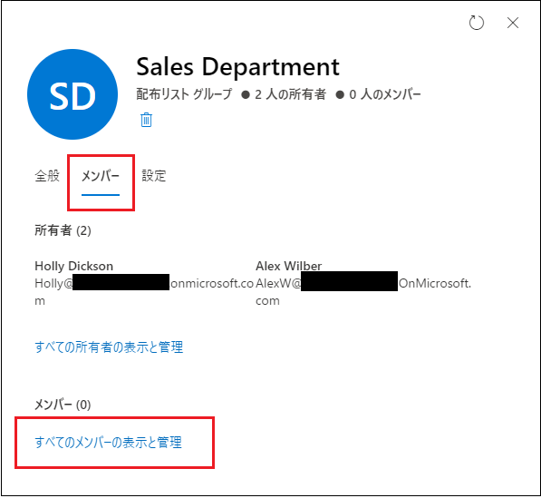
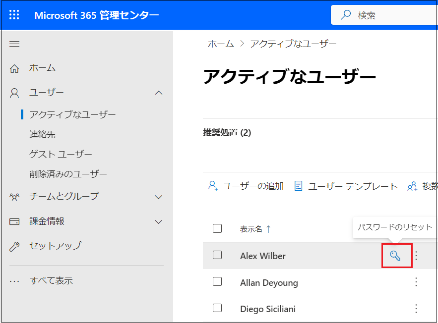
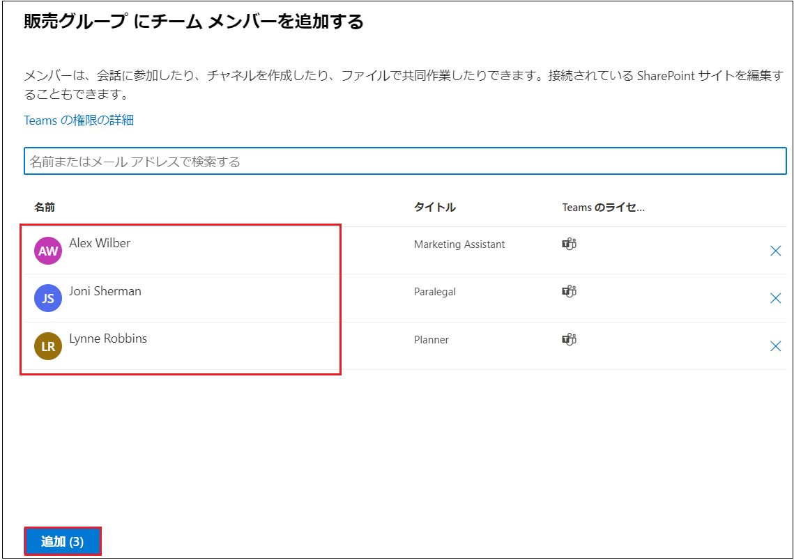

# Lab03: Exchange Online の主な機能の確認

## シナリオ

Holly Dickson は、Adatum のエンタープライズ管理者です。Holly DicksonのMicrosoft 365 アカウントにグローバル管理者の役割が割り当てられたので、Exchange Online、SharePoint Online、および Teams 内の主要な管理機能を確認するよう上司から指示が出ました。

尚、今回はMicrosoft Exchange に関して、Adatum の CTO は、メール フローと受信者管理に関連する Exchange Online の基本的な管理機能の一部を Holly にレビューするよう依頼しました。

> **補足 : グローバル管理者の役割には Exchange 管理者の役割が含まれているため、Holly は Exchange 関連のすべてのタスクを実行できます。**

## 目標とタスク

このラボを完了すると、次のことができるようになります。

- メールボックスの管理

- 配布グループ、Microsoft 365 グループの作成

- 作成したユーザーにMicrosoft 365 の管理者権限を割り当てる。

  

この演習の主なタスクは次のとおりです。

1. 受信者の管理
2. グループの管理
3. 配布リストのアップグレード
4. リソースの管理
5. 連絡先の管理

## 予想所要時間: 30 分

### タスク 1: 受信者の管理

1. InPrivate ウィンドウ(Microsoft Edge) もしくは、シークレットウィンドウ (Google Chrome) で、Microsoft 365 管理センター ([https://admin.microsoft.com](https://admin.microsoft.com/)) にアクセスし、以下の資格情報でサインインします。

| 項目           | 値                                                           |
| -------------- | ------------------------------------------------------------ |
| **ユーザーID** | `Holly@XXXXXXXXXXX.onmicrosoft.com`  @マーク以降のXXXXXXXXXは各自異なります。 |
| **パスワード** | Pa55w.rd1234                                                 |

2. **[サインインの状態を維持しますか]** ページが表示された場合は、 **[いいえ]** をクリックします 。

3. **[Microsoft 365管理センター]** の左ペインで、 **[ ・・・すべて表示]**  をクリックし、 **[管理センター] - [Exchange]** を選択します。

   ※ブラウザーの新しいタブに、 **[Exchange 管理センター]** が表示されます。 **[新しいメニューについて学ぶ]** ウィンドウが表示された場合は、 **[ X ]** を選択してウィンドウを閉じます。

4. Exchange 管理センターの左ナビゲーションペインから、 **[受信者]** を選択し、 **[グループ]** をクリックします。

   

5. **[メールボックス]** を選択します。このビューに表示されるメールボックスには、ラボ ホスティング プロバイダーによってテナントで作成されたすべてのユーザー アカウントと、前のラボでLab2 で作成 した Holly Dickson のメールボックスが含まれていることが確認できます。 

   

6. **[表示名]** の一覧から、 **[Joni Sherman]** のメールボックスを選択します。

7. **[Joni Sherman]** ページで、 **[委任]** タブを選択します。

   

   

8.  **[Joni Sherman]** の **[委任]** タブ内にある、 **[読み取りと管理 (フル アクセス)]** セクションの下に表示される  **[編集]** ボタンをクリックします。

   

9.  **[メールボックス委任の管理]** ページで、 **[ +メンバーの追加]** をクリックします。

10.  **[読み取りアクセス許可の追加と管理アクセス許可]** ページで、 ユーザー アカウントの一覧から **[Holly Dickson]** の左にあるチェックボックスをオンにし、 **[保存]** ボタンをクリックしてから、 **[確認]** を選択します。

11.  **「アクセス許可の委任を追加しますか?」** ページが表示されたら、 **[確認]** をクリックします。

12.  「これらのメールボックスにメールボックスのアクセス許可が追加されました」 ページが表示されたら、ページの右上にある [ × ] をクリックして閉じます。

> **補足 : 管理者は、メールボックスにアクセス許可を割り当てることができます。このラボでは、Joni Sherman のメールボックスに対して、 Holly Dickson に読み取りと管理 (フル アクセス) のアクセス許可を割り当てています。この結果、Holly は、Joni のメールボックスを開き、すべてのメールボックス機能を実行できるようになります。**
>
> **注意 : アクセス許可が反映されるまでには、数分～1時間程度時間がかかります。**

13. ブラウザとすべてのタブを開いたままの状態で、次のタスクに進んでください。

### タスク 2: グループの管理

1. 前のタスクで使用した Exchange 管理センター の 左ナビケーションペインから、 **[受信者] - [グループ]** を選択します。

> **補足 : タスク1を終了した時、 Exchange 管理センター のブラウザータブを閉じてしまった場合は、再度Microsoft 365 管理センター ([https://admin.microsoft.com](https://admin.microsoft.com/)) にアクセスし、 Holly Dickson の資格情報を使用してサインインします。Microsoft 365 管理センターにサインイン後、[Microsoft 365管理センター] の左ペインで、 [ ・・・すべて表示]  をクリックし、 [管理センター] - [Exchange] を選択してください。**

2.  **[グループ]** ページで、 **[グループの追加]** をクリックします。

   

3.  **[グループの種類の選択]** ページで、 **[配布]** を選択し、 **[次へ]** をクリックします。

   

4.  **[基本の設定]** ページで、 **[名前]** フィールドに  **「Sales Department」** と入力し、 **[説明]** フィールドに移動します ([ 次へ] ボタンが有効になります)。 **[説明]** フィールドは空白のままにし、 **[次へ]** をクリックします。

   

5.  **[所有者の割り当て]** ページで、 **[ + 所有者の割り当て]** をクリックします。

   

6.  **[所有者の割り当て]** ページで、 **[Holly Dickson]** の左にあるチェックボックスをオンにして、 **[追加 (1)]** をクリックします。
7.  **[所有者の割り当て]** ページに戻り、Holy Dickson が所有者として追加されたことが確認できたら、 **[次へ]** をクリックします。
8.  **[メンバーの追加]** ページで、 **[ + メンバーの追加]** をクリックします。
9. 一覧から、 **[Allan Deyoung]** のチェックボックスをオンにし、 **[追加 (1)]** をクリックします。
10.  **[メンバーの追加]** ページに戻り、 **[Allan Deyoung]** が追加されたことを確認して、 **[次へ]** をクリックします。
11.  **[設定の編集]** ページで、以下の情報を入力し、 **[次へ]** をクリックします。※指示がないものは規定値のままで構いません。

| 項目                      | 値                                                          |
| ------------------------- | ----------------------------------------------------------- |
| グループのメール アドレス | SalesDept ※@以降のドメイン名は規定値を使用してください |
| グループに参加            | 所有者の承認                                                |
| グループから脱退          | クローズド                                                  |

　

12.  **[確認とグループの追加の完了]** ページで、 **[グループを作成]** ボタンをクリックします。
13. グループがグループ リストに表示されるまでに最大 1 時間かかる可能性があることを示すメッセージがページの上部に表示されたら、 **[閉じる]** をクリックします。
14.  [グループ] ページに戻り、 [配布リスト] タブを選択して、Sales Department グループを確認します。

> **注 : Sales Department グループが配布グループのリストに表示されない場合は、表示されるまで数分ごとに [更新] ボタンをクリックしてください。**

　

15. グループ名の一覧から、 **[Sales Department]** グループを選択します。
16.  **[Sales Department]** ページが表示されたら、 **[メンバー]** タブをクリックします。
17.  **[メンバー]** タブの **[所有者]** セクションで、 **[すべての所有者の表示と管理]** をクリックします。

　

15.  **[所有者]** ページが表示されたら、 **[ + 所有者を追加]** をクリックします。

　

16.  **[所有者の追加]** ウィンドウで、 **[Alex Wilber]** の左にあるチェックボックスをオンにして、 **[追加] (1)**  ボタンをクリックします。
17.  **[所有者]** ページに戻ったら、 Alexがリストに追加されたことを確認し、左上にある **[ ← ]** をクリックして戻ります。

　　

16.  **[Sales Department]** ページに戻り、 **[所有者]** セクションで **[すべてのメンバーの表示と管理]** をクリックします。

　

17.  **[メンバー]** ページが表示されたら、 **[ + メンバーを追加]** をクリックします。

　

1. 
1. 
1. 
1. InPrivate ウィンドウ(Microsoft Edge) もしくは、シークレットウィンドウ (Google Chrome) で、Microsoft 365 管理センター (https://admin.microsoft.com) にアクセスし、以下の資格情報でサインインします。

| 項目           | 値                                                           |
| -------------- | ------------------------------------------------------------ |
| **ユーザー名** | `Holly@XXXXXXXXXXX.onmicrosoft.com`  @マーク以降のXXXXXXXXXは各自異なります。 |
| **パスワード** | Pa55w.rd1234                                                 |

1. **[サインインの状態を維持しますか]** ページが表示された場合は、 **[いいえ]** をクリックします 。

   > **※Microsoft 365管理センターが英語表記の場合は以下の3以降の手順で日本語表記に変更してください。日本語表記の場合は、このままタスク3に進んでください。**

2. 右上の **[Settings]** アイコンをクリックします。 

3. **[Settings]** ページで、 **[Language and time zone]** の **[Change your language]** をクリックします。 

4. **[My Account]** の **[Settings & Privacy]** ページが表示されたことを確認し、 **[Display Language]** をクリックします。

5. **[Change display language]** ボタンをクリックします。

6. **[Languages]** ページが表示されたことを確認し、 **[Search]** ボックスに **「Ja」** と入力します。 

7. 一覧から、 **[Japanese]** を選択します。

8. **[Select]** ボタンをクリックします。

9. **[Update display language]** メッセージボックスで、 **[Update]** ボタンをクリックします。 

10. **[日本語]** メッセージボックスで、 **[はい、今すぐサインアウト]** ボタンをクリックします。

11. **[Pick an account]** ページで、 **[Holly Dickson]** を選択します。 

12. Microsoft 365管理センターをサインアウトし、サインインし直します。

### タスク 3: Microsoft 365ユーザーのパスワードリセットとグループを設定する

1. Holly Dickson でMicrosoft 365管理センターにサインインした状態で、Microsoft 365 管理センター の左ペインから、 **[ユーザー] - [アクティブなユーザー]** を選択します。

2. **[アクティブなユーザー]** ページで、Alex Wilber の表示名にマウスを合わせた時に表示される、鍵アイコンをクリックします。

   

3. Alexの **[パスワードのリセット]** ページで、 **[パスワードを自動作成する]** チェックボックスをオフにします。

4. **[パスワード]** ボックスに **「Pa55w.rd1234」** と入力して、 **[初回サインイン時にこのユーザーにパスワードの変更を要求する]** チェックボックスをオフにします。 

5. **[パスワードのリセット]** をクリックします。

6. **「パスワードがリセットされました」** と表示されたことを確認し、 **[閉じる]** ボタンをクリックします。 

7.  **[Joni Sherman]**  と **[Lynne Robbins]**  のアカウントでも、1 ～ 6 の手順を繰り返し、パスワードをリセットします。 

   > **注 : この設定をしていない場合、以降の手順で作業が進められない場合があります。**

8. Microsoft 365 管理センターの左ペインから、 **[チームとグループ] - [アクティブなチームとグループ]** を選択します。
9.  **[アクティブなチームとグループ]** ページで、 **[グループの追加]** をクリックします。
10.  **[グループの種類の選択]** ページで、 **[Microsoft 365(推奨)]** が選択されていることを確認し、  **[次へ]** ボタンをクリックします。 
11.  **[基本設定]** ページが表示されたら、 **[名前]** ボックスに以下を入力して、 **[次へ]** をクリックします。**※ [説明] ボックスの入力は不要です。**

| 項目     | 値           |
| -------- | ------------ |
| **名前** | 販売グループ |

12.  **[所有者の割り当て]** ページで、 **[ ＋ 所有者の割り当て]** をクリックします。 

13. ユーザー一覧から、次のユーザーのチェックボックスをオンにし、 **[追加(1)]** ボタンをクリックします。

| 項目       | 値           |
| ---------- | ------------ |
| **所有者** | Joni Sherman |

 **[所有者の割り当て]** ページに戻ったら、 **[次へ]** ボタンをクリックします。

14. **[メンバーの追加]** ページで、 **[次へ]** ボタンをクリックします。

15.  **[設定の編集]** ページで、次のように設定して、 **[次へ]** ボタンをクリックします。

| 項目                                     | 値                                    |
| ---------------------------------------- | ------------------------------------- |
| **グループのメールアドレス**             | salesgroup (ドメイン名は変更しません) |
| **プライバシー**                         | パブリック                            |
| **グループへのMicrosoft Teams への追加** | 規定値                                |

16. **[確認とグループの追加の完了]** ページで、 **[グループを作成]** ボタンをクリックします。 

17.  **「新しいグループが作成されました」** と表示されたことを確認し、 **[閉じる]** ボタンをクリックします。

18.  **[更新]** をクリックし、作成したグループが表示されたことを確認します。 

19.  **[アクティブなチームとグループ]** ページで、 **[販売グループ]** をクリックします。 

20. **[販売グループ]** ページで **[メンバーシップ]** タブおよび **[メンバー]** タブをクリックし、  **[メンバーの追加]** ボタンをクリックします。 

21. 検索欄に **[Alex]**  と入力し、リストされた **[Alex Wilber]** をクリックします。

22. **[Joni Sherman] 、 [Lynne Robbins]** も同様に検索し、結果をクリックします。

23.  **[追加(3)]** ボタンをクリックします。

24. 3人のメンバーが追加されたことを確認し、 **[販売グループにメンバーを追加する]** ページで、  **[閉じる]** ボタンをクリックします。 

25. **[販売グループ]** ページの **[メンバーシップ]** タブに、 **[Alex Wilber] 、 [Joni Sherman] 、 [Lynne Robbin]** がメンバーに追加されているのが確認できたら、画面右上の **[ × ]** で閉じます。

### **結果 : この演習を完了すると、Microsoft 365 ユーザーの作成、役割の割り当て、グループの設定ができます。**
