---
lab:
  title: 'ラボ3: リモート サーバー管理の実装と使用'
  module: 'Module 3: Windows Server administration'
---

# <a name="lab-managing-windows-server"></a>Lab3: リモート サーバー管理の実装と使用

## <a name="scenario"></a>シナリオ

Contoso, Ltd. は、自社の環境に新しいサーバーを複数新規に実装したいと考えており、Server Core を使用することを決定しています。 また、組織内の新規サーバーと既存のサーバーの両方をリモートで管理するために Windows Admin Center を実装したいと考えています。そこであなたは、Windows Admin Center の検証を行うことにしました。

​            

## <a name="objectives"></a>目標とタスク

このラボを完了すると、次のことができるようになります。

- Windows Admin Center を実装および構成する

この演習の主なタスクは次のとおりです。

1. Windows Admin Center をインストールする。
1. リモート管理用のサーバーを追加する。
1. Windows Admin Center 拡張機能を構成する。
1. リモート管理を確認する。
1. リモート PowerShell を使用してサーバーを管理する。

## <a name="estimated-time-45-minutes"></a>予想所要時間: 30 分

## <a name="architecture"></a>アーキテクチャの図

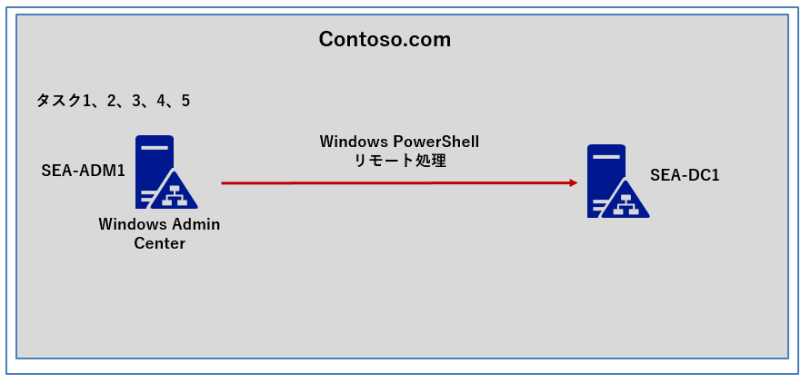

## <a name="lab-setup"></a>ラボのセットアップ

仮想マシン: **SEA-DC1** および **SEA-ADM1** を使用します。

1. **SEA-ADM1** を選択します。
1. 次の資格情報を使用してサインインします。

   - ユーザー名: **Administrator**
   - パスワード: **Pa55w.rd**
   - ドメイン: **CONTOSO**

このラボでは、仮想マシンを使用 します。


### <a name="task-1-install-windows-admin-center"></a>タスク 1: Windows Admin Center をインストールする

1. **SEA-ADM1** で、 **[スタート]** を選択し、 **[ Windows PowerShell (管理者) ]** を選択します。
1. **Windows PowerShell** コンソールで、次のコマンドレットを実行し、Windows Admin Center の最新バージョンをインターネットからダウンロードします。
   
   ```powershell
   Start-BitsTransfer -Source https://aka.ms/WACDownload -Destination "$env:USERPROFILE\Downloads\WindowsAdminCenter.msi"
   ```
1. 次のコマンドレットを実行し、Windows Admin Center をインストールします。
   
   ```powershell
   Start-Process msiexec.exe -Wait -ArgumentList "/i $env:USERPROFILE\Downloads\WindowsAdminCenter.msi /qn /L*v log.txt REGISTRY_REDIRECT_PORT_80=1 SME_PORT=443 SSL_CERTIFICATE_OPTION=generate"
   ```

   > **注**: インストールが完了するまでに、2 ～3分ほど要します。

   > **注**:インストールが完了すると、**"ERR_Connection_Refused"** というエラー メッセージが表示されることがあります。 エラーが発生した場合は、SEA-ADM1 を再起動し、再度コマンドレットを実行してください。

### <a name="task-2-add-servers-for-remote-administration"></a>タスク 2: リモート管理用のサーバーを追加する

1. **SEA-ADM1** で Microsoft Edge を開始して、`https://SEA-ADM1.contoso.com` にアクセスします。 

1. **[ Windows Security (Windows セキュリティ)]** ダイアログ ボックスで次の資格情報を入力し、 **[ OK ]** をクリックします。

   | 設定                  | 値                        |
   | --------------------- | ------------------------- |
   | Username (ユーザー名) | **Contoso\Administrator** |
   | Password (パスワード) | **Pa55w.rd**              |

   

1. ポップアップ ウィンドウを確認し、右上の [×] をクリックします。

   ※**「Successfully updated your extentions」** というポップアップメッセージが表示される場合がありますが、 **[OK]** をクリックして構いません。

   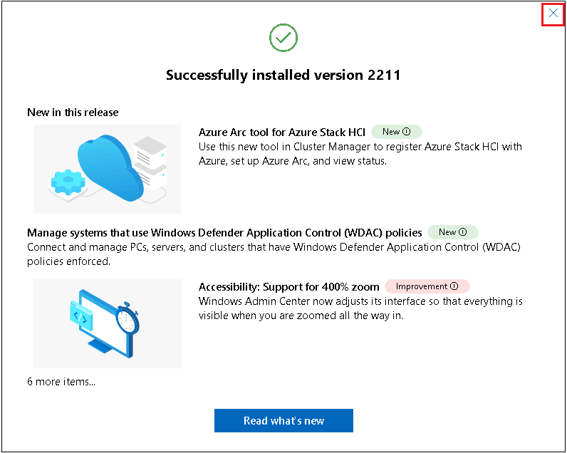

> **※必要に応じ、以下の手順を実行し、Windows Admin Center の表示を日本語へ変更することができます。**
>
> 1. **Windows Admin Center の右上にある 歯車マーク(Settings) をクリックします。**
>
> 2. **Settings ページの左ナビゲーションペイン一覧から、 [Language / Region] を選択します。**
>
> 3.  **[Language] のプルダウンから [日本語] を選択し、 [Save and reload] をクリックします。** 


4. **[すべての接続]** ページを確認し、**sea-adm1.contoso.com**  が含まれていることを確認します。

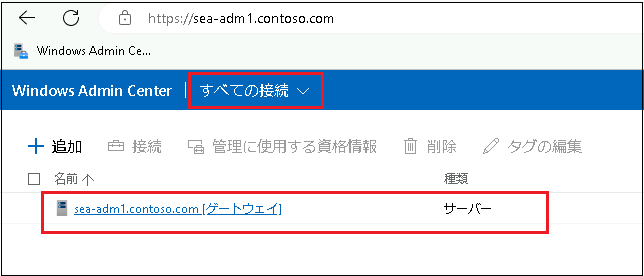

5. **[すべての接続]** ページで、 **[ + 追加]** をクリックします。

6. **[リソースの追加または作成]** ウィンドウの **[サーバー]** タイルで、 **[追加]** をクリックします。

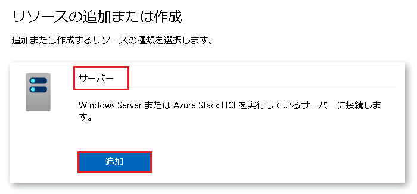

7. **[サーバー名]** テキスト ボックスに **「sea-dc1.contoso.com」** と入力します。

8. **「資格情報が必要です」**というメッセージが表示されたら、**[この接続では別のアカウントを使用する]** のラジオボタンをチェックし、次の資格情報を入力して、 **[資格情報を含めて追加]** を選択します。

   | 設定                  | 値                        |
   | --------------------- | ------------------------- |
   | Username (ユーザー名) | **Contoso\Administrator** |
   | Password (パスワード) | **Pa55w.rd**              |


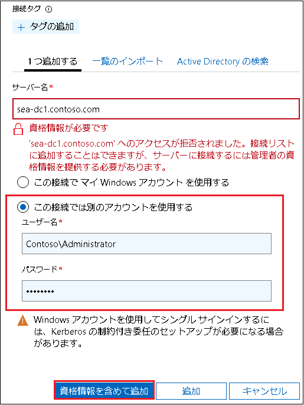

9. **[すべての接続]** ページに戻り、**sea-dc1.contoso.com**  が Windows Admin Center に追加されたことを確認します。

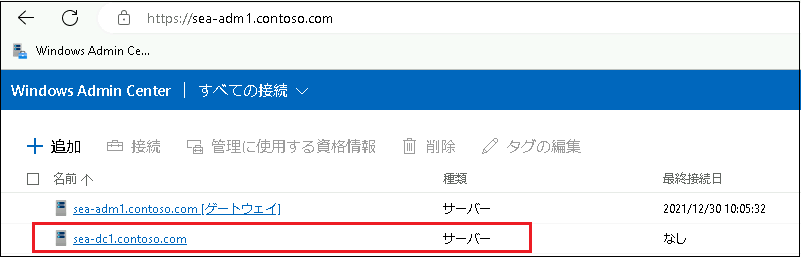

**※このタスクを終了すると、Windows Admin Center から複数のリモートサーバーを管理できるように構成できたことが確認できます。**


### <a name="task-3-configure-windows-admin-center-extensions"></a>タスク 3: Windows Admin Center 拡張機能を構成する

1. **SEA-ADM1** の Windows Admin Center の右上にある **[歯車]** アイコンをクリックします。

1. 左ペインで、 **[拡張]** を選択し、利用可能な拡張機能を確認します。

   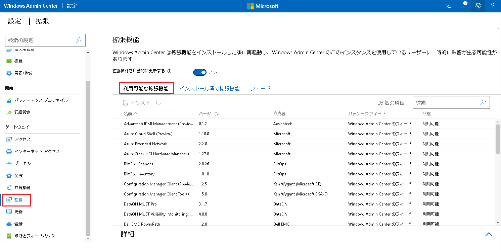

1. 利用可能な拡張機能の一覧から、**[Security (Preview)]**  の拡張機能を選択します。 **[インストール]** をクリックすると、 Windows Admin Center が更新されます。

   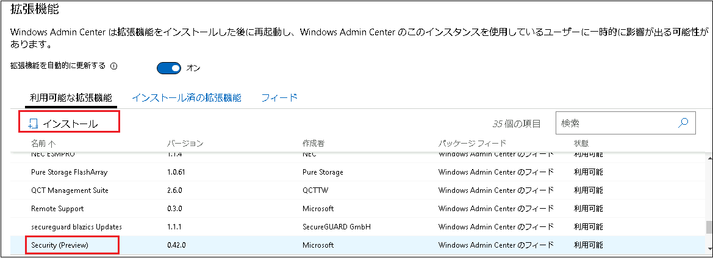

   > **注**: **セキュリティ (プレビュー)** 拡張機能を使用できない場合は、別の Microsoft 拡張機能を選択します。

1. インストール済の拡張機能一覧に **[Security (Preview)]** 拡張機能が含まれていることを確認します。

   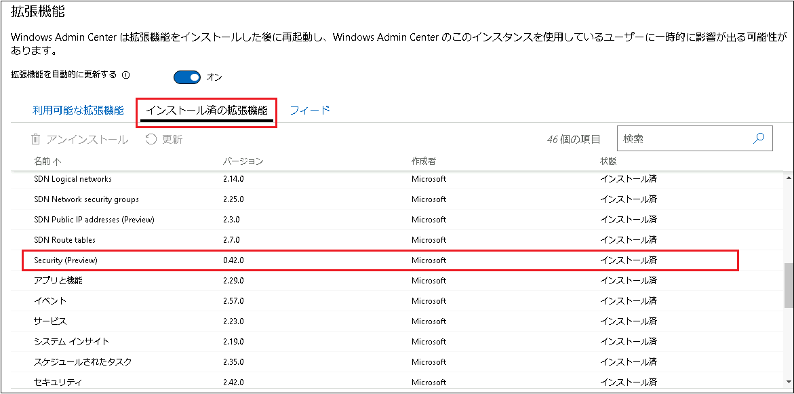

1. Windows Admin Center の **[すべての接続]** プルダウンから、**[サーバー マネージャー]** を選択します。

   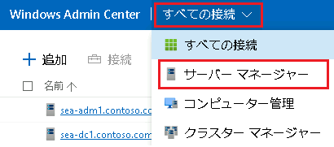

1. **[サーバー接続]** ページで、**sea-dc1.contoso.com** のリンクを選択します。

   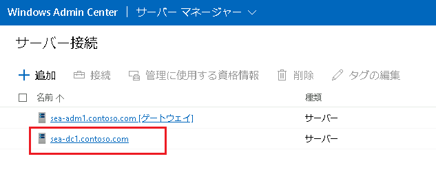

1. **[この接続では別のアカウントを使用する]** のラジオボタンにチェックを入れ、以下の資格情報を入力します。

   | 設定                  | 値                        |
   | --------------------- | ------------------------- |
   | Username (ユーザー名) | **Contoso\Administrator** |
   | Password (パスワード) | **Pa55w.rd**              |


8. **[これらの資格情報をすべての接続で使用します。]** ダイアログボックスにチェックを入れ、 **[続行]** を選択します。

   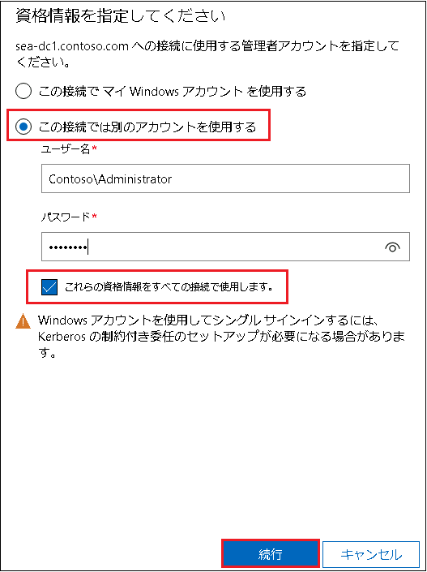

   

9. **SEA-DC1** ページの左のナビゲーションペインの一覧から、 **[DNS]** を選択し、 **[インストール]** をクリックします。※DNS PowerShell ツールをインストールします。

10. **Contoso.com** ゾーンを選択し、**SEA-DC1** で構成済みの DNS レコードの一覧を確認します。

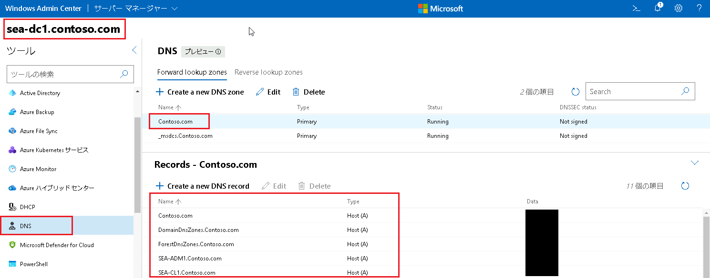


### <a name="task-4-verify-remote-administration"></a>タスク 4: リモート管理を確認する

1. **SEA-ADM1** のWindows Admin Center で、左側ナビゲーションペインの **[ツール]** の一覧から **[概要]** を選択します。Windows Admin Center の詳細ウィンドウでは、基本的なサーバー情報とパフォーマンス監視が確認できるようになります。

   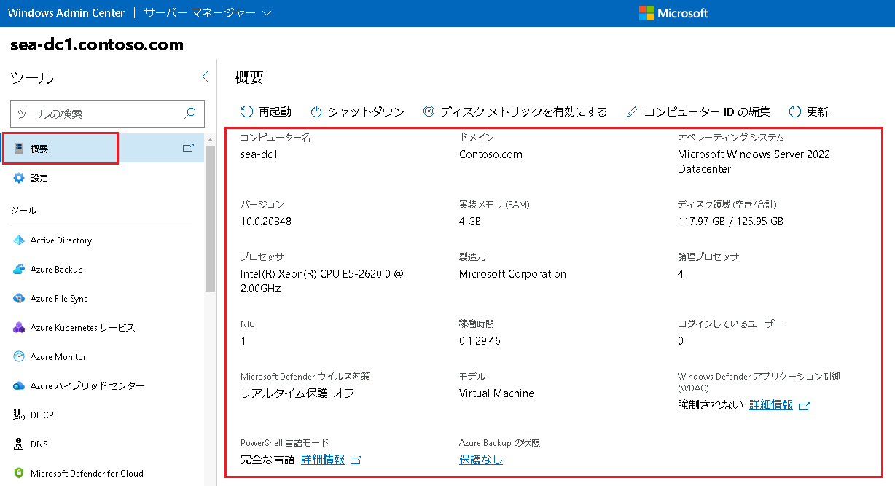

   

2. 左ナビゲーションペインの **[ツール]** のリストを下にスクロールして、 **[役割と機能]** を選択し、インストール済みの役割や機能の一覧を確認します。

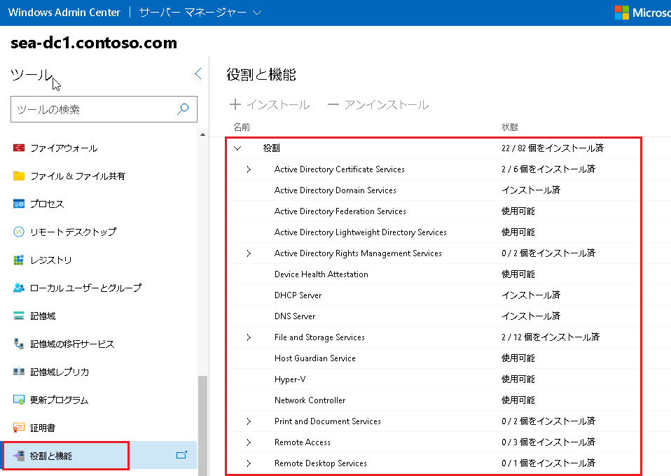

3. **[役割と機能]** の一覧を下にスクロールして **[ Telnet Client ]** チェックボックスを選択し、 **[ + インストール]** をクリックします。 

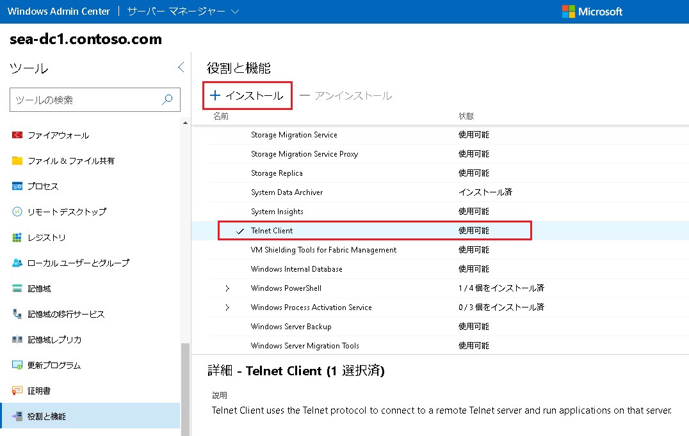

4. **[役割と機能のインストール]** ウィンドウで **[はい]** をクリックし、Telnet クライアントが正常にインストールされたことを確認するメッセージが表示されるまで待ちます。

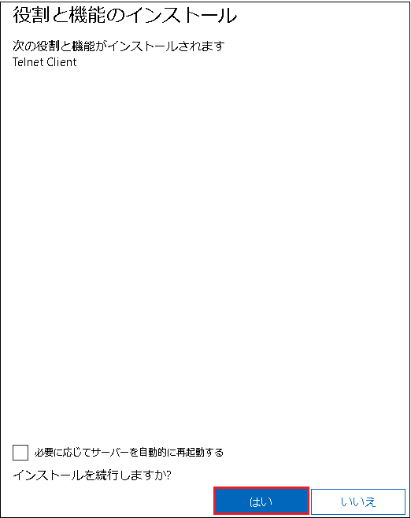

5. 左ナビゲーションペインの一覧から **[設定]** を選択します。

6. 右側の **[設定]** セクションで、 **[リモート デスクトップ]** を選択します。

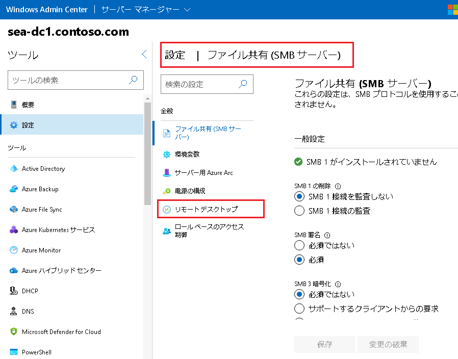

7. **[リモート デスクトップ]** セクションで、 **[このコンピューターへのリモート接続を許可する]** チェックボックスを選択し、 **[保存]** をクリックします。

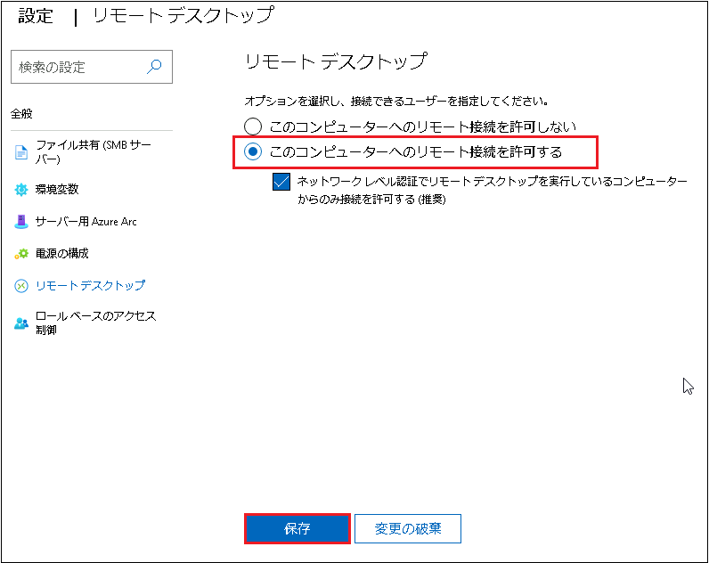

8. 左ナビゲーションペインの **[ツール]** の一覧から、 **[リモート デスクトップ]** を選択します。

9. **[リモート デスクトップ]** ペインで、 **[このマシンが提示した証明書で自動的に接続する]** チェックボックスを選択し、 **[接続]** を選択します。

  **※資格情報は自動的に入力されます。「Sea-dc1.contoso.com により提示された証明書を使用して接続しますか?」というダイアログボックスが表示されたら、 [確認] をクリックしてください。**

10. Windows Admin Center インターフェイス内から、リモート デスクトップ経由で **SEA-DC1** に正常に接続されたことが確認出来たら、 **[切断]** します。

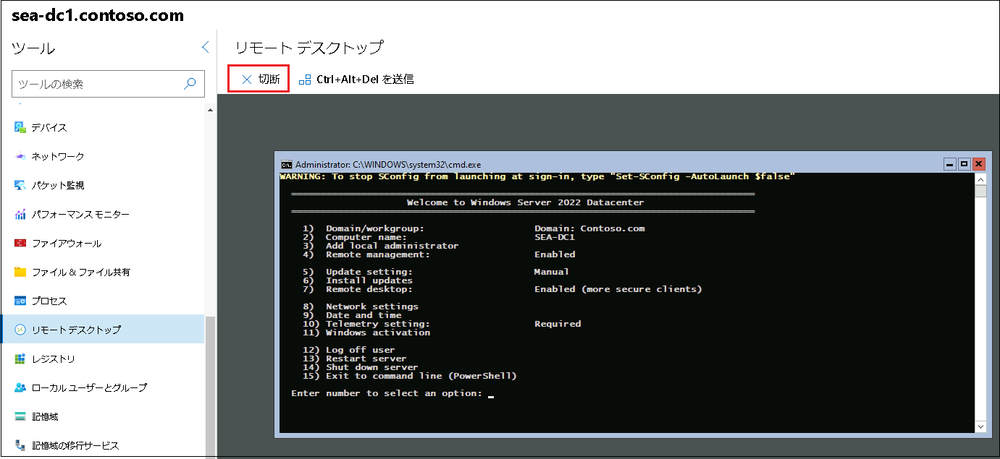

11. Microsoft Edge ウィンドウを閉じます。

**※このタスクを終了すると、Windows Admin Center から管理サーバーへ、リモートデスクトップ接続ができるよう構成されたことが確認できます。**

### <a name="task-5-administer-servers-with-remote-powershell"></a>タスク 5: リモート PowerShell を使用してサーバーを管理する

1. **SEA-ADM1** 上で、**Windows PowerShell** コンソールに切り替えます。

2. **Windows PowerShell** コンソールで、次のコマンドレットを実行して、**SEA-DC1** への PowerShell リモート処理セッションを開始します。

   ```powershell
   Enter-PSSession -ComputerName SEA-DC1
   ```

3. **[SEA-DC1]** プロンプトから次のコマンドレットを実行し、アプリケーション アイデンティティ サービス (AppIDSvc) のステータスを表示します。

   ```powershell
   Get-Service -Name AppIDSvc
   ```

   

   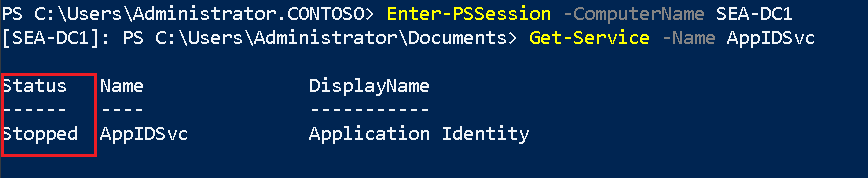

   > **注: サービスが現在停止中であることを確認します。**

4. **[SEA-DC1]** プロンプトから、次のコマンドレットを実行して Application Identity サービスを開始します。

   ```powershell
   Start-Service -Name AppIDSvc
   ```

   

5. **[SEA-DC1]** プロンプトから、次のコマンドレットを実行して、アプリケーション ID サービス (AppIDSvc) の状態を表示します。

   ```powershell
   Get-Service -Name AppIDSvc
   ```

   

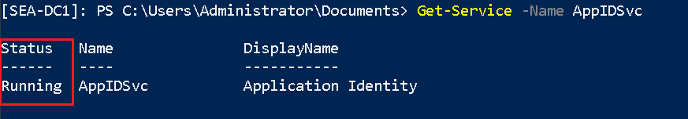

> **注: サービスが現在実行中に変更されたことを確認します。**

6. **[SEA-DC1]** プロンプトから、次のコマンドレットを実行して、リモート処理セッションを終了します。

   ```powershell
   Exit-PSSession
   ```

   

### <a name="results"></a>結果

この演習を完了すると、Windows Admin Center がインストールされ、ラボ環境内のサーバーに接続されます。 機能のインストールや、リモート デスクトップ接続の有効化およびテストなどのリモート管理タスクを複数実行しました。 最後に、PowerShell リモート処理を使用してサービスの状態を確認し、開始しました。


以上で演習は終了です。お疲れさまでした。
