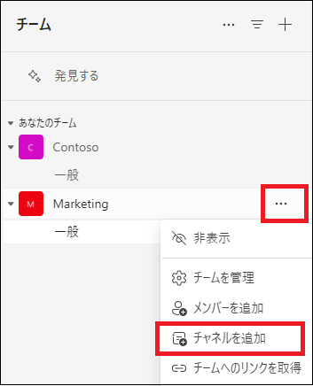

# Lab04: Microsoft Teams の主な機能の確認

## シナリオ

Adatum 社では、現在ハイブリッドワークが推奨されています。従業員はその日の業務によってオフィスに出社することもありますが、自宅でテレワークをする日もあります。また、サテライトオフィスで業務に従事する可能性も出てきました。Adatum の CTO は、このような労働環境でも従業員間のコミュニケーションを重視しており、タスクが滞りなく進められるよう、Microsoft Teams と Planner の検証をするよう、エンタープライズ管理者の Holly Dickson に指示を出しました。

> **補足 : グローバル管理者の役割には Teams 管理者の役割が含まれているため、Holly は Teams 関連のすべてのタスクを実行できます。**

## 目標とタスク

このラボを完了すると、次のことができるようになります。

- チームの管理

  

この演習の主なタスクは次のとおりです。

1. チームの作成とメンバーの追加

## 予想所要時間: 10 分

### タスク 1: チームの作成とメンバーの追加

1. InPrivate ウィンドウ(Microsoft Edge) もしくは、シークレットウィンドウ (Google Chrome) で、Microsoft365 管理センター (https://admin.microsoft.com) にアクセスし、以下の資格情報でサインインします。

| 項目           | 値                                                           |
| -------------- | ------------------------------------------------------------ |
| **ユーザーID** | `Holly@XXXXXXXXXXX.onmicrosoft.com`  @マーク以降のXXXXXXXXXは各自異なります。 |
| **パスワード** | Pa55w.rd1234                                                 |

2. **[サインインの状態を維持しますか]** ページが表示された場合は、 **[いいえ]** をクリックします 。

3. Microsoft 365 管理センターの左ペインから、 **[ユーザー] - [アクティブなユーザー]** を選択します。

4. **[アクティブなユーザー]** ページで、 **[Megan Bowen]** の表示名にマウスを合わせた時に表示される、鍵アイコンをクリックします。

5. Megan の **[パスワードのリセット]** ページで、 **[パスワードを自動作成する]** と **[初回サインイン時にこのユーザーにパスワードの変更を要求する]** のチェックボックスをオフにします。

6. **[パスワード]** ボックスに **「Pa55w.rd1234」** と入力して、 **[パスワードのリセット]** をクリックします。

7. **「パスワードがリセットされました」** と表示されたことを確認し、 **[閉じる]** ボタンをクリックします。

8. **[Isaiah Langer]** のアカウントでも、4 ～ 8 の手順を繰り返し、パスワードをリセットします。

9. 左上の **[アプリ起動ツール]** ボタンをクリックします。

10. アプリの一覧から **[Teams]** を選択してサインインします。

    

12. **[チャット] - [新しいアイテム(下向きのアイコン)] - [新しいチーム]** とクリックします

　

13. **[チームの作成]** ページで、 以下を入力し **[作成]** をクリックします。

| 項目           | 値                                                           |
| -------------- | ------------------------------------------------------------ |
| **チーム名** | Marketing
| **説明** | マーケティングチーム用                                                 |
| **チームの種類** | プライベート                                                 |
| **最初のチャネルに名前を付けてください** | 一般                                                 |

15. **[Marketingにメンバーを追加]** ページの検索ボックスに **[Megan Bowen]** と入力して検索し、 **[Megan Bowen]** を選択します。

16. 続いて **[Isaiah Langer]** と入力して検索し、 **[Isaiah Langer]** を選択した後、 2つのユーザーが表示されていることを確認し、 **[追加]** をクリックします。

　

### タスク 2: Teams に チャネル を追加する

1. **[Marketing]** チャネル右の **[・・・]** をクリックし、 **[チャネルを追加]** をクリックします。

　

14.  **[チャネルの作成]** ページで以下を入力し、 **[作成]** をクリックします。

| 項目             | 値                     |
| ---------------- | ---------------------- |
| **チャネル名**   | 進捗報告               |
| **説明**         | プロジェクトの進捗報告 |
| **チャネルの種類を選択する** | 標準-チームの全員がアクセスできます                  |

　

15.  **[進捗報告]** チャネルが追加されたことが確認出来たら任意のメッセージを投稿します。
16.  現在使用しているものとは別のブラウザー(Microsoft EdgeやChrome)のInprivate ウィンドウやシークレットウインドウを起動し、ブラウザー版のTeams (https://teams.microsoft.com) に以下の資格情報でサインインします。

| 項目           | 値                                                           |
| -------------- | ------------------------------------------------------------ |
| **ユーザーID** | `IsaiahL@XXXXXXXXXXX.onmicrosoft.com` @マーク以降のXXXXXXXXXは各自異なります。 |
| **パスワード** | Pa55w.rd1234                                                 |

17. 進捗報告チャネルが追加されていることが確認できます。前の手順で投稿したメッセージを確認してみてください。

    

### **結果 : この演習を完了すると、Microsoft Teams の利用が行えます。**
