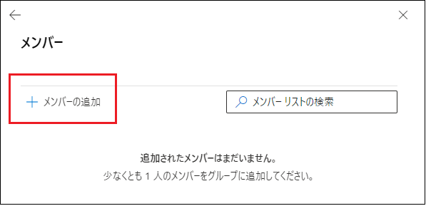
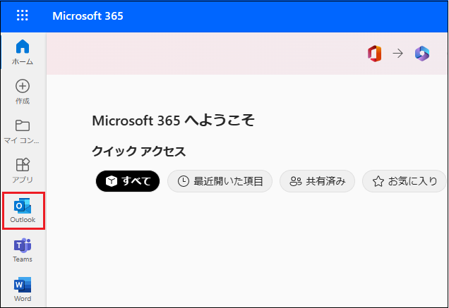

# Lab04: Microsoft Teams の主な機能の確認

## シナリオ

Adatum 社では、現在ハイブリッドワークが推奨されています。従業員はその日の業務によってオフィスに出社することもありますが、自宅でテレワークをする日もあります。また、サテライトオフィスで業務に従事する可能性も出てきました。Adatum の CTO は、このような労働環境でも従業員間のコミュニケーションを重視しており、タスクが滞りなく進められるよう、Microsoft Teams の検証をするよう、エンタープライズ管理者の Holly Dickson に指示を出しました。

> **補足 : グローバル管理者の役割には Exchange 管理者の役割が含まれているため、Holly は Teams 関連のすべてのタスクを実行できます。**

## 目標とタスク

このラボを完了すると、次のことができるようになります。

- チームの管理

- Teams の拡張機能の追加

  

この演習の主なタスクは次のとおりです。

1. チームの作成とメンバーの追加
2. Teams に Planner を追加する

オプション. メーリングリストの検証

## 予想所要時間: 20 分

### タスク 1: チームの作成とメンバーの追加

1. InPrivate ウィンドウ(Microsoft Edge) もしくは、シークレットウィンドウ (Google Chrome) で、Microsoft 365 管理センター ([https://admin.microsoft.com](https://admin.microsoft.com/)) にアクセスし、以下の資格情報でサインインします。

| 項目           | 値                                                           |
| -------------- | ------------------------------------------------------------ |
| **ユーザーID** | `Holly@XXXXXXXXXXX.onmicrosoft.com`  @マーク以降のXXXXXXXXXは各自異なります。 |
| **パスワード** | Pa55w.rd1234                                                 |

2. **[サインインの状態を維持しますか]** ページが表示された場合は、 **[いいえ]** をクリックします 。

3. **[Microsoft 365管理センター]** の左ペインで、 **[ ・・・すべて表示]**  をクリックし、 **[管理センター] - [Teams]** を選択します。

   ※ブラウザーの新しいタブに、 **[Teams 管理センター]** が表示されます。 **[Teams 管理センターへようこそ。]** ウィンドウが表示された場合は、 **[ ツアーをスキップ ]** を選択してウィンドウを閉じます。

   ※ブラウザーの環境により、 Teams 管理センターが英語表記となる場合があります。必要に応じ、ブラウザーの翻訳等を利用してください。

4. Teams 管理センターの左ナビゲーションペインから、 **[チーム]** を選択し、 **[チームを管理する]** をクリックします。

　

5.  **[チームを管理する]** ページで、 **[ ＋ 追加]** をクリックします。

　

6.  **[新しいチームを追加]** ページが表示されたら、以下を入力して、 **[Apply]** をクリックします。

| 項目             | 値                                 |
| ---------------- | ---------------------------------- |
| **名前**         | マーケティング                     |
| **説明**         | マーケティングチーム               |
| **チーム所有者** | Holly Dickson (ホリー・ディクソン) |
| **プライバシー** | プライベート                       |

　

7.  **[チームを管理する]** ページにに戻り、チームの一覧から **[マーケティング]** チームを選択します。

　

8.  **[マーケティング]** チームページの **[メンバー]** タブが表示されている状態で、 **[ ＋ 追加]** をクリックします。

　 

9.  **[メンバーを追加]** ページの [ディスプレイまたはユーザー名で検索] ボックスで、 **[Megan Bowen]** と  **[Isaiah Langer]** を検索し、追加してから **[Apply]** をクリックします。

10.  **[マーケティング]** チームページの **[メンバー]** タブに、Megan と Isaiah が追加されたことが確認できます。

11.  Microsoft 365 管理センターを表示しているブラウザーのタブに切り替えます。

12.   **[Microsoft 365管理センター]** の左ペインで、 **[ユーザー] - [アクティブなユーザー]** の順にクリックします。

13.   **[アクティブなユーザー]** ページで、 **[Megan Bowen]** の表示名にマウスを合わせた時に表示される、鍵アイコンをクリックします。

14.  Megan の **[パスワードのリセット]** ページで、 **[パスワードを自動作成する]** チェックボックスをオフにします。

15.   **[パスワード]** ボックスに **「Pa55w.rd1234」** と入力して、 **[初回サインイン時にこのユーザーにパスワードの変更を要求する]** チェックボックスをオフにします。

16.   **[パスワードのリセット]** をクリックします。

17.   **「パスワードがリセットされました」** と表示されたことを確認し、 **[閉じる]** ボタンをクリックします。

18.   **[Isaiah Langer]** のアカウントでも、13 ～ 17 の手順を繰り返し、パスワードをリセットします。

19.  Teams 管理センターの右上にあるイニシャルのアイコンをクリックして、サインアウトします。
20.  Microsoft 365 管理センタの右上にあるイニシャルのアイコンをクリックして、サインアウトします。
21.  Teams 管理センター を表示しているブラウザーのタブを [ × ] で閉じます。

### タスク 2: Teams に Planner を追加する

1. InPrivate ウィンドウ(Microsoft Edge) もしくは、シークレットウィンドウ (Google Chrome) で、Microsoft 365 管理ポータル (https://portal.office.com/) にアクセスし、以下の資格情報でサインインします。

| 項目           | 値                                                           |
| -------------- | ------------------------------------------------------------ |
| **ユーザーID** | `MeganB@XXXXXXXXXXX.onmicrosoft.com` @マーク以降のXXXXXXXXXは各自異なります。 |
| **パスワード** | Pa55w.rd1234                                                 |

2.  **[Microsoft 365 へようこそ]** ページが表示された場合は、右側に表示される **[>]** ボタンを3回クリックします。(表示されない場合は、そのままMicrosoft 365 ポータルが表示されます)

3.  左のタスクバーから **[Teams]** を選択します。

　

4.  [チームをまとめましょう] ページが表示されたら、右上の [ × ] をクリックします。

　

5.  Teams の左ナビゲーションペインから **[アプリ]** をクリックします。

　

6.  **[Microsoft によるビルド]** の一覧から **[Planner および To Do タスク Tasks]** を選択します。

　

7.  **[Planner および To Do タスク Tasks]** ページの **[開く]** のプルダウンを展開して、 **[チームに追加]** をクリックします。

　

8.  **[チームに Planner および To Do タスク Tasks を追加する]** ページで、チームまたはチャネルの名前検索ボックスをクリックして、 **[マーケティング]** を選択したら、 **[タブを設定]** をクリックします。
9.  **[Planner および To Do タスク Tasks]** ページに戻り、 **[新しいプランを作成する]** のラジオボタンが選択されている状態で、 **[タブ名]** に **[マーケティングプロジェクト]** と入力して **[保存]** をクリックします。

　

 　10.   **[マーケティング]** チームの **[一般]** に **[マーケティングプロジェクト]** タブが追加されたことが確認できます。

11. **[ボード]** タブの **[To Do]** を表示し、 **[ ＋ タスクを追加]** をクリックします。

12.  以下を入力して、 **[タスクを追加]** をクリックします。

| 項目               | 値                 |
| ------------------ | ------------------ |
| **タスク名を入力** | スケジュールの計画 |
| **期限の設定**     | 任意の日付を選択   |
| **割り当てる**     | Isaiah と Megan    |

13. 11と12の手順を繰り返し、以下の2つのタスクを追加します。

| 項目               | 値               |
| ------------------ | ---------------- |
| **タスク名を入力** | 備品発注         |
| **期限の設定**     | 任意の日付を選択 |
| **割り当てる**     | Megan            |

| 項目               | 値               |
| ------------------ | ---------------- |
| **タスク名を入力** | プレゼン資料作成 |
| **期限の設定**     | 任意の日付を選択 |
| **割り当てる**     | Isaiah           |

14.   **[マーケティングプロジェクト]** タブの、 **[リスト]** に切り替え、作成したタスクが一覧として表示されていることを確認します。

　

15. マーケティングチームの **[投稿]** チャネルに切り替えます。

　

16.  **[新しい投稿]** をクリックして、任意のメッセージを投稿します。
17.   **[投稿]** チャネル内の **[さらにチャネルを作成]** をクリックします。

　

18.  ["マーケティング" チームのチャネルを作成] ページで以下を入力し、 [追加] をクリックします。

| 項目             | 値                     |
| ---------------- | ---------------------- |
| **チャネル名**   | 進捗報告               |
| **説明**         | プロジェクトの進捗報告 |
| **プライバシー** | 標準                   |

　

19.  **[進捗報告]** チャネルが追加されたことが確認出来たら、 **[新しい投稿]** をクリックして任意のメッセージを投稿します。
20. 

2. **[グループの種類の選択]** ページで、 **[配布]** を選択し、 **[次へ]** をクリックします。

   

3. **[基本の設定]** ページで、 **[名前]** フィールドに  **「Sales Department」** と入力し、 **[説明]** フィールドに移動します ([ 次へ] ボタンが有効になります)。 **[説明]** フィールドは空白のままにし、 **[次へ]** をクリックします。

   

4. **[所有者の割り当て]** ページで、 **[ + 所有者の割り当て]** をクリックします。

   

5. **[所有者の割り当て]** ページで、 **[Holly Dickson]** の左にあるチェックボックスをオンにして、 **[追加 (1)]** をクリックします。
6. **[所有者の割り当て]** ページに戻り、Holy Dickson が所有者として追加されたことが確認できたら、 **[次へ]** をクリックします。
7. **[メンバーの追加]** ページで、 **[ + メンバーの追加]** をクリックします。
8. 一覧から、 **[Allan Deyoung]** のチェックボックスをオンにし、 **[追加 (1)]** をクリックします。
9. **[メンバーの追加]** ページに戻り、 **[Allan Deyoung]** が追加されたことを確認して、 **[次へ]** をクリックします。
10. **[設定の編集]** ページで、以下の情報を入力し、 **[次へ]** をクリックします。※指示がないものは規定値のままで構いません。

| 項目                      | 値                                                          |
| ------------------------- | ----------------------------------------------------------- |
| グループのメール アドレス | SalesDept ※@以降のドメイン名は規定値を使用してください |
| グループに参加            | 所有者の承認                                                |
| グループから脱退          | クローズド                                                  |

　

12.  **[確認とグループの追加の完了]** ページで、 **[グループを作成]** ボタンをクリックします。
13. グループがグループ リストに表示されるまでに最大 1 時間かかる可能性があることを示すメッセージがページの上部に表示されたら、 **[閉じる]** をクリックします。
14.  [グループ] ページに戻り、 [配布リスト] タブを選択して、Sales Department グループを確認します。

> **注 : Sales Department グループが配布グループのリストに表示されない場合は、表示されるまで数分ごとに [更新] ボタンをクリックしてください。**

　

15. グループ名の一覧から、 **[Sales Department]** グループを選択します。
16.  **[Sales Department]** ページが表示されたら、 **[メンバー]** タブをクリックします。
17.  **[メンバー]** タブの **[所有者]** セクションで、 **[すべての所有者の表示と管理]** をクリックします。

　

18.  **[所有者]** ページが表示されたら、 **[ + 所有者を追加]** をクリックします。

　

19.  **[所有者の追加]** ウィンドウで、 **[Alex Wilber]** の左にあるチェックボックスをオンにして、 **[追加] (1)**  ボタンをクリックします。

20. **[所有者]** ページに戻ったら、 Alexがリストに追加されたことを確認し、左上にある **[ ← ]** をクリックして戻ります。

　　

21.  **[Sales Department]** ページに戻り、 **[所有者]** セクションで **[すべてのメンバーの表示と管理]** をクリックします。

　

22.  **[メンバー]** ページが表示されたら、 **[ + メンバーを追加]** をクリックします。

　

23. **[メンバーの追加]** ページで、 **[Diego Siciliani]** と **[Lynne Robbins]** の左にあるチェックボックスをオンにし、 **[追加] (2)** ボタンをクリックします。

24. **[メンバー]** ページに戻り、LynneとDiego がリストに追加されたことを確認したら、左上にある **[ ← ]** をクリックして戻ります。

25.  **[メンバー]** ページに戻ると、 **[所有者]** に HollyとAlex、 **[メンバー]** に LynneとDiego が追加されたことが確認できます。

　

26.  **[Sales Department]** ページの右上にある [ × ] をクリックして閉じます。

27. ブラウザとすべてのタブを開いたままの状態で、次のタスクに進んでください。

> **補足 : このタスクでは、Exchange Online 内にグループを作成し、所有者とメンバーを追加しました。今回は、メーリングリストとして利用可能な、配布グループを作成しています。**

### オプション: メーリングリストの確認

1. InPrivate ウィンドウ(Microsoft Edge) もしくは、シークレットウィンドウ (Google Chrome) で、Microsoft 365 管理センター (https://portal.office.com/) にアクセスし、以下の資格情報でサインインします。

1. 左上の **[アプリ起動ツール]** ボタンをクリックします。

　

3. アプリの一覧から **[Outlook]** を選択します。

　

4. Outlook に移動したら、 [新規メール] をクリックします。

　

5. 新規メール作成画面が表示されたら、以下を入力して **[送信]** をクリックします。

| 項目     | 値                                                           |
| -------- | ------------------------------------------------------------ |
| **宛先** | SalesDept ※SalesDeptと入力すると、検索結果に前のタスクで作成した 配布グループのアドレスが表示されるため、選択してください。 |
| **CC**   | なし                                                         |
| **件名** | 任意タイトル                                                 |
| **本文** | 任意の文章                                                   |

6. 現在使用しているものとは別のブラウザー(Microsoft EdgeやChrome)のInprivate ウィンドウやシークレットウインドウを起動し、Microsoft 365 ポータル (https://portal.office.com)に以下の資格情報でサインインします。

| 項目       | 値                                                           |
| ---------- | ------------------------------------------------------------ |
| ユーザーID | `LynneR@XXXXXXXXXXX.onmicrosoft.com` @マーク以降のXXXXXXXXXは各自異なります。 |
| パスワード | Pa55w.rd1234                                                 |

7. **[サインインの状態を維持しますか]** ページが表示された場合は、 **[いいえ]** をクリックします 。
8. Welcomeページが表示された場合は、右側に表示される **[>]** ボタンを3回クリックします。(表示されない場合は、そのままMicrosoft 365 ポータルが表示されます)
9. 左のタスクバーから **[Outlook]** を選択します。

　

10. 手順 5でHolly が送信したSales Department メーリングリスト宛のメールが届いていることを確認します。

　

> **補足 : LynneRは、配布グループのSales Departmentメンバーとして追加されているため、Holly からのメールが確認できます。**

11. メールが届いていることを確認したら、Outlook の右上にあるユーザーのアイコンをクリックしてサインアウトしてください。同様に、Holly のアカウントでサインインしている Microsoft 365 管理センターからもサインアウトします。

    

### **結果 : この演習を完了すると、Exchange Online のメーリングリストを作成し、送受信の検証ができます。**
