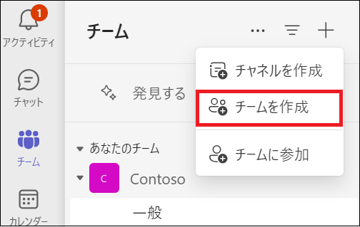

# Lab04: Microsoft Teams の主な機能の確認

## シナリオ

Adatum 社では、現在ハイブリッドワークが推奨されています。従業員はその日の業務によってオフィスに出社することもありますが、自宅でテレワークをする日もあります。また、サテライトオフィスで業務に従事する可能性も出てきました。Adatum の CTO は、このような労働環境でも従業員間のコミュニケーションを重視しており、タスクが滞りなく進められるよう、Microsoft Teams と Planner の検証をするよう、エンタープライズ管理者の Holly Dickson に指示を出しました。

> **補足 : グローバル管理者の役割には Teams 管理者の役割が含まれているため、Holly は Teams 関連のすべてのタスクを実行できます。**

## 目標とタスク

このラボを完了すると、次のことができるようになります。

- チームの管理

- Teams の拡張機能の追加

  

この演習の主なタスクは次のとおりです。

1. チームの作成とメンバーの追加
2. Teams に Planner と To Do を追加する

## 予想所要時間: 20 分

### タスク 1: チームの作成とメンバーの追加

1. InPrivate ウィンドウ(Microsoft Edge) もしくは、シークレットウィンドウ (Google Chrome) で、Microsoft365 管理センター (https://admin.microsoft.com) にアクセスし、以下の資格情報でサインインします。

| 項目           | 値                                                           |
| -------------- | ------------------------------------------------------------ |
| **ユーザーID** | `Holly@XXXXXXXXXXX.onmicrosoft.com`  @マーク以降のXXXXXXXXXは各自異なります。 |
| **パスワード** | Pa55w.rd1234                                                 |

2. **[サインインの状態を維持しますか]** ページが表示された場合は、 **[いいえ]** をクリックします 。

3. Microsoft 365 管理センターの左ペインから、 **[ユーザー] - [アクティブなユーザー]** を選択します。

4. **[アクティブなユーザー]** ページで、 **[Megan Bowen]** の表示名にマウスを合わせた時に表示される、鍵アイコンをクリックします。

5. Megan の **[パスワードのリセット]** ページで、 **[パスワードを自動作成する]** チェックボックスをオフにします。

6. **[パスワード]** ボックスに **「Pa55w.rd1234」** と入力して、 **[パスワードのリセット]** をクリックします。

7. **「パスワードがリセットされました」** と表示されたことを確認し、 **[閉じる]** ボタンをクリックします。

8. **[Isaiah Langer]** のアカウントでも、4 ～ 8 の手順を繰り返し、パスワードをリセットします。

9. 左上の **[アプリ起動ツール]** ボタンをクリックします。

10. アプリの一覧から **[Teams]** を選択します。

    

11. **[チームをまとめましょう]** ページが表示されたら、右上の **[ × ]** をクリックします。

12. **[＋(チームとチャネルの作成と参加)]** をクリックします

　

13. **[チームを作成]** をクリックします。

    

14. **[チームを作成する]** ページで、 以下を入力し **[作成]** をクリックします。

| 項目           | 値                                                           |
| -------------- | ------------------------------------------------------------ |
| **チーム名** | Marketing
| **説明** | マーケティングチーム用                                                 |
| **チームの種類** | プライベート                                                 |
| **最初のチャネルに名前を付けてください** | 一般                                                 |

15. **[Marketingにメンバーを追加]** ページの検索ボックスに **[Megan Bowen]** と入力して検索し、 **[Megan Bowen]** を選択します。

16. 続いて **[Isaiah Langer]** と入力して検索し、 **[Isaiah Langer]** を選択した後、 2つのユーザーが表示されていることを確認し、 **[追加]** をクリックします。

　

### タスク 2: Teams に Planner を追加する

1. Teams の左ナビゲーションペインから **[アプリ]** をクリックします。

　

2.  **[Microsoft によるビルド]** の一覧から **[Planner]** のアイコンをクリックします。

　

3.  **[Planner]** ページの **[追加]** のプルダウンを展開して、 **[チームに追加]** をクリックします。

　

4.  **[チームにPlannerを追加する]** ページで、チームまたはチャネルの名前検索ボックスをクリックして、 **[Marketing]** を選択したら、 **[タブを設定]** をクリックします。
5.  **[Planner]** の概要ページが表示されたら、 **[新しいプランの作成]** のラジオボタンが選択されている状態で、 **[タブ名]** に **[MarketingProgect]** と入力して **[保存]** をクリックします。

　

6.  **[Marketing]** チームの **[一般]** に **[MarketingProject]** タブが追加されたことが確認できます。

7. **[ボード]** タブの **[To Do]** を表示し、 **[ ＋ タスクを追加]** をクリックします。

8.  以下を入力して、 **[タスクを追加]** をクリックします。

| 項目               | 値                 |
| ------------------ | ------------------ |
| **タスク名を入力** | スケジュールの計画 |
| **期限の設定**     | 任意の日付を選択   |
| **割り当てる**     | Isaiah と Megan    |

9. 11と12の手順を繰り返し、以下の2つのタスクを追加します。

| 項目               | 値               |
| ------------------ | ---------------- |
| **タスク名を入力** | 備品発注         |
| **期限の設定**     | 任意の日付を選択 |
| **割り当てる**     | Megan            |

| 項目               | 値               |
| ------------------ | ---------------- |
| **タスク名を入力** | プレゼン資料作成 |
| **期限の設定**     | 任意の日付を選択 |
| **割り当てる**     | Isaiah           |

10.   **[マーケティングプロジェクト]** タブの、 **[リスト]** に切り替え、作成したタスクが一覧として表示されていることを確認します。

　

11. マーケティングチームの **[投稿]** チャネルに切り替えます。

　

12.  **[投稿]** をクリックして、任意のメッセージを投稿します。
13.  **[マーケティング]** チャネル右の **[・・・]** をクリックし、 **[チャネルを追加]** をクリックします。

　

14.  **["マーケティング" チームのチャネルを作成]** ページで以下を入力し、 **[追加]** をクリックします。

| 項目             | 値                     |
| ---------------- | ---------------------- |
| **チャネル名**   | 進捗報告               |
| **説明**         | プロジェクトの進捗報告 |
| **プライバシー** | 標準                   |

　

15.  **[進捗報告]** チャネルが追加されたことが確認出来たら、 **[投稿を開始する]** をクリックして任意のメッセージを投稿します。
16.  現在使用しているものとは別のブラウザー(Microsoft EdgeやChrome)のInprivate ウィンドウやシークレットウインドウを起動し、Microsoft 365 ポータル ([https://portal.office.com](https://portal.office.com/)) に以下の資格情報でサインインします。

| 項目           | 値                                                           |
| -------------- | ------------------------------------------------------------ |
| **ユーザーID** | `IsaiahL@XXXXXXXXXXX.onmicrosoft.com` @マーク以降のXXXXXXXXXは各自異なります。 |
| **パスワード** | Pa55w.rd1234                                                 |

17. **[Microsoft 365 へようこそ]** ページが表示された場合は、右側に表示される **[>]** ボタンを3回クリックします。(表示されない場合は、そのままMicrosoft 365 ポータルが表示されます)

18. 左のタスクバーから **[Teams]** を選択します。

19. **[チームをまとめましょう]** ページが表示されたら、右上の **[ × ]** をクリックします。

20. Megan が追加したマーケティングプロジェクトと、進捗報告チャネルが追加されていることが確認できます。

21. Teams 、Microsoft 365 ポータルからサインアウトして終了します。

    

### **結果 : この演習を完了すると、Microsoft Teams の利用と拡張機能の追加を行えます。**
