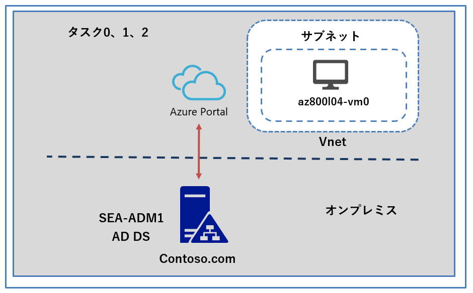
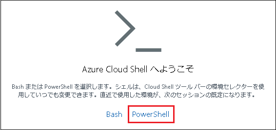
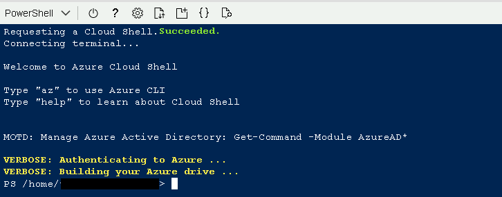
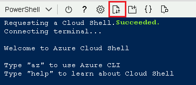

---
lab:
  title: 'ラボ: ハイブリッド シナリオでの Windows Admin Center の使用'
  module: 'Module 4: Facilitating hybrid management'
---

# <a name="lab-using-windows-admin-center-in-hybrid-scenarios"></a>Lab4a: Windows Server を実行する Azure VM のプロビジョニング

## <a name="scenario"></a>シナリオ

Contoso では、オンプレミスとは別に、Azure VM の管理も検討していますが、インターネット経由での接続に懸念事項があることを認識しています。そこで、Azure Bastionを検証することにしました。そこで、検証用にAzure Resource Manager テンプレートを使用して、Windows Server を実行する Azure VM をプロビジョニングし、接続確認を行います。

## <a name="objectives"></a>目標とタスク

このラボを完了すると、次のことができるようになります。

- Azure Bastion を構築し、ブラウザでAzure VM にアクセスする

この演習の主なタスクは次のとおりです。

1. 事前に作成されたリソース グループを特定する。
1. Azure Resource Manager テンプレートを使用して Azure VM を作成する。

## <a name="estimated-time-90-minutes"></a>予想所要時間: 15 分

## <a name="estimated-time-90-minutes"></a>アーキテクチャの図



## <a name="lab-setup"></a>ラボのセットアップ

仮想マシン:  **SEA-ADM1** を使用します。

1. **SEA-ADM1** を選択します。

1. 次の資格情報を使用してサインインします。

   - ユーザー名: **Administrator**
   
   - パスワード: **Pa55w.rd**
   
   - ドメイン: **CONTOSO**
   

このラボでは、仮想マシンと Azure サブスクリプションを使用します。 


### **タスク 0: ラボ ファイルをダウンロードする**

1.  **SEA-ADM1** に、 **Contoso\Administrator** の資格情報でサインインします。

2.  **SEA-ADM1** の、**[スタート]** を展開し、 **Windows PowerShell(管理者)** を起動します。

3.  **Windows PowerShell** コンソール で次のコマンドレットを実行して、ラボ ファイルの最新バージョンを**SEA-ADM1** にダウンロードします。

   ```powershell
   ([System.Net.WebClient]::new()).DownloadFile('https://github.com/MicrosoftLearning/AZ-800-Administering-Windows-Server-Hybrid-Core-Infrastructure/archive/refs/heads/master.zip', 'C:\Labfiles\master.zip')
   ```

   ```powershell
   Expand-Archive -Path 'C:\Labfiles\master.zip' -DestinationPath 'C:\Labfiles'
   ```

   ```powershell
   Move-item -Path "C:\Labfiles\AZ-800-Administering-Windows-Server-Hybrid-Core-Infrastructure-master\Allfiles\Labfiles\Lab04*" -Destination "C:\Labfiles" -confirm:$false
   ```

> **注: BitsTransfer がエラーを返す場合は、エラーが表示されなくなるまで、コマンドを再実行してください。**

### <a name="task-1-create-an-azure-resource-group-by-using-an-azure-resource-manager-template"></a>タスク 1: 事前に作成されたリソース グループを特定する

1. **SEA-ADM1** で Microsoft Edge を起動し、Azure portal (`https://portal.azure.com`)を参照して、Azure AD のグローバル管理者ロールの資格情報でサインインします。(資格情報は、ラボの **[Home]** タブ内で提供されているものを使用してください。)

   ※Azure Portal にサインイン後は、必要に応じ、言語設定を日本語に変更できます。

1. Azure portal の右上にある **［Cloud Shell］** ペインで PowerShell セッションを開きます。

   

1. **Bash** または **PowerShell** のいずれかを選択するように求められたら、**PowerShell** を選択します。

   

4.   **「ストレージがマウントされていません」** というメッセージが表示されたら、 **[サブスクリプション]**  の右にある  **[詳細設定]** を表示をクリックし、以下の項目を変更します。

   ※指示がないものは規定値のままで構いません。

   | 項目                       | 値                                                           |
   | -------------------------- | ------------------------------------------------------------ |
   | **Cloud Shell リージョン** | **米国東部**                                                 |
   | **リソースグループ**       | **既存のものを使用**                                         |
   | **ストレージアカウント**   | **一意であれば、任意の名前で構いません。<br />例 : mystorageaccount** |
   | **共有ファイル**           | **ストレージアカウントで設定した値と同じものを使用**         |

　　項目を入力したら、 **[ストレージの作成]** をクリックします。

　　**※ストレージの作成には数分かかります。**

　　**※ストレージの作成に失敗した場合、ストレージアカウントの名前が既に使用されていることが考えられます。ストレージアカウントの名前を別のものにして再度作成を実行してください。**

5. ストレージの作成が完了すると、 Cloud Shell が起動します。



6. Cloud Shell ペインのツールバーで、**[ファイルのアップロード/ダウンロード]** アイコンをクリックし、ドロップダウン メニューで **[アップロード]** を選択します。



7. タスク0で準備した、 **C:\Labfiles\Lab04\L04-sub_template.json** ファイルを Cloud Shell ホーム ディレクトリにアップロードします。


### <a name="task-2-create-an-azure-vm-by-using-an-azure-resource-manager-template"></a>タスク 2: Azure Resource Manager テンプレートを使用して Azure VM を作成する

1.  Cloud Shell ペインで、**[ファイルのアップロード/ダウンロード]** アイコンをクリックし、ドロップダウン メニューで **[アップロード]** を選択します。Azure Resource Manager テンプレートとテンプレートに対応したパラメーター値が記述された、2つのファイルをアップロードします。

   **C:\\Labfiles\\Lab04\\L04-rg_template.json**

   **C:\\Labfiles\\Lab04\\L04-rg_template.parameters.json**

1.  Cloud Shell ペインで、次のコマンドレットを実行して、このラボで使用する、Windows Server を実行している Azure VM をデプロイします。

   ```powershell
   New-AzResourceGroupDeployment -Name az800l04rgDeployment -ResourceGroupName AZ80x-RG -TemplateFile $HOME/L04-rg_template.json -TemplateParameterFile $HOME/L04-rg_template.parameters.json
   ```

   >**注: Azure VM のデプロイが完了するまで待ってから、次の演習に進んでください。 デプロイには約 5 分程度かかります。**

1. 実行結果の **[ProvisioningState]** が **[Success]** となっていることを確認して、Cloud Shell ペインを閉じます。

4. Azure portalのツール バーに、 **「Virtual Machines」** と入力し、 **[az800l04-vm0]** という仮想マシンが作成されたことを確認してください。 

   


### <a name="results"></a>結果

このラボを完了すると、Azure Resource Manager テンプレートを使用して、Windows Server を実行している Azure VM がデプロイおよび構成されます。

