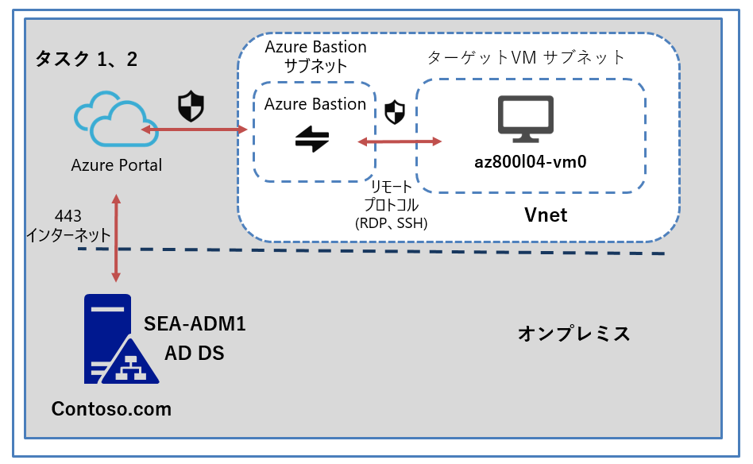
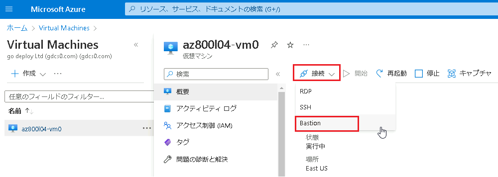
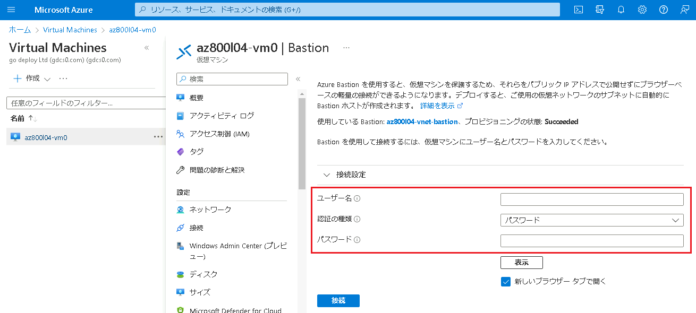

---
lab:
  title: 'ラボ: ハイブリッド シナリオでの Windows Admin Center の使用'
  module: 'Module 4: Facilitating hybrid management'
---

# Lab4b: Azure Bastion の使用

## シナリオ

Azure VM に RDP 以外でアクセスできるようにするため、Azure Bastion を実装し、接続できるか検証することになりました。

## 目標とタスク

このラボを完了すると、次のことができるようになります。

- Azure Bastion を構築し、ブラウザでAzure VM に接続する。

この演習の主なタスクは次のとおりです。

1. Azure Bastion を構築する。
2. Azure Bastion の検証。

## 予想所要時間: 20 分

## アーキテクチャの図

## ラボのセットアップ

仮想マシン:  **SEA-ADM1** を使用します。

1. **SEA-ADM1** を選択します。

1. 次の資格情報を使用してサインインします。

   - ユーザー名: **Administrator**
   
   - パスワード: **Pa55w.rd**
   
   - ドメイン: **CONTOSO**
   
     

このラボでは、仮想マシンと Azure サブスクリプションを使用します。 

### タスク 1: Azure Bastion を構築する

1. **SEA-ADM1** で Microsoft Edge を起動し、Azure portal (`https://portal.azure.com`)を参照して、Azure AD のグローバル管理者ロールの資格情報でサインインします。(資格情報は、ラボの **[Home]** タブ内で提供されているものを使用してください。)

   ※Azure Portal にサインイン後は、必要に応じ、言語設定を日本語に変更できます。

1. Azure portal の検索ボックス内に、**[Virtual Machines]** と入力します。

1. 検索結果の **[サービス]** から **[Virtual Machines]** を選択し、前の演習で作成した、 **[az800l04-vm0]** を選択します。

1. **[az800l04-vm0]** の概要ページから、 **[接続]** のプルダウンを展開し、 **[Bastion]** を選択します。

   

5. 更に、 **[Bastion]** をクリックしデプロイを開始します。

   > **注 : Bastion がデプロイされるまでに、10分以上かかります。 デプロイが完了してから、次のタスクに進んでください。**

### タスク 2: Azure Bastion の検証

1. **SEA-ADM1** の Azure Portal で **[az800l04-vm0 | Bastion]** ページを更新し、資格情報の入力が可能な状態となっていることを確認します。

   > **注 : 資格情報の入力画面に移管していない場合は、バックグラウンドで Bstion のプロビジョニングが完了していません。時間を空けてブラウザを更新してください。**

   

2. 以下の資格情報を入力し、 **[接続]** をクリックします。

   | 設定       | 値               |
   | ---------- | ---------------- |
   | ユーザー名 | **Student**      |
   | 認証の種類 | **パスワード**   |
   | パスワード | **Pa55w.rd1234** |

   

3.  「× ポップアップブロックが原因で新しいウィンドウを開くことができません。ポップアップを許可してから再試行してください。」と表示されたら、Microsoft Edge のポップアップを許可し、再度接続を試します。

4. ブラウザのタブが新たに開き、Azure VM の **az800l04-vm0** にアクセスできたことが確認できます。

   > **注 : 接続後に表示される、ブラウザのポップアップメッセージは [Allow] で許可してください。**

5. 接続できたことを確認したら、 **az800l04-vm0** を表示しているブラウザは閉じて構いません。

### 結果

このラボを完了すると、Contoso のセキュリティの要件を満たす、Windows Server を実行している Azure VM に Azure Bastion 経由で接続できるようになりました。

