---
lab:
  title: 'ラボ: ハイブリッド シナリオでの Windows Admin Center の使用'
  module: 'Module 4: Facilitating hybrid management'
---

# Lab4c: Azure ネットワーク アダプターを使用したハイブリッド接続の実装

## シナリオ

オンプレミス サーバーと前の演習でプロビジョニングした Azure VM の間にハイブリッド接続を確立できることを確認する必要があります。 そこで、Windows Admin Center の Azure ネットワーク アダプター機能を使用して検証を行います。

## 目標とタスク

このラボを完了すると、次のことができるようになります。

- Azure ネットワーク アダプターを使用してハイブリッド接続をテストします。
- Azure で Windows Admin Center ゲートウェイをデプロイします。

この演習の主なタスクは次のとおりです。

1. Azure VM に Gateway Subnet を作成する。
1. Windows Admin Center を Azure に登録する。
1. Azure ネットワーク アダプターを作成する。

## 予想所要時間: 60 分

## アーキテクチャの図

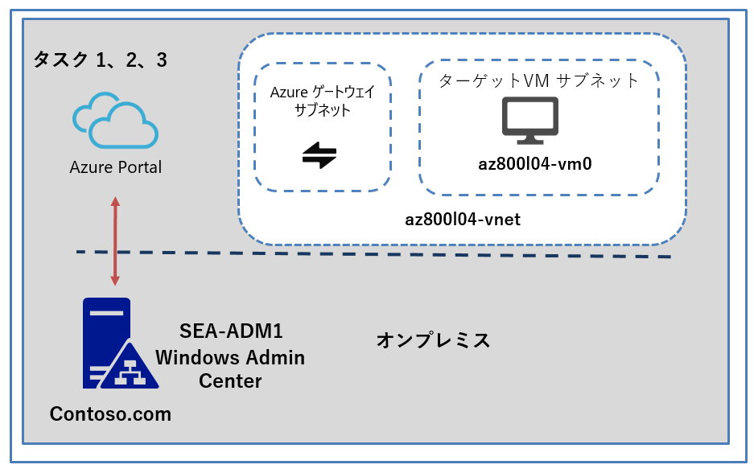

## ラボのセットアップ

仮想マシン:  **SEA-ADM1** を使用します。

1. **SEA-ADM1** を選択します。

1. 次の資格情報を使用してサインインします。

   - ユーザー名: **Administrator**
   
   - パスワード: **Pa55w.rd**
   
   - ドメイン: **CONTOSO**
   
     

このラボでは、仮想マシンと Azure サブスクリプションを使用します。 

### タスク 1: Azure VM に Gateway Subnet を作成する

1. Azure portalのツール バーに、 **「Vnet」** と入力し、結果に表示される **[仮想ネットワーク]** を選択します。 

   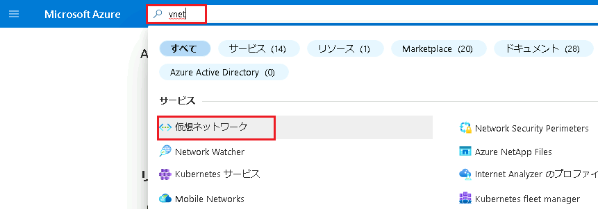

1. **「az800l04-vnet」**という仮想ネットワークがプロビジョニングされていることが確認できます。

   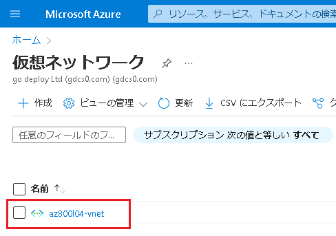

3.  **「az800l04-vnet」**  をクリックし、左のナビゲーションペインの一覧から **[サブネット]** を選択します。

   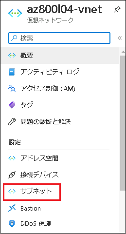

4. **[Subnets]** ページで **[+ Gateway subnet]** を選択します。

5. **[サブネットの追加]** ページで、サブネット アドレス範囲に  **[10.4.3.224/27]** と入力して **[保存]** をクリックします。**※その他の項目は規定値のままで構いません。**

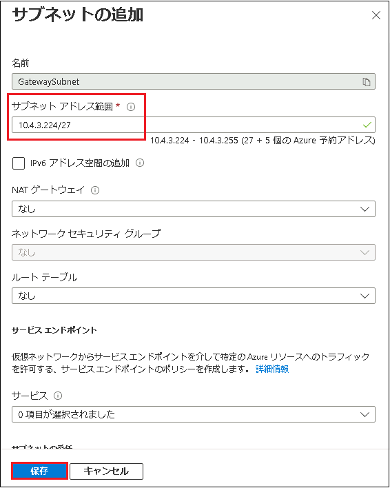

6. **「サブネットが正常に追加されました」** という通知が表示されたら、次のタスクに進みます。

### タスク 2: Windows Admin Center を Azure に登録する

1. **SEA-ADM1** で Microsoft Edge で新しいタブを開き、`https://SEA-ADM1.contoso.com` にアクセスします。

1.  **[Windows セキュリティ]** ダイアログ ボックスに次の資格情報を入力し、**[OK]** をクリックします。

  

| 設定       | 値                         |
| ---------- | -------------------------- |
| ユーザー名 | **CONTOSO\\Administrator** |
| パスワード | **Pa55w.rd**               |

   ※Windows Admin Center にサインイン後、必要に応じ言語設定を日本語に変更してください。

   

3. **[すべての接続]** ページで、 **sea-adm1.contoso.com** エントリを選択します。

4. **sea-adm1.contoso.com** ページの左のナビゲーションペインの一覧から、 **[ネットワーク]** を選択し、 **[ + Azure ネットワーク アダプターの追加 (プレビュー)]** をクリックします。

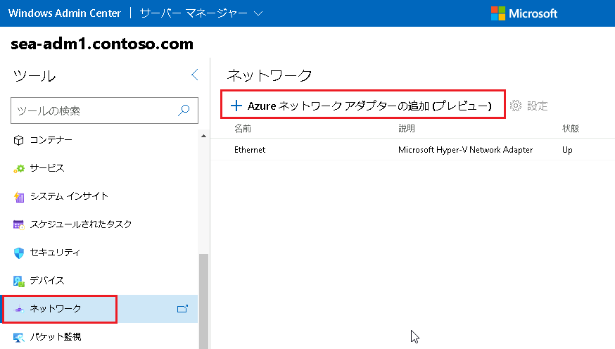

5. **[ Azure ネットワーク アダプターの追加]** ウィンドウで、 **[ Windows Admin Center を Azure に登録]** をクリックします。

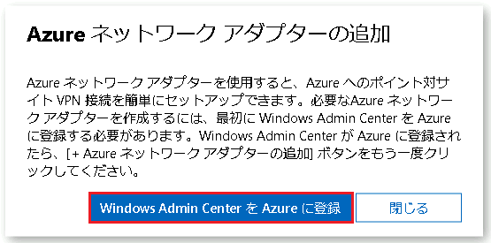

6. Windows Admin Center の Azure ペインの **[設定]** ページで、 **[登録]** を選択します。

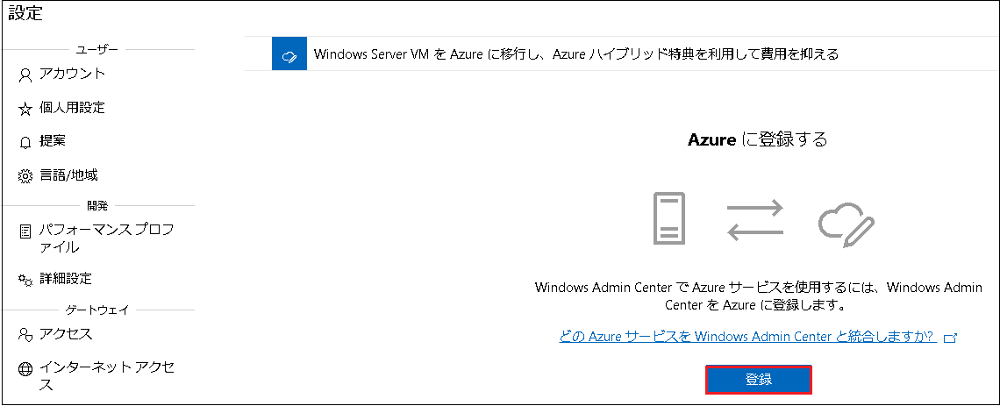

7. **[Windows Admin Center で Azure の使用を開始する]** ウィンドウで、**「2.このコードをコピーします」**  で **[コピー]**  を選択します。

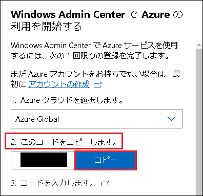

8.  **「3.コードを入力します」** のリンクをクリックし、コードの入力画面に前の手順でコピーしたコードを貼り付け、 **[次へ]** をクリックします。

9. **[サインイン]** ページで、 Azure サブスクリプションへのサインインに使用したものと同じ資格情報を入力し、**[次へ]** を選択します。対応するパスワードを入力し、**[サインイン]** を選択します。

10. **「Windows Admin Center にサインインしようとしていますか? 」** という画面に移管したら、 **[続行]** を選択します。

11. **「Welcome Admin Center」** と表示されたら、Microsoft Edge のタブは閉じます。

12. **[Windows Admin Center で Azure の使用を開始する]**  ウィンドウで、Azure Active Directory アプリケーションが  **[新規作成]** に設定されていることを確認し、 **[接続]** をクリックします。

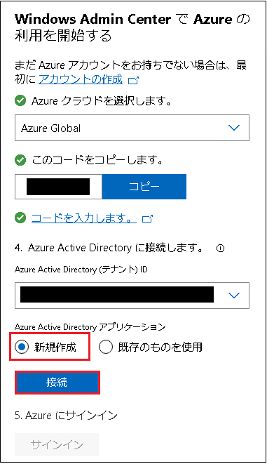

13.  **「5. Azureにサインイン」**  の手順で **[サインイン]** をクリックします。

14.  **「Permissions requested (要求されたアクセス許可)」** のポップアップメッセージが表示されたら、 **[Accept (同意する)]** をクリックします。

**※エラーが発生した場合は、一度登録解除し、再度登録しなおしてください。**

### **タスク 3: Azure ネットワーク アダプターを作成する**

1. **SEA-ADM1** で、Windows Admin Center が表示されている Microsoft Edge ウィンドウを使用して、**sea-adm1.contoso.com** ページを参照し、左のナビゲーションペインの一覧から **[ネットワーク]** を選択します。

1.  Windows Admin Center の **[ネットワーク]** ページで、 **[ + Azure ネットワーク アダプターの追加 (プレビュー)]** エントリを再度選択します。

3. **[ネットワーク アダプター設定の追加]** ウィンドウで、次の設定を行い、**[作成]** をクリックします(指示がない項目は既定値のままにします)。

   |設定|値|
   |---|---|
   |**サブスクリプション**|**既定で入力されたものを使用**|
   |位置情報|**EastUS**|
   |**仮想ネットワーク**|**az800l04-vnet**|
   |**ゲートウェイ サブネット**|**10.4.3.224/27**|
   |**ゲートウェイ SKU**|**VpnGw1**|
   |**クライアント アドレス空間**|**192.168.0.0/24**|
   |**認証証明書**|**自動生成された自己署名ルート証明書とクライアント証明書**|

   > **注 :  [位置情報] を [EastUS] で指定しても、 [仮想ネットワーク] で [az800l04-vnet] が選択できない場合は、前のタスクで作成した仮想ネットワークゲートウェイサブネットのプロビジョニングが完全に完了していません。その場合は、しばらく時間を空けてブラウザ更新をし再度確認してください。最大で30分以上かかる場合があります。**

1.  **SEA-ADM1** で、Azure portal に切り替え、ツール バーに **[仮想ネットワーク ゲートウェイ]** と入力し、結果に表示された **[仮想ネットワークゲートウェイ]** を選択します。

   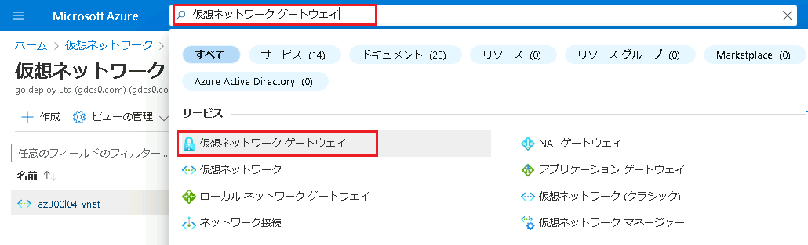

   

5.  **[仮想ネットワーク ゲートウェイ]** ページで、**WAC-Created-vpngw-ID_XX** で始まる新しい仮想ネットワーク ゲートウェイが表示されることを確認します。

   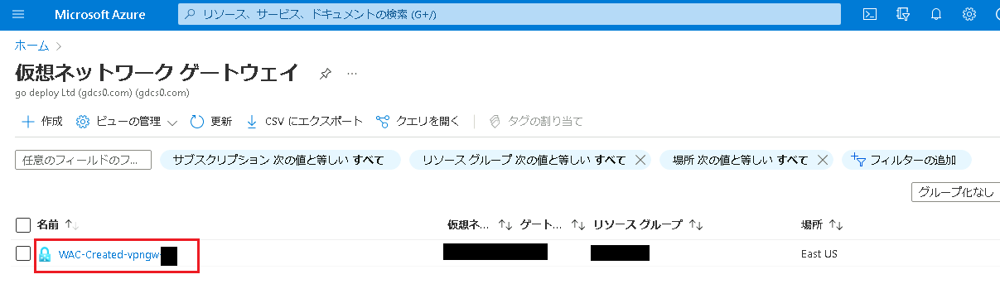

>**注: Azure 仮想ネットワーク ゲートウェイのプロビジョニングには最大 45 分かかります。 プロビジョニングが完全に終了するのを待たず、次の演習に進んでください。**

### 結果

このラボを完了すると、Windows Admin Center の Azure ネットワーク アダプター機能が利用できるようになります。
