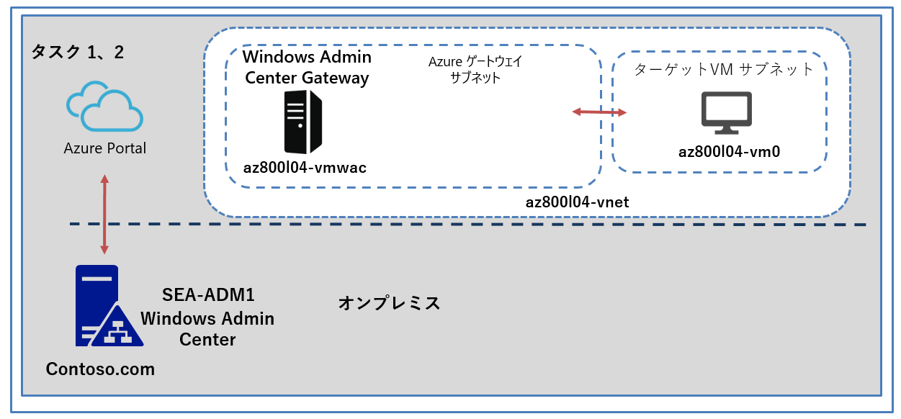

---
lab:
  title: 'ラボ: ハイブリッド シナリオでの Windows Admin Center の使用'
  module: 'Module 4: Facilitating hybrid management'
---

# <a name="lab-using-windows-admin-center-in-hybrid-scenarios"></a>Lab4d: Azure での Windows Admin Center ゲートウェイのデプロイ

## <a name="scenario"></a>シナリオ

Windows Admin Center を使用して、Windows Server OS を実行している Azure VM を管理する機能を検証します。 Azure 仮想ネットワークに Windows Admin Center ゲートウェイをインストールします。

## <a name="objectives"></a>目標とタスク

このラボを完了すると、次のことができるようになります。

- Azure で Windows Admin Center ゲートウェイをデプロイします。
- Azure で Windows Admin Center ゲートウェイの機能を検証します。

この演習の主なタスクは次のとおりです。

1. Azure で Windows Admin Center ゲートウェイをインストールする。
1. スクリプト プロビジョニングの結果を確認する。

## <a name="estimated-time-90-minutes"></a>予想所要時間: 30 分

## <a name="architecture"></a>アーキテクチャの図



## <a name="lab-setup"></a>ラボのセットアップ

仮想マシン:  **SEA-ADM1** を使用します。


1. **SEA-ADM1** を選択します。

1. 次の資格情報を使用してサインインします。

   - ユーザー名: **Administrator**
   
   - パスワード: **Pa55w.rd**
   
   - ドメイン: **CONTOSO**
   
     

このラボでは、仮想マシンと Azure サブスクリプションを使用します。 


### <a name="task-1-install-windows-admin-center-gateway-in-azure"></a>タスク 1: Azure で Windows Admin Center ゲートウェイをインストールする

1. **SEA-ADM1** で、Azure portal が表示されているブラウザー ウィンドウに切り替えます。

1. Azure portal の **［Cloud Shell］** ペインで PowerShell セッションを開始します。

1. Cloud Shell ペインで、**C:\\Labfiles\\Lab04\\Deploy-WACAzVM.ps1** ファイルを Cloud Shell ホーム ディレクトリにアップロードします。

1. Cloud Shell ペインから次のコマンドレットを実行し、Windows Admin Center プロビジョニング スクリプトで使用されるAzureRm PowerShell コマンドレットの互換性を有効にします。

   ```powershell
   Enable-AzureRmAlias -Scope Process
   ```

1. Cloud Shell ペインから、次のコマンドを実行して、Windows Admin Center プロビジョニング スクリプトの実行に必要な変数の値を設定します。

   ```powershell
   $rgName = 'AZ80x-RG'
   $vnetName = 'az800l04-vnet'
   $nsgName = 'az800l04-web-nsg'
   $subnetName = 'subnet1'
   $location = 'eastus'
   $pipName = 'wac-public-ip'
   $size = 'Standard_D2s_v3'
   ```

1. 次のコマンドレットを実行して、スクリプト パラメーター変数を設定します。

   ```powershell
   $scriptParams = @{
     ResourceGroupName = $rgName
     Name = 'az800l04-vmwac'
     VirtualNetworkName = $vnetName
     SubnetName = $subnetName
     GenerateSslCert = $true
     size = $size
     PublicIPAddressName = $pipName
     SecurityGroupName = $nsgName
   }
   ```

1. Cloud Shell ペインから次のコマンドレットを実行して、PowerShell リモート処理の証明書検証を無効にします (信頼されていないリポジトリからのインストールを確認するように求められたら、Aを入力して Enter キーを押します)。

   ```powershell
   install-module pswsman
   ```

   ```powershell
   Disable-WSManCertVerification -All
   ```

   

1. 次のコマンドを実行して、プロビジョニング スクリプトを起動します。

   ```powershell
   ./Deploy-WACAzVM.ps1 @scriptParams
   ```

1. ユーザーアカウントの名前を入力するように求められたら、「**Student**」と入力します。

1. ユーザーアカウントのパスワードを入力するように求められたら、「**Pa55w.rd1234**」と入力します。

    >**注: プロビジョニング スクリプトが完了するまで待ちます。 これには 5 分以上かかる場合があります。**
    >
    >**注: 仮想ネットワークゲートウェイのプロビジョニングが完了していないとエラーとなります。エラーが返ってきた場合は、時間を空け仮想ネットワークゲートウェイのプロビジョニングが完了してから再度、8 の手順のコマンドレットを実行してください。**

1. スクリプトが正常に完了したことを確認し、 cloud shell の結果に表示されるURLをメモに残します。

    >**注: Windows Admin Center インストールをホストする Azure VM の完全修飾名は、 このラボで後ほど必要になります。**

1. [Cloud Shell] ペインを閉じます。

#### <a name="task-2-review-results-of-the-script-provisioning"></a>タスク 2: スクリプト プロビジョニングの結果を確認する

1. Azure portal のテキストボックスで、 **[リソースグループ]** を検索し、**AZ800x-RG** リソース グループのページを参照します。

1. **AZ800x-RG** ページの **[概要]** ページで、Azure VM **az800l04-vmwac** を選択します。

1.  **az800l04-vmwac** の ネットワーク ページから、  **[受信ポートの規則]** タブで、TCP ポート 5986 で接続を許可する受信ポートの規則、および TCP ポート 443 で接続を許可する受信規則をそれぞれ示すエントリに注目します。

   > **注 : ポート 443、5986 が各々 Allow(許可) となっていることが確認できます。**

   

### <a name="results"></a>結果

このラボを完了すると、 Azure 仮想ネットワークに Windows Admin Center ゲートウェイをインストールができました。

