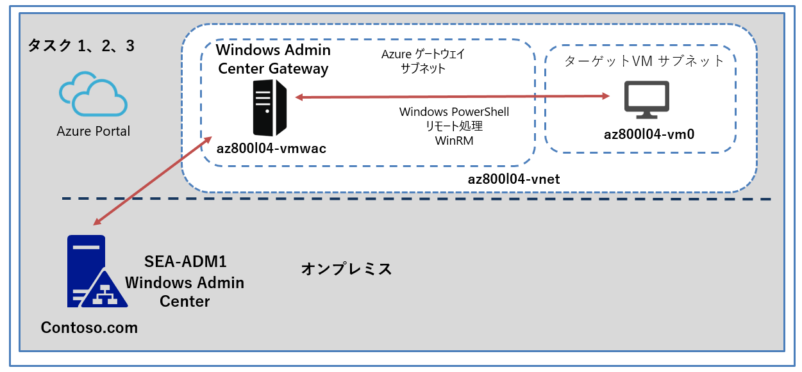

---
lab:
  title: 'ラボ: ハイブリッド シナリオでの Windows Admin Center の使用'
  module: 'Module 4: Facilitating hybrid management'
---

# <a name="lab-using-windows-admin-center-in-hybrid-scenarios"></a>Lab4e: Azure での Windows Admin Center ゲートウェイの機能の確認

## <a name="scenario"></a>シナリオ

必須コンポーネントがすべて揃っている状態で、このラボの最初の演習でプロビジョニングした Azure 仮想ネットワークにデプロイした Azure VM をターゲットとして、WAC 機能をテストします。

## <a name="objectives"></a>目標とタスク

このラボを完了すると、次のことができるようになります。

- Azure で Windows Admin Center ゲートウェイの機能を検証します。

この演習の主なタスクは次のとおりです。

1. Azure VM で実行されている Windows Admin Center ゲートウェイに接続する。
1. Azure VM の PowerShell リモート処理を有効にする。
1. Azure VM で実行されている Windows Admin Center ゲートウェイを使用して、Azure VM に接続する。

## <a name="estimated-time-90-minutes"></a>予想所要時間: 30 分

## <a name="architecture"></a>アーキテクチャの図



## <a name="lab-setup"></a>ラボのセットアップ

仮想マシン:  **SEA-ADM1** を使用します。


1. **SEA-ADM1** を選択します。

1. 次の資格情報を使用してサインインします。

   - ユーザー名: **Administrator**
   
   - パスワード: **Pa55w.rd**
   
   - ドメイン: **CONTOSO**
   
     

このラボでは、仮想マシンと Azure サブスクリプションを使用します。 


### <a name="task-1-connect-to-the-windows-admin-center-gateway-running-in-azure-vm"></a>タスク 1: Azure VM で実行されている Windows Admin Center ゲートウェイに接続する

1. **SEA-ADM1** で Microsoft Edge で新しいタブを開き、Lab4dのタスク3で特定した、URLに接続します。

   > **注 : Microsoft Edge ウィンドウで、メッセージYour connection isn't private を無視し、[ Advanced]を選択してから、[Continue to] というテキストで始まるリンクを選択します。**

1. 資格情報の入力ダイヤログボックスが表示されたら、以下の資格情報を使用し接続します。

   | 設定       | 値               |
   | ---------- | ---------------- |
   | ユーザー名 | **Student**      |
   | パスワード | **Pa55w.rd1234** |

   

1. Windows Admin Center の **[すべての接続]** ペインで、**az800l04-vmwac [ゲートウェイ]** を選択します。

1. Windows Admin Center の **[概要]** ペインで、**az800l04-vmwac** が動作していることを確認し、次のタスクに進みます。

   > **注 : 初回接続時は拡張機能のインストール等が開始されるため、概要が表示されるまでに数分かかる場合があります。**

### <a name="task-2-enable-powershell-remoting-on-an-azure-vm"></a>タスク 2: Azure VM の PowerShell リモート処理を有効にする

1. ツールバーの **[リソース、サービス、およびドキュメントの検索]** テキスト ボックスで、 **[Virtual Machines]** を検索して選択します。

1.  **[Virtual Machines]** ページで、 **az800l04-vm0** を選択します。

1.  左ペインの一覧から、 **[実行コマンド]** を選択し、 **[RunPowerShellScript]** を選択します。

1. 実行コマンドページで、以下のコマンドを実行してリモート管理を有効にします。

   > **注 : 実行結果で already running と表示された場合は、既に有効化されていますが、そのまま次に進んでください。**

   ```powershell
   winrm quickconfig -quiet
   ```

1. 前の手順で入力したテキストを次のコマンドに置き換え、 **[実行]** をクリックして Windows リモート管理の受信ポートを開きます。

   ```powershell
   Set-NetFirewallRule -Name WINRM-HTTP-In-TCP-PUBLIC -RemoteAddress Any
   ```

1. 前の手順で入力したテキストを次のコマンドに置き換え、 **[実行]** をクリックして PowerShell リモート処理を有効にします。

   ```powershell
   Enable-PSRemoting -Force -SkipNetworkProfileCheck
   ```

　**※コマンドの実行が終了したら、次のタスクに進みます。**

### <a name="task-3-connect-to-an-azure-vm-by-using-the-windows-admin-center-gateway-running-in-azure-vm"></a>タスク 3: Azure VM で実行されている Windows Admin Center ゲートウェイを使用して、Azure VM に接続する

1. **SEA-ADM1** で、 **az800l04-vmwac** に接続している、Windows Admin Center に切り替えます。

1.   **[すべての接続]** ページで、 **[ + 追加]** をクリックします。

1.  **[リソースの追加または作成]** ページで **[サーバー]** を選択し、 **[追加]** をクリックします。

1.  **[サーバー名]** テキスト ボックスに **「az800l04-vm0」** と入力します。

1. **[この接続では別のアカウントを使用する]** のラジオボタンにチェックを入れ、以下の資格情報を入力したあと、 **[資格情報を含めて追加]** をクリックします。

   | 設定       | 値               |
   | ---------- | ---------------- |
   | ユーザー名 | **Student**      |
   | パスワード | **Pa55w.rd1234** |

6. 接続先の一覧で、 **az800l04-vm0** が追加されたことを確認し、選択します。

7. VM に正常に接続されたら、Windows Admin Center の **az800l04-vmwac** Azure VM の **[概要]** ペインを確認し、VM が動作していることを確認します。


### <a name="results"></a>結果

このラボを完了すると、Azure VM を Windows Admin Center に追加し、一元管理できるようになりました。

