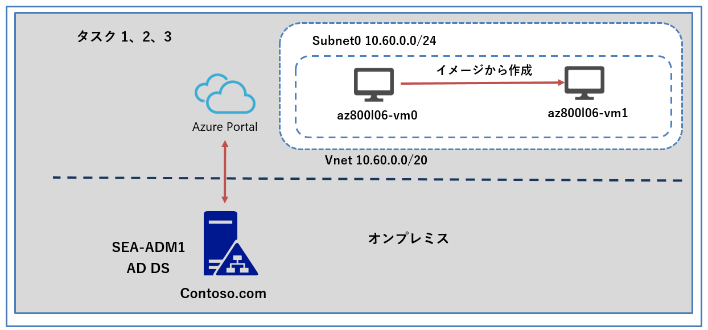
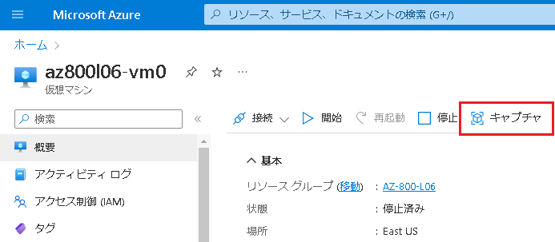

---
lab:
  title: 'ラボ: Azure VM での Windows Server のデプロイと構成'
  module: 'Module 6: Deploying and Configuring Azure VMs'
---

# Lab6b: マネージド イメージから新しい Azure VM を作成する

## シナリオ

Contoso では、同じ構成のAzure VM を複数デプロイすることを検討しています。そこで、マネージドイメージを作成し、Azure VM を作成できるか検証することになりました。

## 目標とタスク

このラボを完了すると、次のことができるようになります。

- マネージドイメージから、Azure VM を作成する。

この演習の主なタスクは次のとおりです。

1. 一般化されたイメージを作成する
1. 一般化された VM からマネージド イメージを作成する
1. マネージド イメージから新しい VM を作成する

## 予想所要時間: 20 分

## アーキテクチャの図

## ラボのセットアップ

仮想マシン: **SEA-ADM1** を使用します。

1. **SEA-ADM1** を選択します。
1. 次の資格情報を使用してサインインします。

   - ユーザー名: **Administrator**
   - パスワード: **Pa55w.rd**
   - ドメイン: **CONTOSO**

このラボでは、 仮想マシンと Azure サブスクリプションを使用します。

### タスク 1: 一般化されたイメージを作成する

1. **SEA-ADM1** の Azure portalの、**[リソース、サービス、およびドキュメントの検索] テキスト ボックス**のツール バーで、 **[Virtual Machines]** を検索し、Lab6aで作成した仮想マシン  **「az800l06-vm0」** を表示します。

1. **az800l06-vm0** の 概要 ページから **[接続]** タブを選択します。

1.  **[RDP]** を選択し、 **[RDPファイルのダウンロード]** をクリックします。

1.  Microsoft Edge の右上に表示されるダウンロードファイルの [Open file] をクリックし、以下の資格情報でAzure VM にリモートデスクトップ接続をします。

   > **注 : セキュリティの警告ダイアログボックスが表示されたら [Connect] をクリックしてください。**
   >
   > **注 : 資格情報のダイヤログボックスでは [More choice] をクリックして資格情報を入力します。**

   | 項目      | 値               |
   | --------- | ---------------- |
   | User Name | **Student**      |
   | Password  | **Pa55w.rd1234** |

   

1. リモートデスクトップ接続先でファイルエクスプローラーを起動し、 `C:\windows\system32\sysprep` にアクセスします。

1.  **Sysprep.exe** をダブルクリックで実行したら、以下の設定をし [OK] をクリックします。

   | 項目               | 値                                           |
   | ------------------ | -------------------------------------------- |
   | System CleanAction | **Enter System Out-of-Box Experience(OOBE)** |
   | Generalize         | **チェックを入れる**                         |
   | Shutdown Options   | **Shutdown**                                 |

   > **注 : Sysprepが完了すると、リモートデスクトップ接続が強制的に切断されます。切断されたというメッセージが表示されたら [OK] をクリックし、Azure Portal に切り替えます。**

### タスク 2: 一般化された VM からマネージド イメージを作成する

1.  **az800l06-vm0** の 概要ページに戻り、**[状態]** が **[停止済み]** であることを確認したら、 **[キャプチャ]** タブを選択します。

   

1.  **[イメージの作成]** ページで以下を設定し、 **[確認および作成]** をクリックします。指示がないものは規定値のままで構いません。

   | 項目                                                   | 値                                                   |
   | ------------------------------------------------------ | ---------------------------------------------------- |
   | リソースグループ                                       | 規定値                                               |
   | Azure コンピューティングギャラリーにイメージを共有する | **いいえ、まねーじどいめーじのみをキャプチャします** |

1. 検証に成功したことを確認し、 **[作成]** をクリックします。

   

### タスク 3: マネージド イメージから新しい VM を作成する

1. Azure portal の **[リソース、サービス、およびドキュメントの検索]** テキスト ボックスのツール バーで、 **[Virtual Machines]** を検索、選択します。

1.  **[ ＋ 作成]** を選択します。

1.   **[Azure 仮想マシン]** を選択し、 **[仮想マシンの作成]** ページに移管したら以下を設定します。

   | 項目                 | 値                                                           |
   | -------------------- | ------------------------------------------------------------ |
   | サブスクリプション   | **規定値**                                                   |
   | リソースグループ     | **AZ-800-L06**                                               |
   | 仮想マシン名         | **az-800l06-vm1**                                            |
   | イメージ             | **すべてのイメージを表示 を選択後、左ペインの [マイイメージ] から 前のタスクで作成したイメージを選択** |
   | ユーザー名           | **Student**                                                  |
   | パスワード           | **Pa55w.rd1234**                                             |
   | パブリック受信ポート | **RDP(3389)、HTTPS(443)**                                    |
   | ライセンスの種類     | **Windows Server**                                           |

4.ディスクの設定などはせず、そのまま **[確認および作成]** をクリックします。

5.検証に成功したことを確認してから **[作成]** をクリックします。

6.Azure Portal に **az-800l06-vm1** という仮想マシンが作成されたことが確認できます。

結果

このラボを完了すると、Azure VM でイメージを作成し、イメージを元に同じ構成のAzure VM を作成できることが確認できます。
