---
lab:
  title: 'ラボ: ハイブリッド ネットワーク インフラストラクチャの実装'
  module: 'Module 8: Implementing Windows Server IaaS VM networking'
---

# <a name="lab-implementing-hybrid-networking-infrastructure"></a>Lab8a: Azure で仮想ネットワーク ルーティングを実装する

## <a name="scenario"></a>シナリオ

あなたは、ハブ アンド スポーク トポロジで構成された、個別の仮想ネットワークにデプロイされている Microsoft Azure 仮想マシンのテスト環境の構築を任されました。テスト環境には、トラフィックがハブ経由で流れるようにするユーザー定義のルートを使用して、スポーク間の接続を実装する必要があります。そこで、Azure Resource Manager テンプレートを使ってコア ネットワーク インフラストラクチャをデプロイし、カスタム ルーティングを構成して、機能を検証します。 


## <a name="objectives"></a>目標とタスク

このラボを完了すると、次のことができるようになります。

- Azure で仮想ネットワーク ルーティングを実装する

この演習の主なタスクは次のとおりです。

1. ラボ インフラストラクチャ リソースをプロビジョニングする
1. ハブ アンド スポーク ネットワーク トポロジを構成する
1. 仮想ネットワーク ピアリングの推移性をテストする
1. ハブ アンド スポーク トポロジでルーティングを構成する

## <a name="estimated-time-60-minutes"></a>予想所要時間: 25分

## <a name="architecture"></a>アーキテクチャの図

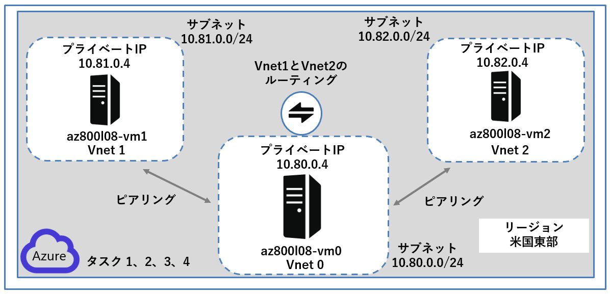

## <a name="lab-setup"></a>ラボのセットアップ

仮想マシン:   **SEA-ADM1**  を使用します。

1. **SEA-ADM1** を選択します。
1. 次の資格情報を使用してサインインします。

   - ユーザー名: **Administrator**
   - パスワード: **Pa55w.rd**
   - ドメイン: **CONTOSO**

このラボでは、 仮想マシンと Azure サブスクリプションを使用します。


### **事前準備 : ラボ ファイルをダウンロードする**

1.  **SEA-AMD1** にサインイン後、 **[スタート]** メニューを選択し、 **[ Windows PowerShell ]** を起動します。

2. 次の Windows PowerShell コマンドレットを実行して、ラボ ファイルの最新バージョンを仮想マシンにダウンロードします。

   ```powershell
   ([System.Net.WebClient]::new()).DownloadFile('https://github.com/MicrosoftLearning/AZ-800-Administering-Windows-Server-Hybrid-Core-Infrastructure/archive/refs/heads/master.zip', 'C:\Labfiles\master.zip')
   ```

   ```powershell
   Expand-Archive -Path 'C:\Labfiles\master.zip' -DestinationPath 'C:\Labfiles'
   ```

   ```powershell
   Move-item -Path "C:\Labfiles\AZ-800-Administering-Windows-Server-Hybrid-Core-Infrastructure-master\Allfiles\Labfiles" -Destination "C:\Labfiles" -confirm:$false
   ```

   

### <a name="task-1-provision-lab-infrastructure-resources"></a>タスク 1: ラボ インフラストラクチャ リソースをプロビジョニングする

このタスクでは、3 つの仮想マシンを同じ Azure リージョン内の個別の仮想ネットワークにデプロイします。 1 つ目の仮想ネットワークはハブとして機能し、残りの 2 つの仮想ネットワークはスポークとなります。 これらのリソースは、ラボ インフラストラクチャの基礎として機能します。

1. **SEA-ADM1** でMicrosoft Edge を起動し、Azure portal `https://portal.azure.com`に接続します。

   (資格情報は、ラボの **[Home]** タブ内で提供されているものを使用してください。)

   ※Azure Portal にサインイン後は、必要に応じ、右上の歯車マーク(設定)画面から、言語設定を日本語に変更できます。

2. Azure portal で、検索テキスト ボックスの横にあるツールバー アイコンを選択して、Cloud Shell ペインをクリックします。

3. **Bash** または **PowerShell** のいずれかを選択するように求められたら、**PowerShell** を選択します。

4. **[ストレージがマウントされていません]** ウィンドウで、 **[詳細設定の表示]** をクリックし、以下の項目を設定します。指示がないものは規定値のままで構いません。

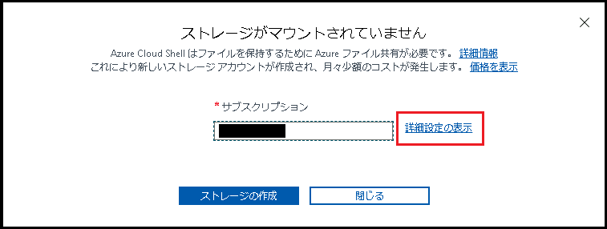

| 設定                   | 値                                                           |
| ---------------------- | ------------------------------------------------------------ |
| Cloud Shell リージョン | **米国東部 (East US)**                                       |
| リソース グループ      | **既存のものを使用 (AZ80x-RG)**                              |
| ストレージ アカウント  | **新規作成 : テキストボックス内に、文字数3～24文字、小文字と数字を組み合わせた任意の名前 (例 : mystorageXXXX) 注意 : ストレージアカウントの名前は一位である必要があります。** |
| 共有ファイル           | **新規作成 : 必須フィールドに [cloudshell] と入力してください** |

設定したら、 **[ストレージの作成]** をクリックします。

> **注 : [ストレージの作成に失敗しました] ストレージアカウントは既に取得されています。というエラーが表示された場合は、ストレージアカウントの名前を別のものに設定しなおし、再度 [ストレージの作成] を実行してください。**

**※ストレージアカウントが作成されるまでに、数分要する場合があります。**

5. Cloud Shell ペインのツールバーで、 **[ファイルのアップロード / ダウンロード]** アイコンを選択し、ドロップダウン メニューで  **[アップロード]** を選択します。

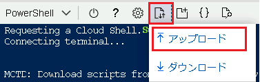

6. `C:\Labfiles\Lab08\` に格納されている、 **L08-rg_template.json** および  **L08-rg_template.parameters.json** を Cloud Shell ホーム ディレクトリに追加します。

7. Cloud Shell ペインで次のコマンドレットを実行し、アップロードしたテンプレートとパラメーター ファイルを使用して、3 つの仮想ネットワークと Azure VM を作成します。

   ```powershell
   New-AzResourceGroupDeployment -ResourceGroupName AZ80x-RG -TemplateFile ./L08-rg_template.json -TemplateParameterFile ./L08-rg_template.parameters.json
   ```

   

  **※デプロイが完了してから、次の作業に進んでください。完了するまでに5分程度要することがあります。**

### <a name="task-2-configure-the-hub-and-spoke-network-topology"></a>タスク 2: ハブ アンド スポーク ネットワーク トポロジを構成する

このタスクでは、前のタスクでデプロイした仮想ネットワーク間にローカル ピアリングを構成し、ハブ アンド スポーク ネットワーク トポロジを作成します。

1. **SEA-ADM1** の Azure portal を表示している Microsoft Edge ウィンドウで、別のタブを開き、Azure Portal `https://portal.azure.com`にアクセスします。

1. Azure portal で、ツール バーの  **[リソース、サービス、およびドキュメントの検索]** テキスト ボックスで、  **[Virtual networks (仮想ネットワーク)]** を検索し、サービス一覧から **[仮想ネットワーク]** を選択します。 

1. 仮想ネットワークの一覧から、 **az800l08-vnet0** を選択します。

1. **az800l08 -vnet0** 仮想ネットワーク ページの左ペインにある **[設定]** セクションの一覧から、 **[ピアリング]** を選択し、 **[ + 追加]** をクリックします。

    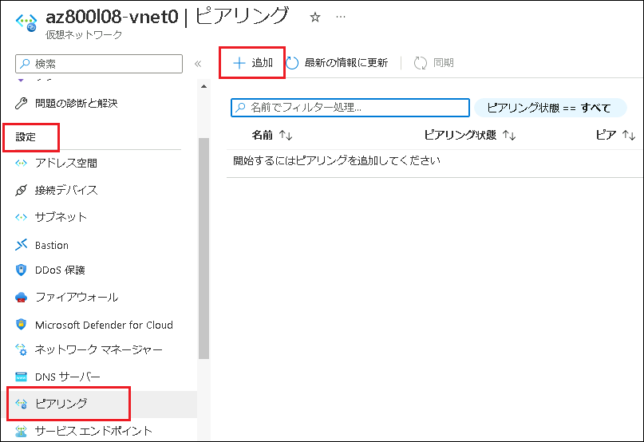

    

1. **[ピアリングの追加]**  ページで次の設定を指定し、 **[追加]** をクリックします。指示がないものは規定値のままで構いません。

   **※仮想ネットワークがプルダウンから選択できない場合は、15分程度待ってからブラウザ更新をしてみてください。**

   | 設定                                               | 値                                          |
   | -------------------------------------------------- | ------------------------------------------- |
   | ピアリング リンク名                                | **az800l08-vnet0_to_az800l08-vnet1**        |
   | リモート仮想ネットワークへのトラフィック           | **許可 (規定)**                             |
   | リモート仮想ネットワークから転送されたトラフィック | **許可 (規定)**                             |
   | 仮想ネットワーク ゲートウェイまたはルート サーバー | **なし (規定)**                             |
   | ピアリング リンク名                                | **az800l08-vnet1_to_az800l08-vnet0**        |
   | 仮想ネットワークのデプロイモデル                   | **Resource Manager (リソースマネージャー)** |
   | 仮想ネットワーク                                   | **az800l08-vnet1**                          |
   | リモート仮想ネットワークへのトラフィック           | **許可 (規定)**                             |
   | リモート仮想ネットワークから転送されたトラフィック | **許可 (規定)**                             |
   | 仮想ネットワーク ゲートウェイ                      | **なし (規定)**                             |

   >**注: 操作が完了するまで待ちます。**

   >**注**: この手順を実行すると、2 つのピアリング (1 つは **az800l08-vnet0** から **az800l08-vnet1** 、もう 1 つは **az800l08-vnet1** から **az800l08-vnet0** へ) を確立します。

   >**注**: このラボで後ほど実装するスポーク仮想ネットワーク間のルーティングを容易にするために、 **[トラフィック転送を許可する]** を有効にする必要があります。このタスクはラボの後半で実施します。

1. **[az800l08 -vnet0 | ピアリング]** 画面に戻り、ピアリング状態が **[接続済み]** となるまで、 **[最新の状態を更新]** をクリックしてください。

    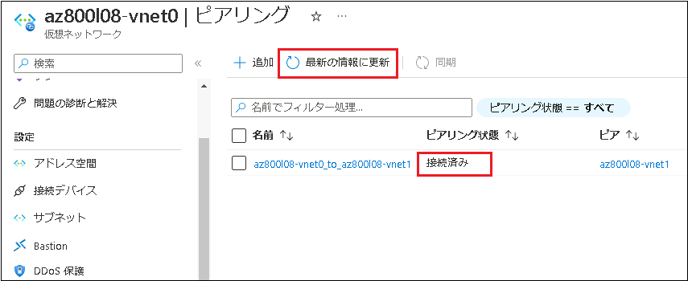

1. **[az800l08 -vnet0 | ピアリング]** 画面で **[ + 追加]** をクリックします。

1. ピアリングの追加 ページで次の設定を指定し、 **[追加]** をクリックします。指示がないものは規定値のままで構いません。

     | 設定                                               | 値                                          |
     | -------------------------------------------------- | ------------------------------------------- |
     | ピアリング リンク名                                | **az800l08-vnet0_to_az800l08-vnet2**        |
     | リモート仮想ネットワークへのトラフィック           | **許可 (規定)**                             |
     | リモート仮想ネットワークから転送されたトラフィック | **許可 (規定)**                             |
     | 仮想ネットワーク ゲートウェイまたはルート サーバー | **なし (規定)**                             |
     | ピアリング リンク名                                | **az800l08-vnet2_to_az800l08-vnet0**        |
     | 仮想ネットワークのデプロイモデル                   | **Resource Manager (リソースマネージャー)** |
     | 仮想ネットワーク                                   | **az800l08-vnet2**                          |
     | リモート仮想ネットワークへのトラフィック           | **許可 (規定)**                             |
     | リモート仮想ネットワークから転送されたトラフィック | **許可 (規定)**                             |
     | 仮想ネットワーク ゲートウェイ                      | **なし (規定)**                             |

     >**注**: この手順を完了すると、2 つのピアリング (1 つは **az800l08-vnet0** から **az800l08-vnet2** へ、もう 1 つは **az800l08-vnet2** から **az800l08-vnet0**へ) を確立します。 これでハブ アンド スポーク トポロジの設定は完了です (**az800l08-vnet0** 仮想ネットワークがハブの役割を果たし、**az800l08-vnet1** と **az800l08-vnet2** はそのスポークです)。

1. **[az800l08 -vnet0 | ピアリング]** 画面に戻り、2つのピアリングが接続済みであることを確認し、タスク3に進んでください。

### <a name="task-3-test-transitivity-of-virtual-network-peering"></a>**タスク3: 仮想ネットワーク ピアリングの推移性をテストする**

このタスクでは、Azure VM の実行コマンド を使って、仮想ネットワーク ピアリング間の接続をテストします。


1. Azure portal で、 **[リソース、サービス、およびドキュメントの検索]テキスト ボックス** のツール バーで **Virtual Machines** を検索して、サービス一覧に表示された **[Virtual Machines]** を選択します。

2. 仮想マシンの一覧から、 **「az800l0-vm0」** を選択します。

3. 左ナビゲーションペインを下にスクロールし、 **[実行コマンド]** をクリックします。

4.  **[RunPowerShellScript]** を選択し、プロンプトが表示させたら、以下のPowerShellコマンドレットを実行します。

   ```powershell
   Test-NetConnection -ComputerName 10.81.0.4 -Port 3389 -InformationLevel 'Detailed'
   ```

   > **注 : 実行結果が返ってくるまでに数分かかります。**
   >
   > **注 : 宛先 IP アドレスの 10.81.0.4 は az800l0-vm1 の プライベート IP アドレスです。このコマンドを実行することによって、TCP ポート 3389 での az800l0-vm1 への接続性をテストしています。**

5. 実行結果を確認し、 **[TcpTestSuccessed]** の結果が **[True]** と返ってくれば、接続ができています。

6. プロンプトで、以下のコマンドレットを実行し、接続性のテストを実行します。

   ```powershell
   Test-NetConnection -ComputerName 10.82.0.4 -Port 3389 -InformationLevel 'Detailed'
   ```

   > **注 : 実行結果が返ってくるまでに数分かかります。**
   >
   > **注 : 宛先 IP アドレスの 10.82.0.4 は az800l0-vm2 の プライベート IP アドレスです。このコマンドを実行することによって、TCP ポート 3389 での az800l0-vm2 への接続性をテストしています。**

7. 実行結果を確認し、 **[TcpTestSuccessed]** の結果が **[True]** と返ってくれば、接続ができています。

8. 実行コマンド画面を×で閉じます。

9.  **[Virtual Machines]** に戻り、仮想マシンの一覧から、 **「az800l0-vm1」**を選択します。

10. 左ナビゲーションペインを下にスクロールし、 **[実行コマンド]** をクリックします。

11. **[RunPowerShellScript]** を選択し、ブロンプロが表示させたら、以下のPowerShellコマンドレットを実行します。

    ```
    Test-NetConnection -ComputerName 10.82.0.4 -Port 3389 -InformationLevel 'Detailed'
    ```

    > **注 : 実行結果が返ってくるまでに数分かかります。**
    >
    > **注 : 宛先 IP アドレスの 10.82.0.4 は az800l0-vm2 の プライベート IP アドレスです。このコマンドを実行することによって、TCP ポート 3389 での az800l0-vm2 への接続性をテストしています。**

12. 実行結果を確認し、 **[TcpTestSuccessed]** の結果が **[False]** となり、接続に失敗することが確認できます。

    > **注 : az800l0-vm1とaz800l0-vm2は直接通信できないため、これは正しい結果です。**
    >
    > **注: 2 つのスポーク仮想ネットワーク ( az800l08-vnet1 と az800l08-vnet2 ) は相互にピアリングされておらず、仮想ネットワーク ピアリングが推移的ではないことから、このような結果になります。**

13. 実行コマンド画面を×で閉じます。


### <a name="task-4-configure-routing-in-the-hub-and-spoke-topology"></a>タスク 4: ハブ アンド スポーク トポロジでルーティングを構成する

このタスクでは、**az800l08-vm1** 仮想マシンのネットワーク インターフェイスで IP 転送を有効にし、スポーク仮想ネットワーク上でユーザー定義ルートを構成することで、2 つのスポーク仮想ネットワーク間のルーティングを、テストします。

1. Azure portal   **[リソース、サービス、およびドキュメントの検索]テキスト ボックス** のツール バーで、 **[Virtual Machines]** を検索し、 **az800l08-vm0** 仮想マシンのページに移動します。

1.  **az800l08 -vm0** 仮想マシン ページの **[設定]** セクションで、 **[ネットワーク]** を選択します。

    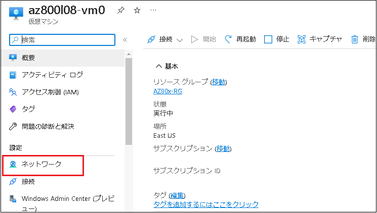

1.  **[ネットワーク インターフェイス]** ラベルの横にある **az800l08-nic0リンク** をクリックします。

    

1.  **[az800l08-nic0 ネットワーク インターフェイス]**  ページの **[設定]** クションで **[ IP 構成]** をクリックします。

    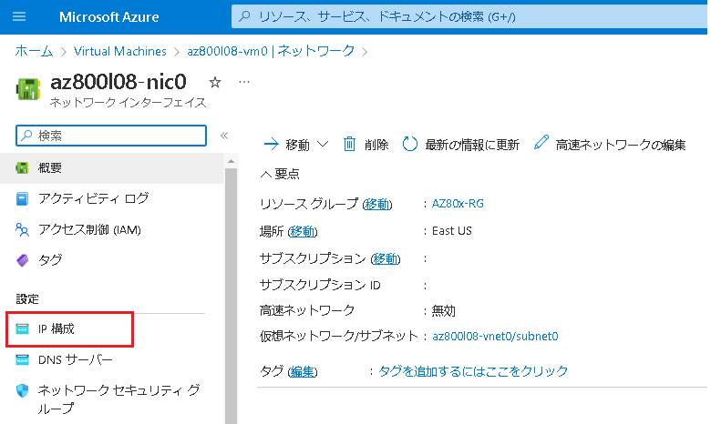

1.  **[ IP 転送]** のスライダーを **[有効]** に設定し、 **[保存]** をクリックします。

    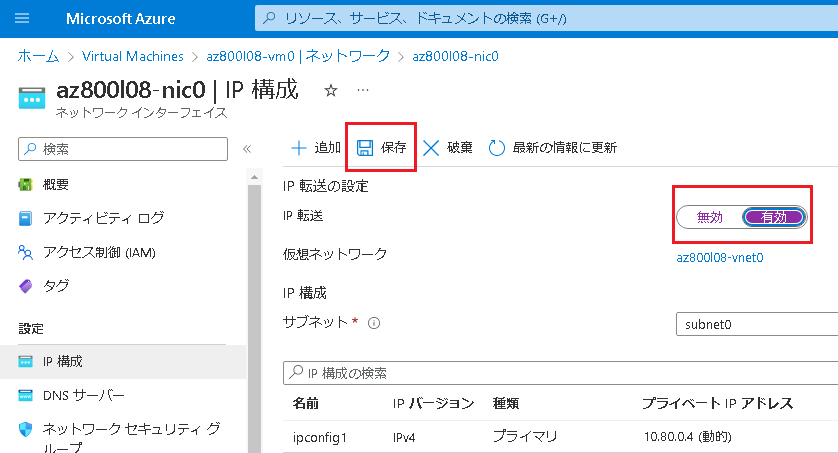

    > **注: この設定は、 az800l08-vm0が 2 つのスポーク仮想ネットワーク間のトラフィックをルーティングするルーターとして機能するために必要です。**

    > **注**: 次に、ルーティングをサポートするために、**az800l08-vm0** 仮想マシンのオペレーティング システムを構成する必要があります。

1. Azure portal で **az800l08-vm0** 仮想マシン ページに戻ります。

1. **az800l08-vm0** ページの左ナビゲーションペイン **[操作]** セクションで、 **[実行コマンド]** を選択し、コマンドの一覧で **[RunPowerShellScript]** をクリックします。

   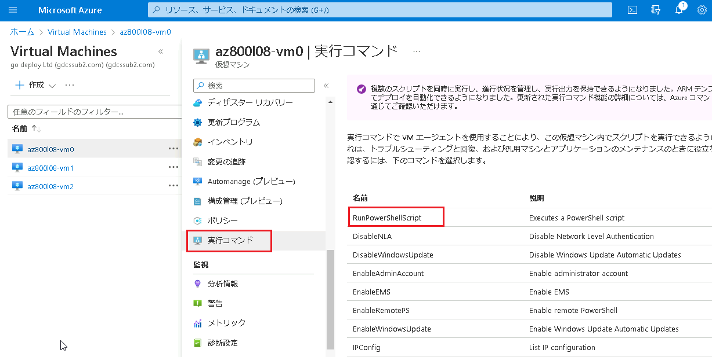

   

8. **[実行コマンドスクリプト]** ページで、次のコマンドを入力し、 **[実行]** をクリックしてリモート アクセス Windows サーバーの役割をインストールします。

   ```powershell
   Install-WindowsFeature RemoteAccess -IncludeManagementTools
   ```

   > **注: コマンドが正常に完了したのを確認してから、次の作業に進んでください。**

9. **[PowerShell スクリプト]** セクションで、前に入力したコマンドを次のコマンドに置き換え、**[実行]** をクリックして、ルーティング役割サービスをインストールします。

   ```powershell
   Install-WindowsFeature -Name Routing -IncludeManagementTools -IncludeAllSubFeature
   Install-WindowsFeature -Name "RSAT-RemoteAccess-Powershell"
   Install-RemoteAccess -VpnType RoutingOnly
   Get-NetAdapter | Set-NetIPInterface -Forwarding Enabled
   ```

   > **注: コマンドが正常に完了したことの確認を待ちます。**
   >
   > **注**: 次の作業で、スポーク仮想ネットワーク上でユーザー定義のルートを作成および構成する必要があります。
   >
   > コマンドの実行が終了したのを確認したら、 **[実行コマンドスクリプト]** ページは閉じて構いません。


10. Azure portal のツール バー **[リソース、サービス、およびドキュメントの検索] テキスト ボックス**で、 **[ルート テーブル]** を検索し、サービス一覧から **[ルートテーブル]** を選択します。

11. **[ルート テーブル]** ページで **[ + 作成]** をクリックします。

12. **[ルートテーブルの作成]** ページで次の設定で次の設定をします。指示がないものは規定値のままで構いません。

| 設定 | 値 |
| --- | --- |
| サブスクリプション | **あらかじめ入力されているものを使用してください** |
| リソース グループ | **AZ80x-RG** |
| リージョン | **East US (米国東部)** |
| 名前 | **az800l08-rt12** |
| ゲートウェイのルートを伝達する | **No (いいえ)** |


13. **[確認と作成]** をクリックし、検証に成功したことを確認してから、 **[作成]** をクリックします。

    > **注 : ルートテーブルが作成されるまで待ちます。通常、作成されるまでに約 1 分程度かかります。**

14. **[リソースに移動]** を選択します。

15. **az800l08-rt12 ルート テーブル**  ページの左ナビゲーションペインの **[設定]** セクションで、 **[ルート]** を選択し、 **[ + 追加]** をクリックします。

 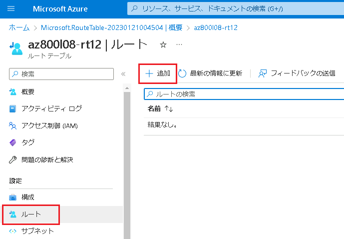

16. **[ルートの追加]** ページで、次の設定で新しいルートを追加します。指示がないものは規定値のままで構いません。

 | 設定 | 値 |
 | --- | --- |
 | ルート名 | **az800l08-route-vnet1-to-vnet2** |
 | アドレス プレフィックス送信先 | **IP アドレス** |
 | 宛先 IP アドレス/CIDR 範囲 | **10.82.0.0/20** |
 | ネクストホップの種類 | **仮想アプライアンス** |
 | ネクストホップアドレス | **10.80.0.4** |

 > **注**: **10.80.0.4** は、**az800l08-vm0** のプライベート IP アドレスです。 

 値を設定したら、 **[追加]** をクリックします。

17. **az800l08-rt12 ルート**  ページに戻り、左ナビゲーションペインの **[設定]** セクションから **[サブネット]** を選択し、 **[ +関連付け]** をクリックします。

 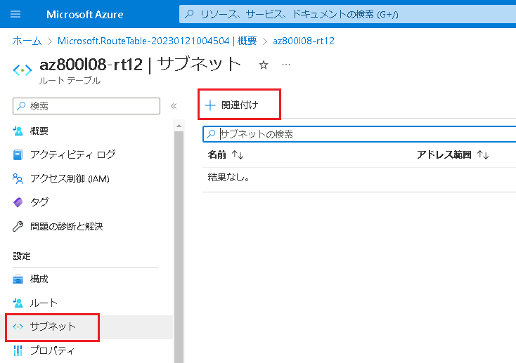


18. **サブネットの関連付け** ページで以下の設定をして、サブネットに関連付けします。

| 設定             | 値                 |
| ---------------- | ------------------ |
| 仮想ネットワーク | **az800l08-vnet1** |
| サブネット       | **subnet 0**       |

値を設定したら、 **[OK]** をクリックしてサブネットに関連付けしてください。

19. **ルートテーブル** ページに戻り、 **[ + 作成]** をクリックします。

20. **[ルートテーブルの作成]** ページで以下の値を設定し、2つめのルートテーブルを作成します。

| 設定                           | 値                                                 |
| ------------------------------ | -------------------------------------------------- |
| サブスクリプション             | **あらかじめ入力されているものを使用してください** |
| リソースグループ               | **AZ80X-RG**                                       |
| リージョン                     | **East US (米国東部)**                             |
| 名前                           | **az800l08-rt21**                                  |
| ゲートウェイのルートを伝達する | **NO (いいえ)**                                    |

値を設定したら、 **[確認および作成]** をクリックし、検証に成功したことを確認してから **[作成]** をクリックします。

> **注 : ルートテーブルが作成されるまで待ちます。通常、作成されるまでに約 1 分程度かかります。**

21. **[リソースに移動]** をクリックします。

22. **az800l08 -rt12 ルート テーブル** ページの左ナビゲーションペインの **[設定]** セクションで、 **[ルート]** を選択し、 **[ + 追加]** をクリックします。

23. **[ルートの追加]** ページで、次の設定で新しいルートを追加します。指示がないものは規定値のままで構いません。

| 設定                          | 値                                |
| ----------------------------- | --------------------------------- |
| ルート名                      | **az800l08-route-vnet2-to-vnet1** |
| アドレス プレフィックス送信先 | **IP アドレス**                   |
| 宛先 IP アドレス/CIDR 範囲    | **10.81.0.0/20**                  |
| ネクストホップの種類          | **仮想アプライアンス**            |
| ネクストホップアドレス        | **10.80.0.4**                     |

　　値を設定したら、 **[追加]** をクリックします。

24.  **az800l08 -rt12 ルート** ページに戻り、左ナビゲーションペインの **[設定]** セクションから **[サブネット]** を選択し、 **[ +関連付け]** をクリックします。

25. **サブネットの関連付け** ページで以下の設定をして、サブネットに関連付けします。

    | 設定             | 値                 |
    | ---------------- | ------------------ |
    | 仮想ネットワーク | **az800l08-vnet2** |
    | サブネット       | **subnet 0**       |

　　値を設定したら、 **[OK]** をクリックしてサブネットに関連付けしてください。

26. Azure portal で **az800l08-vm1** 仮想マシン ページに戻ります。

27. **az800l08-vm1** ページの左ナビゲーションペイン **[操作]** セクションで、 **[実行コマンド]** を選択し、コマンドの一覧で **[RunPowerShellScript]** をクリックします。

28. 以下のPowerShellコマンドレットを実行します。

    ```powershell
    Test-NetConnection -ComputerName 10.82.0.4 -Port 3389 -InformationLevel 'Detailed'
    ```

    > 注 : **注 : 実行結果が返ってくるまでに数分かかります。**
    >
    > 注 : **注 : 宛先 IP アドレスの 10.82.0.4 は az800l0-vm2 の プライベート IP アドレスです。このコマンドを実行することによって、TCP ポート 3389 での az800l0-vm2 への接続性をテストしています。**

29. 実行結果を確認し、 [TcpTestSuccessed] の結果が [True] となり、接続に成功したことが確認できます。

    > **注 : 同様に、仮想マシン az800l0-vm2 の実行コマンドで、 10.81.0.4 (az800l08-vm1 のプライベートIPアドレス) に対して、28の手順のコマンドを実行しても、同様に接続ができるようになったことが確認できます。**

    

    結果

    このラボを完了すると、異なる VNet間でピアリングを構成(ハブアンドスポークネットワークとトポロジ)し、更にルーティングさせることでプライベートIPアドレスのみをもつAzure VM同士の通信が可能となったことが確認できます。

    

