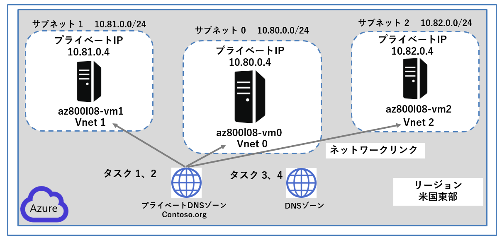
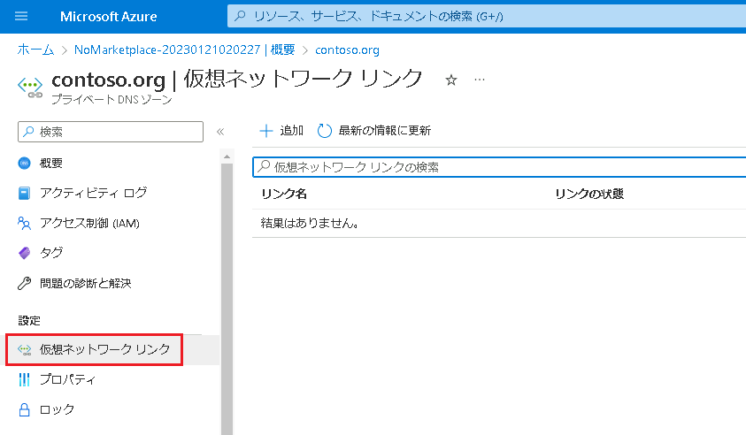
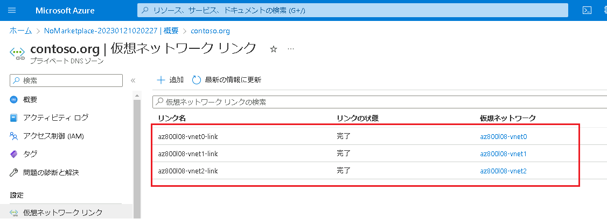
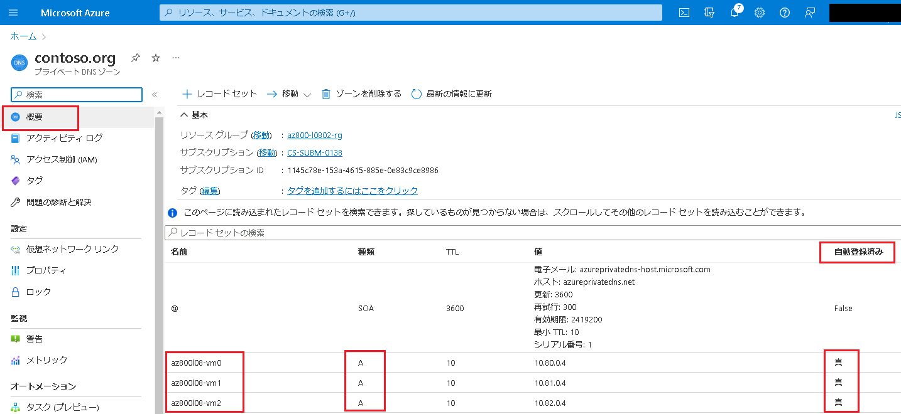
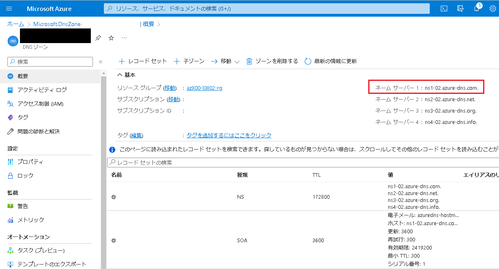

---
lab:
  title: 'ラボ: ハイブリッド ネットワーク インフラストラクチャの実装'
  module: 'Module 8: Implementing Windows Server IaaS VM networking'
---

# <a name="lab-implementing-hybrid-networking-infrastructure"></a>Lab8b: Azure で DNS 名前解決を実装する

## <a name="scenario"></a>シナリオ

あなたは、Azure プライベート DNS ゾーンを使用して仮想ネットワーク間で Azure 仮想マシンの DNS 名前解決を実装し、外部名前解決のための Azure DNS ゾーンの使用を検証する必要もあります。


## <a name="objectives"></a>目標とタスク

このラボを完了すると、次のことができるようになります。

- Azure で DNS 名前解決を実装する

この演習の主なタスクは次のとおりです。

1. Azure プライベート DNS 名前解決を構成する
1. Azure プライベート DNS 名前解決を検証する
1. Azure パブリック DNS 名前解決を構成する
1. Azure パブリック DNS 名前解決を検証する

## <a name="estimated-time-60-minutes"></a>予想所要時間: 25 分

## <a name="architecture"></a>アーキテクチャの図



## <a name="lab-setup"></a>ラボのセットアップ

仮想マシン:  **SEA-ADM1** を使用します。また、Lab8aでAzure Portalに作成した3台のAzure VM も使用します。

1. **SEA-ADM1** を選択します。
1. 次の資格情報を使用してサインインします。

   - ユーザー名: **Administrator**
   - パスワード: **Pa55w.rd**
   - ドメイン: **CONTOSO**

このラボでは、 仮想マシンと Azure サブスクリプションを使用します。


### <a name="task-1-configure-azure-private-dns-name-resolution"></a>タスク 1: Azure プライベート DNS 名前解決を構成する

このタスクでは、Azure プライベート DNS ゾーンを使って、仮想ネットワーク間の DNS 名前解決を構成します。

1.  **SEA-ADM1** のAzure portal で、ツールバー **[リソース、サービス、およびドキュメントの検索]** テキスト ボックスで **[プライベート DNS ゾーン]** を検索して、サービス一覧から **[プライベートDNSゾーン]** を選択します。

1.  **[プライベートDNSゾーン]** ページで **[ + 作成]** をクリックします。

1. **[プライベートDNSゾーンの作成]** ページで、次の設定をして、**[確認および作成]** をクリックします。指示がないものは規定値のままで構いません。

    | 設定 | 値 |
    | --- | --- |
    | サブスクリプション | **あらかじめ入力されているものを使用してください** |
    | リソース グループ | **[新規作成]** のリンクをクリックし、 **[AZ800-L0802-RG]** という名前のリソースグループを作成します。 |
    | インスタンスの詳細 : 名前 | **contoso.org** |
    | リソース グループの場所 | **East US (米国東部)** |

    >**注**: プライベート DNS ゾーンが作成されるまで待ちます。 これには 2 分ほどかかります。

4. 検証に成功したことを確認してから、 **[作成]** をクリックします。

   > **注: プライベート DNS ゾーンが作成されるまで待ちます。作成されるまでに、2～3分程度かかります。**

5. **[リソースに移動]** をクリックして、**contoso.org** のDNS プライベート ゾーン ページを開きます。

6. **contoso.orgプライベート DNS ゾーン** ページの 左ナビゲーションペイン **[設定]** セクションで、 **[仮想ネットワーク リンク]** を選択します。



7. **contoso.org | [仮想ネットワーク リンク]** ページで、 **[ + 追加]** をクリックし、次の値を設定します。

​     指示がないものは規定値のままで構いません。

| 設定                 | 値                                                 |
| -------------------- | -------------------------------------------------- |
| リンク名             | **az800l08-vnet0-link**                            |
| サブスクリプション   | **あらかじめ入力されているものを使用してください** |
| 仮想ネットワーク     | **az800l08-vnet0**                                 |
| 自動登録を有効にする | **チェックボックスオン**                           |

この設定をすることで、前の演習で作成した仮想ネットワークの、ネットワークリンクを作成することになります。

8. [OK] をクリックして、仮想ネットワークリンクの追加を待ちます。

   > **注 : 仮想ネットワークリンクが作成されるまでに、1分程度かかります。** 

9.  7の手順を繰り返し、仮想ネットワーク **az800l08-vnet1** と **az800l08-vnet2** に対し、それぞれ **az800l08-vnet1-link** および **az800l08-vnet2- link** という名前の仮想ネットワーク リンク (自動登録を有効にして) を作成します。3つの仮想ネットワークリンクが作成されたことを確認し、次の作業に進んでください。




10. **contoso.org** の **プライベート DNS ゾーン** ページで、左側のナビゲーションペインから **[概要]** を確認します。

11. [概要] セクションで、DNS レコード セットの一覧を確認し、 **az800l08-vm0、az800l08-vm1、az800l08-vm2** のAレコードが **[自動登録済み]** として一覧に表示されていることを確認します。



> **注 : レコードが確認できない場合は、 [最新の情報に更新] をクリックしてください。**


### <a name="task-2-validate-azure-private-dns-name-resolution"></a>タスク2: Azure プライベート DNS 名前解決を検証する

このタスクでは、Azure プライベート DNS 名前解決を確認します。

1. Azure portal で、ツールバーの **[リソース、サービス、ドキュメントを検索]** テキスト ボックスで **[Virtual Machines]** を検索し、結果に表示された **[Virtual Machines]** をクリックします。

1.   **[Virtual Machines]**  ページで、Azure VMの一覧から **az800l08-vm0** を選択します。

1.  **az800l08-vm0** の概要ページの左ペインを下にスクロールし、 **[実行コマンド]** をクリックし、 **[RunPowerShellScript]** を選択します。

1. 以下のコマンドをコンソール画面に入力し、 [実行] をクリックします。

    ```powershell
    Resolve-DnsName az800l08-vm1.contoso.org
    Resolve-DnsName az800l08-vm2.contoso.org
    ```

1. ターゲットVM の完全修飾ドメイン名(FQDN)がAzure プライベートゾーンを介し、名前解決可能であることを確認してください。

    > **注: 実行結果では、az800l08-vm1.contoso.org と az800l08-vm2.contoso.org の Aレコードが返ってきます。**

6. ターゲットVMのAレコードが確認出来たら、 **[実行コマンドスクリプト]** ページを閉じ、次のタスクに進んでください。


### <a name="task-3-configure-azure-public-dns-name-resolution"></a>**タスク 3: Azure パブリック DNS 名前解決を構成する**

このタスクでは、Azure パブリック DNS ゾーンを使って外部 DNS 名前解決を構成します。

1. **SEA-ADM1** の Microsoft Edge ウィンドウで、新しいタブを開き、　`https://www.godaddy.com/domains/domain-name-search`に移動します。

2. ドメイン名検索を使って、現在使われていないドメイン名を特定します。

   > **注 : パブリックDNSゾーンの検証のため、一意のドメインをここで確認する必要があります。ドメインは購入する必要はありません。ドメイン名を調べたら、メモ帳にペーストするなどして残しておいてください。**

3. **SEA-ADM1** で、Azure portal の タブに切り替え、ツールバーの **[リソース、サービス、ドキュメントを検索]** テキスト ボックスで **[DNS ゾーン]** を検索して、サービス一覧から **[DNSゾーン]** を選択します。

4. **[DNSゾーン]** ページで  **[ + 作成]** をクリックします。 

5. **[DNS ゾーンの作成]**  ページで、次の値を設定します。指示がないものは規定値のままで構いません。

   | 設定 | 値 |
   | --- | --- |
   | サブスクリプション | **あらかじめ入力されているものを使用してください** |
   | リソース グループ | **AZ800-L0802-RG** |
   | 名前 | **このタスクの2.の作業で確認した DNS ドメイン名** |

   >**注**: DNS ゾーンが作成されるまで待ちます。 これには 1 分ほどかかります。

6. **[確認および作成]** をクリックし、検証に成功したことを確認してから **[作成]** をクリックします。

   > **注 : DNS ゾーンが作成されるまで待ちます。作成されるまでに約 1 分程度かかります。**

7. **[リソースに移動]** をクリックして、新しく作成された DNS ゾーンのページを開きます。

8. **[DNS ゾーン]** ページで、 **[ + レコード セット]** をクリックします。

9. [レコード セットの追加] ページで、次の値を設定します。指示がないものは規定値のままで構いません。

   | 設定                       | 値              |
   | -------------------------- | --------------- |
   | 名前                       | **www**         |
   | 種類                       | **A**           |
   | エイリアスのレコードセット | **いいえ**      |
   | TTL                        | **1**           |
   | TTLの単位                  | **時間**        |
   | IPアドレス                 | **20.30.40.50** |

   設定したら、 **[OK]** をクリックします。

10. DNS ゾーン ページで、**ネーム サーバー 1** のFQDNを確認し、メモ帳などにコピーアンドペーストします。



>**注: ネームサーバー 1 のFQDN名は、次のタスクで必要になります。**

### <a name="task-4-validate-azure-public-dns-name-resolution"></a>タスク 4: Azure パブリック DNS 名前解決を検証する

このタスクでは、Azure パブリック DNS ゾーンを使って外部 DNS 名前解決を確認します。

1. **SEA-ADM1** の **[スタート]** メニューで、**Windows PowerShell** を選択します。
1. **Windows PowerShell** コンソールで次のコマンドを実行し、新しく作成した DNS ゾーンの **www** DNS レコード セットの外部名前解決をテストします (`<Name server 1>` は、前のタスクでメモしたこのタスクの**ネーム サーバー 1** の名前に置き換えます。また、`<domain name>` プレースホルダーは、前のタスクで作成した DNS ドメイン名に置き換えて実行してください)。

   ```powershell
   nslookup www.<domain name> <Name server 1>
   ```

1. 実行結果に **20.30.40.50** のパブリック IP アドレスが含まれていることを確認します。

    >**注: nslookup コマンドでは、レコードのクエリを実行する DNS サーバーの IP アドレスを指定できるため、名前解決は期待どおりに動作します (ここでは `<Name server 1>` とします。 一般にアクセス可能な DNS サーバーに対してクエリを実行して名前解決を行うには、DNS レジストラー(ドメインの登録事業者)にドメイン名を登録し、Azure portal のパブリック DNS ゾーン ページに記載されているネーム サーバーを、そのドメインに対応する名前空間の権限として構成する必要があります。**


### <a name="results"></a>結果

このラボを完了すると、次の作業が完了しています。

- 内部の名前解決のために Azure DNS を構成しました。
- 外部の名前解決のために Azure DNS を構成しました。
