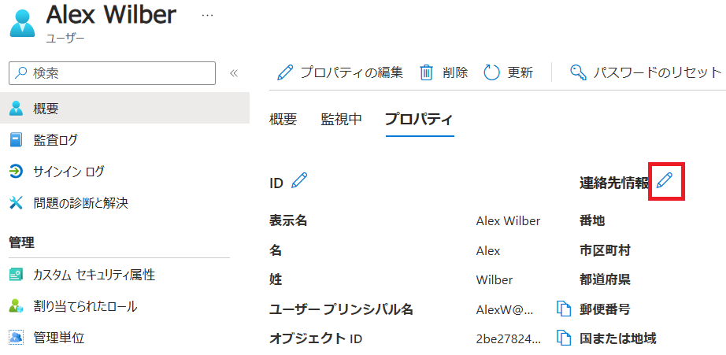

# **オプションラボ 1: Microsoft Teams を管理する**

## **Microsoft 365 ユーザー インターフェイス**

Microsoft クラウド ツールの動的な性質を考えると、このトレーニング コンテンツの開発後にユーザー インターフェイス (UI) が変更される場合があります。これは、この実習ラボ マニュアルに記載されている詳細な手順と一致しない UI の変更として現れます。

Microsoft World-Wide Learning チームは、このような変更が通知され次第、このトレーニング コースを更新します。ただし、クラウド更新の動的な性質を考えると、このトレーニング コンテンツが更新される前に UI の変更が発生する可能性があります。**これが発生した場合は、変更に適応し、必要に応じてラボの演習で作業する必要があります。**

- ## **ラボのシナリオ**

  仮想化されたラボ環境に Microsoft 365 を既に実装しており、Teams  Web クライアントを使用した新しいチームをテストするように依頼されました。パイロット チームが Microsoft 365 管理センターの機能の調査とテストを完了したら、チームの作成に制限を適用しながら、グループとチームの名前付けポリシーと有効期限ポリシーの作成と構成のベスト プラクティスに従うようにガイドする必要があります。

- ## **目標**

  このラボを完了すると、次のことができるようになります。

  - Teams Web クライアントを使用して新しいチームを作成する
  - 有効期限ポリシーの構成
  - 名前付けポリシーを作成する

### **演習 1: グループとチームを作成する**

この演習では、Microsoft 365 管理センターから Microsoft 365 グループを作成し、Teams  Web クライアントからチームを作成します。

#### **タスク 1 - Teams Rollout チームを作成する**

Teams のセルフサービス機能をテストするために、このタスクでは、**Alex Wilber** が Teams Web クライアントにサインインし、Teams ロールアウトという名前の新しいチームを作成し、**Teams** 評価プロジェクトに参加しているすべてのメンバーを追加します。

1. ブラウザーで **Microsoft Teams Web クライアント(https://teams.microsoft.com/)** を参照し 、**Alex Wilber** (AlexW@YourTenant.onmicrosoft.com) としてサインインします。

3. 左側のメニューで **チーム(Teams)** を選択し、上の **[+]ボタン**  - **[チームを作成(Create Team)]** を選択します。

4. 以下の通り設定し **[作成(Create)]** を選択します。

   チーム名(Team name)：  **Teams Rollout**

   チームの種類(Team type)：  **パブリック(Public)**

   最初のチャネルに名前を付けてください(Name the first channel)：  **Test Channel**

5. [Teams Rolloutにメンバーを追加(Add membtes to Teams Rollout)] ウィンドウで、次の名前を入力します。

   - **Joni Sherman**
   - **Lynne Robbins**
   - **Diego Siciliani**

6. [Joni Sherman] の横にあるドロップダウン メニューを選択し、 **[メンバー(Member)] から[所有者(Owner)]** に切り替えます。

7. **[追加(Add)]** を選択します。

Teams デスクトップ クライアントから新しいチームを正常に作成し、プロジェクト チーム メンバーを追加し、Joni Sherman をチーム所有者にしました。

### 演習 2: Microsoft Teams のライフサイクル管理とガバナンスを実装する

  組織は、Microsoft 365 サービス導入の計画プロセスを開始しました。Teams ガバナンスを計画するための Teams 管理者ロールが割り当てられます。Teams は Microsoft 365 グループに依存しているため、Microsoft 365 グループの有効期限ポリシーの作成、Microsoft 365 グループ作成ポリシーのアクセス許可の構成、Microsoft 365 **グループの名前付けポリシー**の構成とテストなど、**Microsoft 365 グループの**ガバナンス手順を計画する必要があります。

  #### タスク 1 - 有効期限ポリシーを作成して割り当てる

  組織の要件に基づいて、不要なグループは 90 日後に自動的に削除する必要があります。Teams の有効期限機能を評価するには、90 日後に Teams ロールアウト グループを期限切れにするグループ有効期限ポリシーを構成します。

  1. **クライアント 1 VM** に接続し、**Holly**として Entra ID 管理センター (https://entra.microsoft.com/) を参照します。

     Entra ID 管理センターが英語表示の場合は、次の手順で日本語表記に変更してください。

     画面右上の歯車のマーク「Settings」をクリックした後、左の「Language + region」をクリックします。Language と Regional format でいずれも日本語を選択し、[Apply] - [OK] をクリックして変更します。

  2. 左側のナビゲーション ウィンドウで、[**ID** > **グループ**] > [**すべてのグループ**] を選択します。

  3. グループ|すべてのグループ ページの左のメニューから、[**有効期限**] を選択します。

  4. グループ|有効期限 ページで、次の設定を構成します。

     - **[グループの有効期間 (日数)]** のドロップダウン メニューで [**カスタム**] を選択し、テキスト ボックスに 

        **「90」** と入力します。

     - **[所有者のいないグループの連絡先にメールを送信する**] の右側のテキスト ボックスに、**Holly@YourTenant.onmicrosoft.com(YourTenenant は環境に合わせて変更してください)**　と入力します。

     - [**Office 365 グループの有効期限を有効にする**] の右側で、[**選択済み**] を選択します。

     - **[+ 追加**] を選択して、 [**グループの選択**] ウィンドウを開きます。

     - [グループの選択] ウィンドウで、テキスト ボックスに「**Teams Roleout**」と入力し、グループを選択します。

     - 右側のペインの下端にある [**選択**] ボタンを使用して、ポリシーを [選択済み] グループに適用します。

     - グループ|有効期限 ページで、 [**保存**] を選択します。

  新しい有効期限ポリシーが正常に作成され、90 日後に期限切れになるように **Teams ロールアウト** チームが構成されました。

  #### タスク 2 - 新しい名前付けポリシーの構成

  Teams 計画プロジェクトの一環として、新しい各 Microsoft 365 グループまたはチームがオブジェクトの名前付けに関する組織の規制に準拠する必要がある名前付けポリシーを構成します。各グループ名は、**Group** という文字で始まり、所有者の場所の **Country** 属性で終わる必要があります。

  1. **クライアント 1 VM** に接続し、**Holly**として Microsoft Entra 管理センター (https://entra.microsoft.com/) を参照します。

  2. Alex Wilber のロケーションをカナダに更新

     - 左側のナビゲーション ウィンドウで、[**ID**] > **[ユーザー]** > **[すべてのユーザー**] を選択します。

     -  **[ユーザー]** ページで、**Alex Wilber** の名前を選択します。

     -  **[パスワードのリセット]** をクリックし、発行された一時的なパスワードをメモ帳等に記録し、次回のサインインに備えます。

     - [**プロパティ**]タブを選択します。

     - **[連絡先情報]** の横の鉛筆アイコンを選択します。

       

     - **[国または地域]**  に**Canada** と入力します。

     - [**保存**] を選択します。

  3. 左側のナビゲーション ウィンドウで、**[ID]** > **[グループ**] > **[すべてのグループ]** を選択します。

  4. [グループ] ページで、左側のメニューから [**名前付けポリシー**] を選択します。

  5. **グループの名前付けポリシー**を構成する

     1. グループ |名前付けポリシー ページで、[**グループの名前付けポリシー**] タブを選択します。
     2. **Group_** 文字列をプレフィックスとして追加します
        1. [**プレフィックスの種類を選択します**] のドロップダウンメニューを選択し、[**文字列**] を選択します。
        2. [**プレフィックスを追加**]チェックボックスをオンにします。
        3. テキスト ボックスに「 **Group-** 」と入力します。
     3. **国または地域の**文字列をサフィックスとして追加します
        1.  [**サフィックスの種類を選択します**]のドロップダウンメニューを選択し、[**文字列**]を選択して、テキストボックスに「 **-**」と入力します。
        1. 「**サフィックスの追加**」チェックボックスを選択します。 
        3.  [**別のサフィックスを選択**] のドロップダウン メニューを選択し、[**属性**] を選択して、「種類の選択」ドロップダウン メニューから **[国またはリージョン]** を選択します。
     4. [**保存**] を選択して、新しいブロックする単語の設定を適用します。

  このタスクでは、Microsoft 365 グループ名で使用される特定の単語をブロックする名前付けポリシーを構成し、Microsoft 365 グループとチームの名前に対して新しい名前付けポリシーを構成しました。

  #### タスク 4 - 新しい名前付けポリシーをテストする

  新しく作成した名前付けポリシーをテストして、パイロット環境でその効果を確認する必要があります。次のタスクでは、新しいチームを作成し、構成された名前付けポリシー テンプレートが新しいチームの構成された名前を完成させるのを確認します。

  **手記：** ブロックする単語の設定が有効になるまで、最大で 24 時間かかることがあります。したがって、構成された命名ポリシーのみをテストします。

  **手記：** サフィックスで使用する「国または地域」属性は Alex Wilber のものとなります。今回の環境では未設定のため空欄となります。空欄のままラボを続けても支障はありません。もし確認したい場合は、Entra ID管理センターのユーザーの画面にて、Alex Wilber のプロパティの編集から、「国または地域」を **Canada** 等に設定してから、Alex Wilberによるチーム作成を試みると、想定したサフィックスが表示されるでしょう。

  1. **Alex Wilber** (AlexW@YourTenant.onmicrosoft.com) として **Teams Web クライアント** (https://teams.microsoft.com/) を開きます。サインイン時には前に記録した一時的なパスワードでサインインを試みますが、パスワードの更新を求められた場合は、 **Pa55w.rd1234** を新しいパスワードとして設定します。

  2. 左側のメニューで **チーム(Teams)** を選択し、上の **[+]ボタン**  - **[チームを作成(Create Team)]** を選択します。

3. 以下の通り設定し **[作成(Create)]** を選択します。

   チーム名(Team name)：  **Afterwork**

   ※ 入力した名前の下に、新しいチーム用に設定されたプレフィックスとサフィックスが表示されます。

   チームの種類(Team type)：  **パブリック(Public)**

   最初のチャネルに名前を付けてください(Name the first channel)：  **Test Channel**

4. [Teams Rolloutにメンバーを追加(Add membtes to Teams Rollout)] ウィンドウで、次の名前を入力します。

   - **Lynne Robbins**

5. **[追加(Add)]** を選択します。

6. 新しく作成したチームの名前を確認します。

  ユーザーが作成したチームの接頭辞と接尾辞を管理するための命名ポリシーのテストに成功しました。

  #### タスク 5 - 命名ポリシーの削除

  名前付けポリシーは、テスト後に削除できます。次のタスクでは、作成した名前付けポリシーを削除します。

1. **Holly**として Microsot Entra 管理センター (https://entra.microsoft.com/) を参照します。
2. 左側のナビゲーション ウィンドウで、[**ID**] > **[グループ**] > **[すべてのグループ**] を選択します。
3. [グループ] ページで、左側のメニューから [**名前付けポリシー**] を選択します。
4. [**グループの名前付けポリシー**] タブに移動します。
5. 上部のリボンで [**ポリシーの削除**] を選択し **> [はい]** を選択します。

  ラボ終了

