# <a name="lab-answer-key-implementing-identity-services-and-group-policy"></a>Lab01a: Server Core への新しいドメイン コントローラーの展開

## <a name="scenario"></a>シナリオ

あなたは Contoso Ltd. に管理者として勤務しています。この会社は、いくつかの新しい場所でビジネスを拡大しています。 現在、Active Directory Domain Services (AD DS) 管理チームは、非対話型のリモート ドメイン コントローラーの展開のために Windows Server で使用できる方法を評価しています。 また、チームは特定の AD DS 管理タスクを自動化する方法を探しています。 さらに、チームは、グループ ポリシー オブジェクト (GPO) に基づいて構成管理を確立したいと考えています。

## <a name="objectives"></a>目標とタスク

このラボを完了すると、次のことができるようになります。

- Server Core に新しいドメイン コントローラーを展開する。
- グループ ポリシーを構成する。

この演習の主なタスクは次のとおりです。

1. Server Core に AD DS を展開する
2. AD DS インストールの準備をして、リモート サーバーを昇格させる
3. AD DS でオブジェクトを管理する

## <a name="estimated-time-45-minutes"></a>予想所要時間: 20 分

## <a name="architecture"></a>アーキテクチャの図

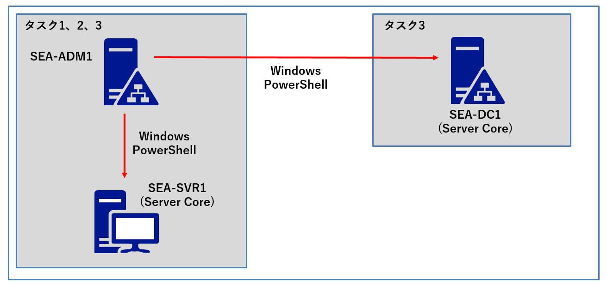

## <a name="lab-setup"></a>ラボのセットアップ

使用する仮想マシン: **SEA-DC1**、**SEA-SVR1**、**SEA-ADM1**  

1. **SEA-ADM1** を選択します。

2. 次の資格情報を使用してサインインします。
   - ユーザー名: **Administrator**
   
   - パスワード: **Pa55w.rd**
   
   - ドメイン: **CONTOSO**
   
     

### <a name="task-1-deploy-ad-ds-on-a-new-windows-server-core-server"></a>タスク 1: Server Core に AD DS を展開する

1. **SEA-ADM1** に以下の資格情報でサインインします。

   | 資格情報       | 値                         |
   | -------------- | -------------------------- |
   | **ユーザー名** | **Contoso\\Administrator** |
   | **パスワード** | **Pa55w.rd**               |

1. **SEA-ADM1** で **[スタート]** メニューから、**[Windows PowerShell (管理者)]** をクリックします。

1. 以下のWindows PowerShellコマンドレットを実行し、**SEA-SVR1**にAD DS (Active Directory ドメインサービス)の役割をインストールします。

   ```powershell
   Install-WindowsFeature –Name AD-Domain-Services –ComputerName SEA-SVR1
   ```

   **※インストールが完了するまでに数分時間を要します。**

   **※実行結果の[Success]が[True]とかえってくれば、インストール完了です。**

   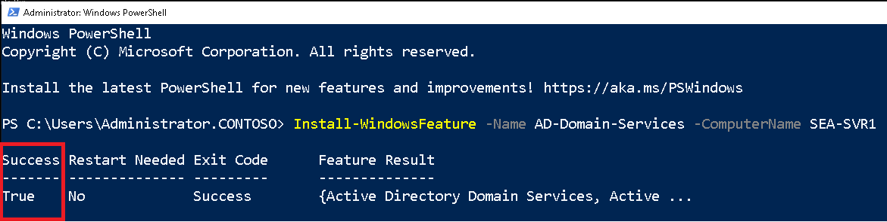

1. **SEA-SVR1** に AD DS 役割がインストールされていることを確認するには、**SEA-ADM1**で以下のWindows PowerShell コマンドレットを実行します。

   ```powershell
   Get-WindowsFeature –ComputerName SEA-SVR1
   ```

1. 4のコマンドレット実行結果で、**Active Directory Domain Services** を探し、**[X]** が表示されていれば、**SEA-SVR1**にインストール済みです。

   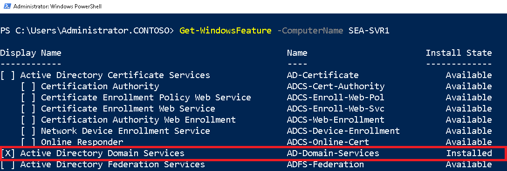

   > **注: インストール プロセスが完了してから、AD DS の役割がインストールされていることが確認できるようになるまで、時間を要する場合があります。 Get-WindowsFeature コマンドレットから結果が得られない場合は、時間をおいて再度実行してみてください。**

### <a name="task-2-prepare-the-ad-ds-installation-and-promote-a-remote-server"></a>タスク 2: AD DS インストールの準備をして、リモート サーバーを昇格させる

1.  **SEA-ADM1** の **[スタート]** メニューから **[Server Manager]** を選択して起動させます。起動後、左ペインから **[All Servers(すべてのサーバー)]** を選択します。

   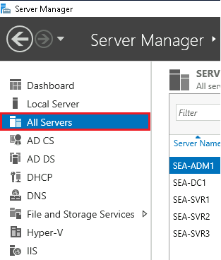

2. **[Manage(管理)]** メニューで、**[Add Servers(サーバーの追加)]** を選択します。

   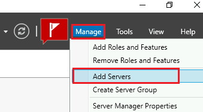
   
3. **[Add Servers(サーバーの追加)]** ダイアログ ボックスで、 **[Find Now(今すぐ検索)]** をクリックします。

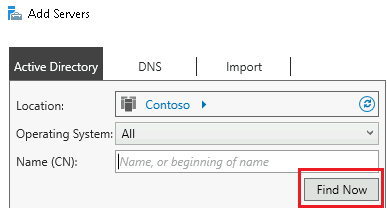

   4.サーバーの **[Active Directory]** リストで **[SEA-SVR1]** を選び、矢印を選択して **[選択済み]** リストに追加してから、**[OK]** を選択します。

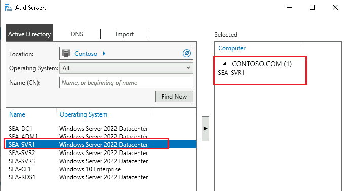


   5.**SEA-ADM1** の **[Server Manager]** の左ペインから **[AD DS]** を選択し、**SEA-SRV1** への AD DS 役割のインストールが完了していることを確認します。

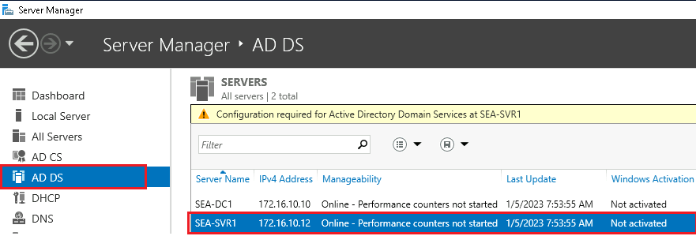


   6.**[Server Manager]**の右上にある**[通知]** フラグ をクリックします。**SEA-SVR1** の展開後の構成に注目します。**[ Promote this server to a domain controller (このサーバーをドメイン コントローラーに昇格する)]** のリンクをクリックします。

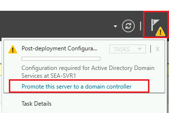

> **注: SEA-SVR1にAD DSの役割をインストールしただけではドメインコントローラーにならないため、昇格させる必要があります。**

**※通知フラグに[Refresh failed]エラーが表示される場合がありますが、ラボと直接関係のないエラーのため無視して構いません。**

7. **[Active Directory Domain Services Configuration ウィザード]** の **[Deployment Configuration(展開構成)]** ページの **[Select the deployment operation (展開操作の選択)]**  の下で、**[Add a domain controller to an existing domain(既存のドメインにドメイン コントローラーを追加する)]** が選択されていることを確認します。

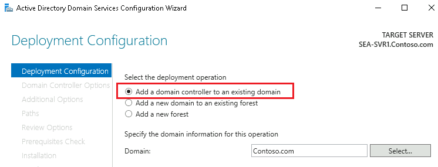

   8.`Contoso.com` ドメインが指定されていることを確かめてから、**[Supply the credentials to perform this operation (この操作を実行する資格情報を指定する)]** セクションで **[Change (変更)]** を選択します。

 

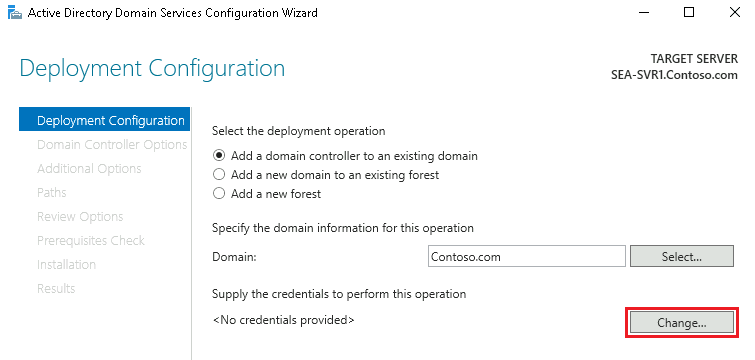

   9.**[資格情報]** ダイアログ ボックスに以下の資格情報を入力し、**[OK]** をクリックします。

| 資格情報       |                            |
| -------------- | -------------------------- |
| **ユーザー名** | **Contoso\\Administrator** |
| **パスワード** | **Pa55w.rd**               |

10. 資格情報が変更されたことを確認し、**[Next (次へ)]** をクリックします。

11.  **[Domain Controller Options]** ページで、**[Domain Name System (DNS) server]** と **[Global Catalog (GC)]** チェックボックスがオンになっていることを確認します。 **[読み取り専用ドメイン コントローラー (RODC)]** チェック ボックスはオフで構いません。

12. **[Type the Directory Services Restore Mode (DSRM) password (ディレクトリ サービス復元モード (DSRM) パスワードの入力)]** セクションで、以下のパスワードを入力し、**[次へ]** をクリックします。

| パスワード   |
| ------------ |
| **Pa55w.rd** |

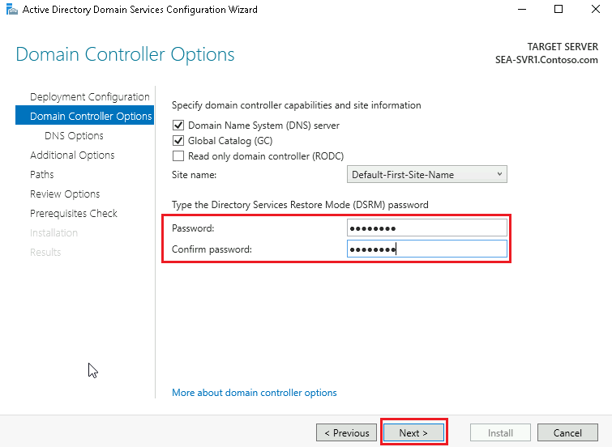


13. **[DNS Options]** ページでは規定値のまま、**[Next (次へ)]** をクリックします。

**※ページ内に、DNSゾーンの委任に関する警告メッセージが表示されますが、このラボではDNSゾーンの委任は行わないため無視して構いません。**

14.  **[Additional Options (追加オプション)]**  ページで、規定値のまま **[Next (次へ)]**  をクリックします。

**※IFMオプションはチェックを外したままで構いません。**

15.  **[Paths (パス)]** ページでは、既定のパスのまま、**[Next (次へ)]** をクリックします。

16.  **[Review Options (オプションの確認)]**ページでは、**[Next (次へ)]** をクリックします。

17.   **[Prerequisites Check (前提条件のチェック)]** ページで、緑のチェックが表示されたことを確認したら **[Install (インストール)]** をクリックします。

 **[This server was successfully configured as a domain contoroller]** のメッセージが表示されたら、 **[Close (閉じる)]** をクリックします。

18.  **SEA-ADM1** で **[Server Manager]** に切り替え、右上の更新ボタンをクリックします。その後、通知メッセージを確認し **[ Promote this server to a domain controller (このサーバーをドメイン コントローラーに昇格する)]**  が表示されなくなっていることを確認します。

> **注:SEA-SVR1の再起動が完了するまでに何度か [更新] を繰り返す必要がある場合があります。**

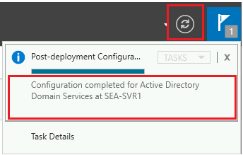


### <a name="task-3-manage-objects-in-ad-ds"></a>タスク 3: AD DS でオブジェクトを管理する

1. **SEA-ADM1** で **Windows PowerShell (管理者)** に切り替えます。

1. 以下のWindows PowerShellコマンドレットを実行し、**SEA-DC1** のドメインコントローラーに **Seattle** という組織単位 (OU) を作成します。

   ```powershell
   New-ADOrganizationalUnit -Name "Seattle" -Path "DC=contoso,DC=com" -ProtectedFromAccidentalDeletion $true -Server SEA-DC1.contoso.com
   ```

1. 以下のWindows PowerShellコマンドレットを実行し、**Seattle** OU 配下に、 **Ty Carlson** というユーザーを作成します。

   ```powershell
   New-ADUser -Name Ty -DisplayName 'Ty Carlson' -GivenName Ty -Surname Carlson -Path 'OU=Seattle,DC=contoso,DC=com'
   ```

1. Ty のユーザー アカウントのパスワードを設定するには、次のコマンドレットを実行します。

   ```powershell
   Set-ADAccountPassword Ty
   ```

1. 現在のパスワードの入力を求めるメッセージが表示されたら、何も入力せずにEnter キーを押します。

   > **注 : ユーザーTyの作成時にパスワード設定をせずに作成したため、現在のパスワードは設定されていません。**

1. 新たに設定するパスワードを求めるメッセージが表示されたら、「**Pa55w.rd**」と入力し、Enter キーを押します。

1. パスワードをもう一度入力するよう求められたら、「**Pa55w.rd**」と入力し、Enter キーを押します。

1. アカウントを有効にするには、次のコマンドを入力し、Enter キーを押します。

   ```powershell
   Enable-ADAccount Ty
   ```

1.  **SeattleBranchUsers** という名前のドメイン グローバル グループを作成します。**SEA-ADM1** の **Windows PowerShell (管理者)** で以下のコマンドレットを実行します。

   ```powershell
   New-ADGroup SeattleBranchUsers -Path 'OU=Seattle,DC=contoso,DC=com' -GroupScope Global -GroupCategory Security
   ```
   
1. 以下のWindows PowerShell コマンドレットを実行し、 **SeattleBranchUsers** に ユーザー **Ty**  を追加します。

   ```powershell
   Add-ADGroupMember -Identity SeattleBranchUsers -Members Ty
   ```

1. 以下のWindows PowerShell コマンドレットを実行し、 **SeattleBranchUsers** に ユーザー **Ty** が追加されたことを確認します。

     ```powershell
     Get-ADGroupMember -Identity SeattleBranchUsers
     ```

     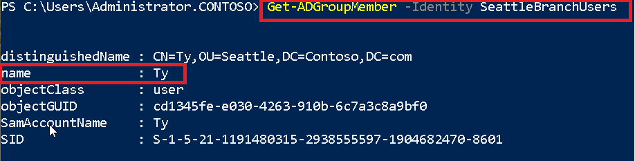

1. 以下のWindows PowerShell コマンドレットを実行し、ローカルの管理者グループ(Administrators グループ)にユーザー Ty を追加します。

     ```powershell
     Add-LocalGroupMember -Group 'Administrators' -Member 'CONTOSO\Ty'
     ```

     > **注:  この次の演習で検証のためにサインインする必要があるため、管理者グループにユーザーを追加しました。**

#### **結果**: この演習が完了すると、AD DS に新しいドメイン コントローラーとマネージド オブジェクトが作成できています。

## **オプション : オブジェクト作成結果の確認** 

1.   **SEA-ADM1** の **[スタート]** メニューから **[Server Manager]** を起動させます。
2.  **[Tools]** を展開し、**[Active Directory Users and Computers (Active Directory ユーザーとコンピューター)]** を選択します。

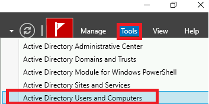

3.   **Seattle OU**  配下に、 **SeattleBrunchUsers** グループとユーザー **Ty** が作成されていることが確認できます。

   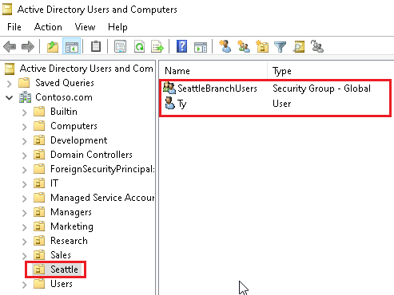

4.   **SeattleBrunchUsers**  グループのプロパティを確認すると、ユーザー **Ty** がメンバーとして追加されていることが確認できます。

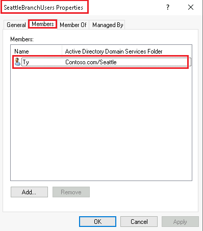

**注 : OUとグループは、Windows PowerShell のコマンドレットでリモートサーバーの SEA-DC1 に作成しましたが、GUIでも確認ができます。** 

#### **結果 : この演習を完了すると、リモートサーバーにAD DS の役割をインストールと、ドメインコントローラーに昇格できました。また、OU、ユーザー、グループオブジェクトを作成、管理できるようになっています。**
